# Informe de evidencias — Backend Business con SDD + Kanban

**Repositorio:** `DW-2026-IISem/dw-2026-Futbol-Total`  
**Workspace:** `~/ia-lab/projecs/desarrollo web/Pedalibre-Desarrollo Web/dw-2026-Futbol-Total`  
**Metodología:** SDD + Kanban + asistencia de IA + revisión humana  
**Estado:** configuración base de ISS-01 implementada y verificada; el tablero y los Issues de GitHub quedaron fuera del alcance por indicación docente.

## Día 0 — Preparación de trazabilidad y repositorio remoto

Se reorganizaron los materiales existentes en la carpeta `motores/` y se añadieron las siete plantillas de trazabilidad: `ISS-01.md` a `ISS-07.md`.

Se creó el commit inicial:

```text
f10a2e8 chore(dia-0): preparar trazabilidad inicial
```

El commit se envió correctamente al remoto `origin/main`.

### Evidencia 01 — Commit inicial y push exitoso

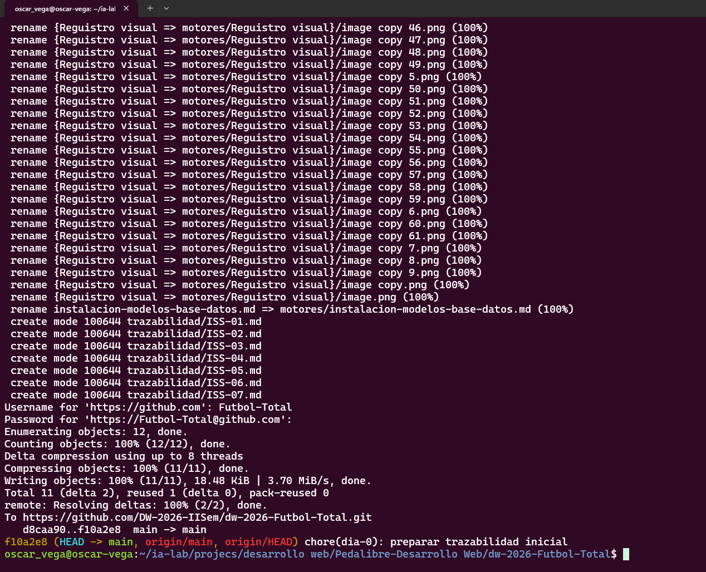

**Cómo reproducir la verificación:**

```bash
git log -1 --oneline
git status --short
```

**Resultado esperado:** el historial debe incluir el commit `f10a2e8` y el repositorio debe sincronizarse con `origin/main`.

## Limpieza del workspace

Se eliminó el marcador obsoleto `proyecto/.gitkeep` y los metadatos de Windows `Zone.Identifier` asociados a las plantillas de trazabilidad. Se añadió este informe y su evidencia visual al repositorio.

### Evidencia 02 — Estado preparado para el commit de limpieza

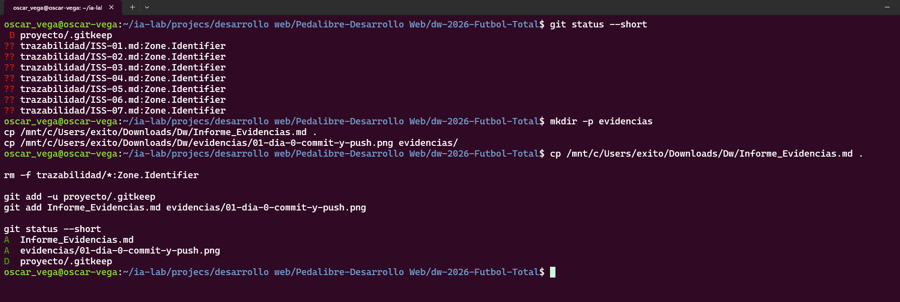

**Resultado verificado:** se prepararon `Informe_Evidencias.md`, la evidencia del Día 0 y la eliminación de `proyecto/.gitkeep`; no quedaron archivos `Zone.Identifier`.

### Evidencia 03 — Push final del Día 0


La resolución DNS de WSL fue restaurada y GitHub recibió el commit `2cd9bd3` en la rama `main`.

## Bloqueo temporal — Tablero Kanban

La creación del GitHub Project tipo Board no pudo realizarse debido a un error de la plataforma. El docente fue informado y está trabajando en su resolución.

**Decisión:** por indicación del docente, GitHub Projects y GitHub Issues no son requisitos de entrega. Se aplaza su configuración, pero el desarrollo técnico continúa. El informe de evidencias y las plantillas locales de trazabilidad se conservarán como respaldo del proceso.

## Creación del proyecto NestJS base

Se generó el proyecto temporal `futbol-total-api` mediante NestJS CLI en `/tmp/futbol-total-api`. Se seleccionó **No** para la observabilidad automática y **CJS (CommonJS)** como sistema de módulos.

### Evidencia 04 — Generación exitosa del proyecto NestJS

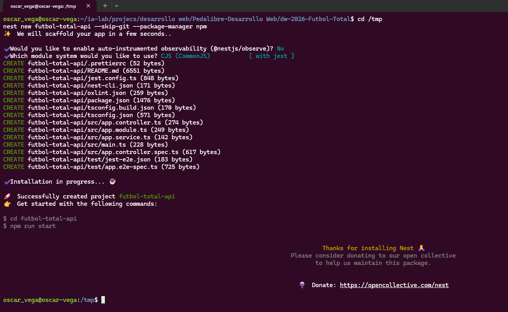

La CLI confirmó `Successfully created project futbol-total-api`. El proyecto será trasladado a la raíz del repositorio conservando las carpetas de documentación y trazabilidad existentes.

## Dependencias de validación

Se instalaron `class-validator` y `class-transformer`, dependencias requeridas para validar y transformar las solicitudes HTTP mediante `ValidationPipe`.

### Evidencia 05 — Instalación de dependencias

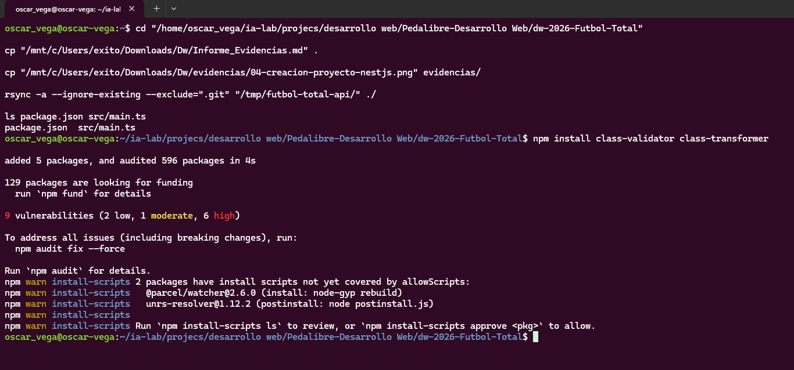

La instalación añadió cinco paquetes y terminó correctamente. npm reportó vulnerabilidades transitivas; no se aplicó `npm audit fix --force` para evitar modificaciones incompatibles no revisadas.

## Estructura inicial de Clean Architecture

Se crearon las carpetas `src/config`, `src/common` y `src/infrastructure/database`. También se generó `BusinessModule`, registrado automáticamente en `AppModule`. El archivo `.gitignore` fue actualizado para excluir `node_modules/`, `dist/` y `.env`.

### Evidencia 06 — Módulo Business y estructura base

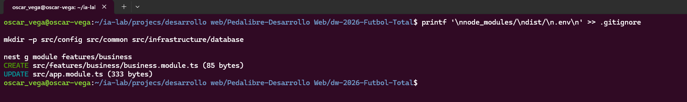

La salida confirma la creación de `src/features/business/business.module.ts` y la actualización de `src/app.module.ts`.

## Arranque y comprobación de la API

Se ejecutó `npm run start:dev`. El servidor inició sin errores, cargó `BusinessModule` y registró el endpoint `GET /api/health` bajo el prefijo global `/api`.

### Evidencia 07 — Servidor NestJS iniciado

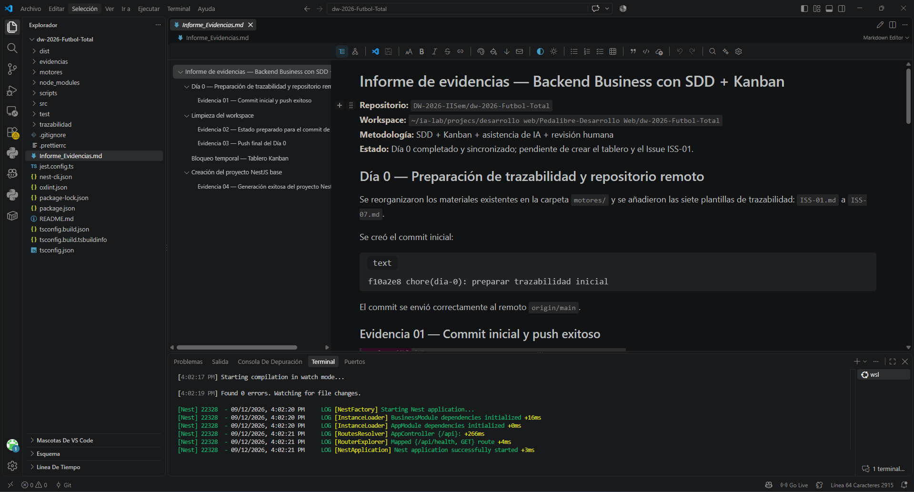

La consola confirma `Found 0 errors`, `Mapped {/api/health, GET}` y `Nest application successfully started`.

### Evidencia 08 — Endpoint de salud operativo

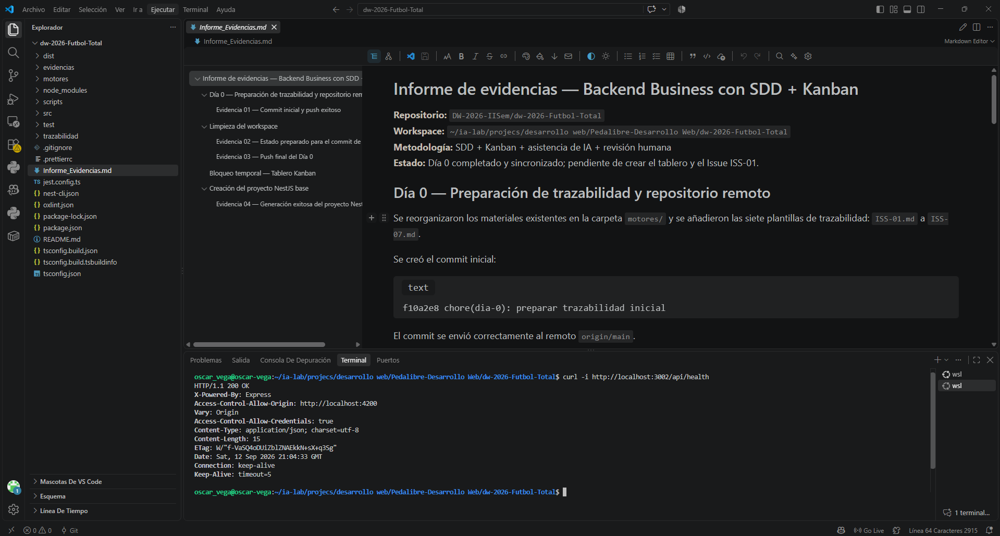

El comando `curl -i http://localhost:3002/api/health` respondió `HTTP/1.1 200 OK`, con CORS habilitado para `http://localhost:4200`.

## Revisión previa al commit técnico

Se revisó el estado de Git antes del primer commit técnico. Los archivos del esqueleto NestJS, las configuraciones, el código fuente, pruebas y evidencias están pendientes de registrar. Las dependencias y la carpeta `dist/` permanecen excluidas.

### Evidencia 09 — Revisión de archivos pendientes

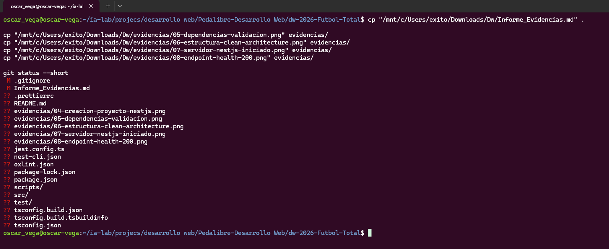

Como ajuste adicional, se excluirá `*.tsbuildinfo`, un archivo generado por TypeScript que no debe versionarse.

### Verificación de formato del script

La primera ejecución de `git diff --cached --check` detectó saltos de línea CRLF en `scripts/free-port.js`. Se corregirán a formato LF antes del commit para mantener compatibilidad con el entorno WSL/Linux.

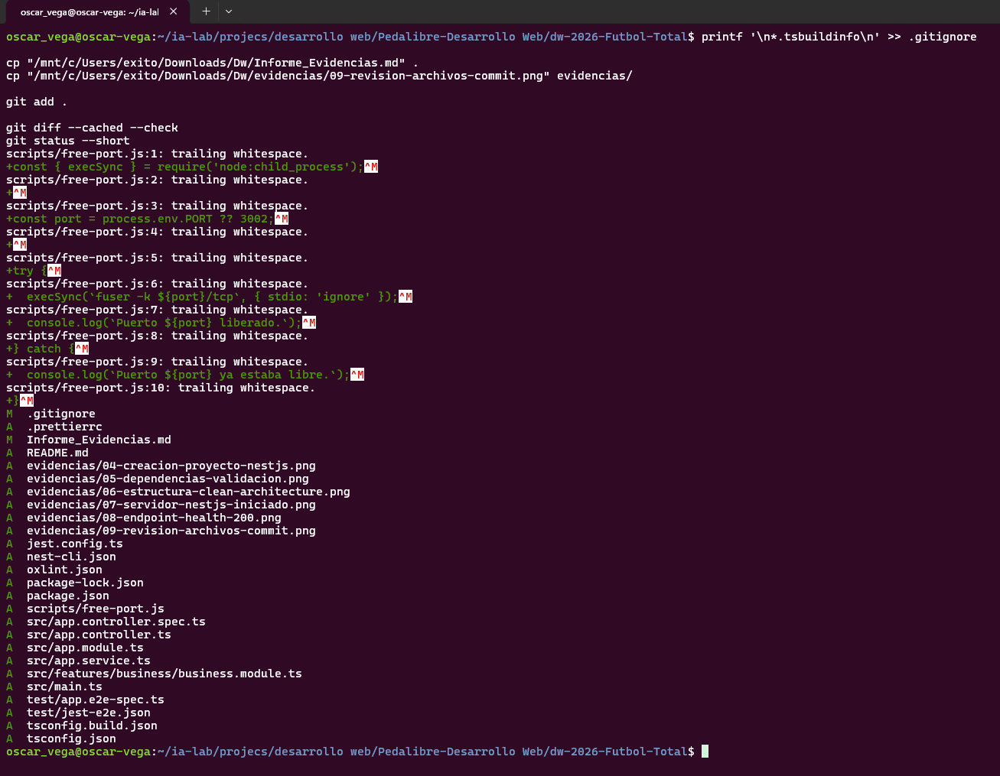

### Evidencia 11 — Validación de Git sin errores

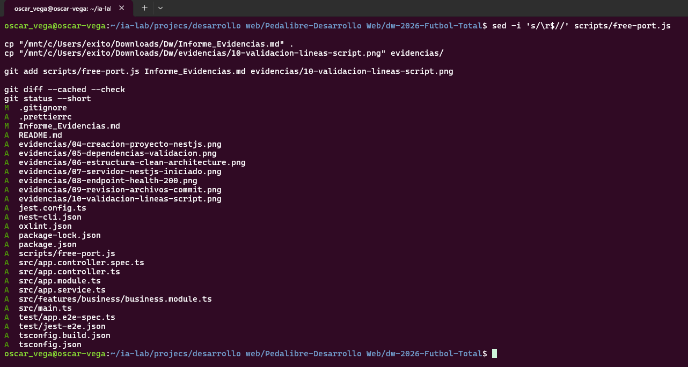

Después de convertir el script a formato LF, `git diff --cached --check` terminó sin mensajes, confirmando que no hay errores de espacios finales.

Para conservar en Git las carpetas vacías de la estructura base (`src/config`, `src/common` y `src/infrastructure/database`), se añadirán archivos `.gitkeep`.

## Commit técnico — ISS-01

Se consolidó el esqueleto NestJS, la configuración de la API y las evidencias de verificación en el commit:

```text
959a4c4 feat(iss-01): esqueleto NestJS CA arrancable
```

El commit se envió correctamente a la rama remota `main`.

### Evidencia 12 — Commit y push de ISS-01

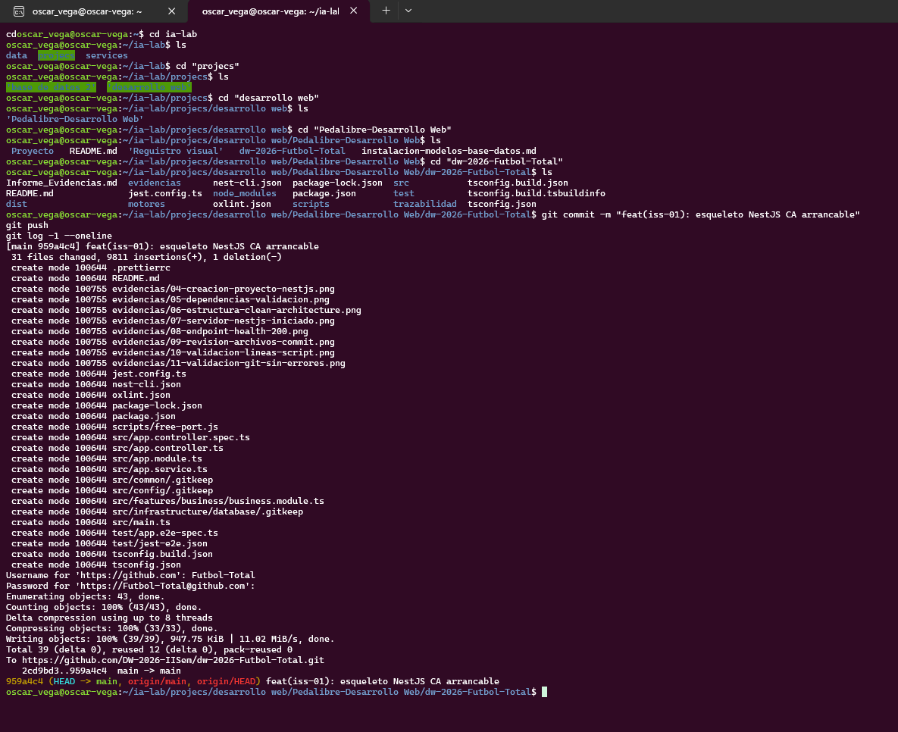

## Tablero Kanban

Se configuró el tablero `SDD Kanban — dw-2026-Futbol-Total` con los estados: `Preparado`, `En curso`, `Verificación`, `Revisión humana` y `Hecho`.

La tarjeta `ISS-01 — Esqueleto NestJS CA arrancable` superó la revisión humana y se encuentra en **Hecho**.

### Evidencia 13 — ISS-01 en revisión humana

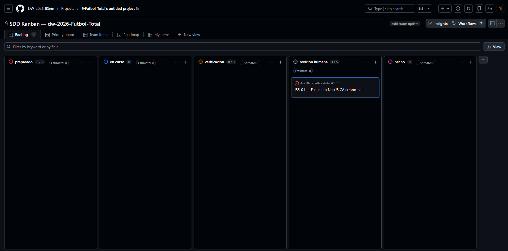

## Cierre documental de ISS-01

Se completaron los criterios de aceptación, el registro de uso de Cursor, las evidencias reproducibles y la autoevaluación en `trazabilidad/ISS-01.md`. El ajuste fue confirmado mediante un commit referenciado al Issue GitHub `#1`.

### Evidencia 14 — Trazabilidad ISS-01 completada y enviada

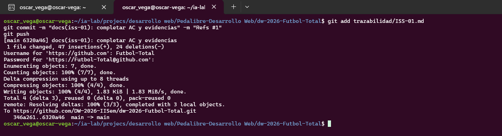

Commit: `6320a46 docs(iss-01): completar AC y evidencias` con `Refs #1`.

## Verificación funcional de ISS-02

Se comprobó que, después de configurar la infraestructura de entorno, base de datos y respuestas globales, el endpoint de salud continúa disponible y usa el envelope de respuesta definido para la API.

### Evidencia 15 — Envelope de respuesta operativo


`GET /api/health` respondió `HTTP/1.1 200 OK` con `statusCode`, `message`, `data` y `timestamp`; el valor de salud se encuentra en `data.status`.

### Evidencia 16 — Restricciones de sincronización y entorno

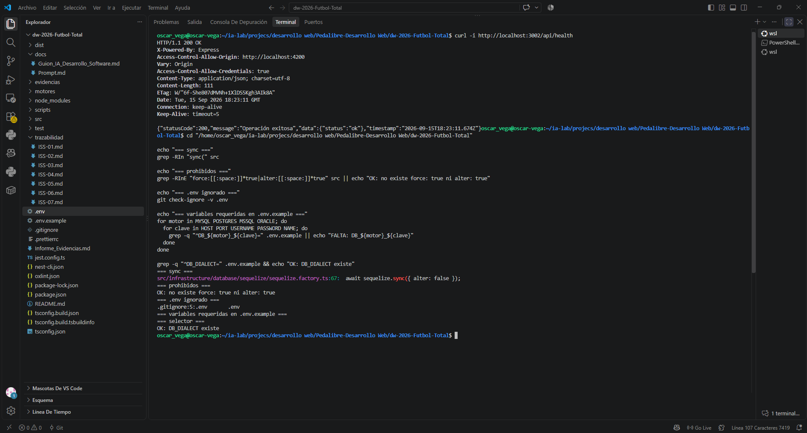

La inspección confirmó una sola llamada `sync({ alter: false })`, ausencia de `force: true` y `alter: true`, exclusión de `.env` por Git y presencia de `DB_DIALECT` más los cuatro bloques de conexión en `.env.example`.

## Commit técnico — ISS-02

La configuración de entorno por motor, la infraestructura Sequelize y los componentes comunes se consolidaron y enviaron al remoto.

```text
8781fb5 feat(iss-02): entorno Sequelize y common
```

### Evidencia 17 — Commit y push de ISS-02

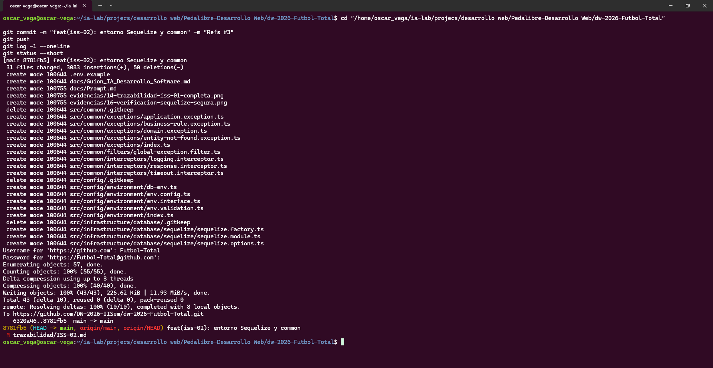

El commit fue enviado correctamente a `origin/main` con la referencia al Issue `#3`.

### Evidencia 18 — ISS-01 e ISS-02 cerradas en Kanban

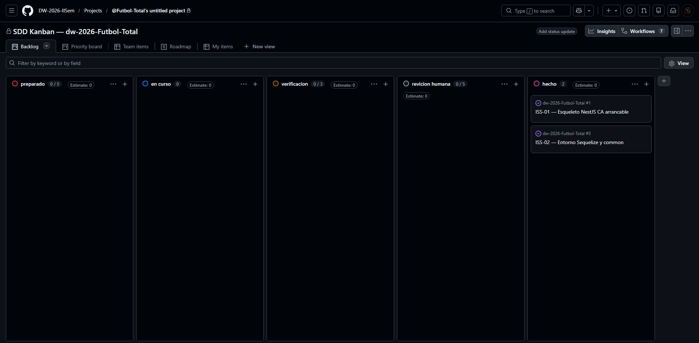

El tablero registra ambas tarjetas en **Hecho**, después de la verificación, revisión humana y Gate aprobados.

## Inicio de ISS-03 — Feature clients CA

El Issue GitHub `#4` se creó como una tarea real y se ubicó en **Preparado**, luego de cerrar las dos dependencias anteriores.

### Evidencia 19 — ISS-03 en Preparado

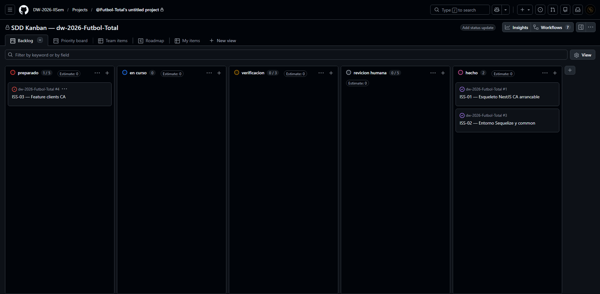

## Verificación funcional de ISS-03

La primera feature de negocio se validó contra la base de datos. El seeder no duplicó registros entre reinicios y la entidad de dominio se mantuvo libre de dependencias del framework y del ORM.

### Evidencia 20 — Idempotencia y entidad Client pura

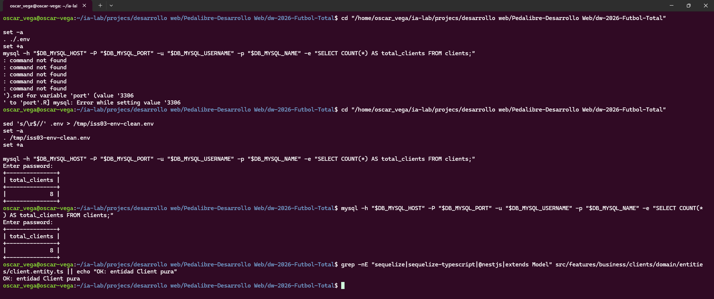

El conteo de `clients` se conservó en `8` antes y después del reinicio. La inspección de la entidad no devolvió imports de NestJS/Sequelize ni `extends Model`.

### Evidencia 21 — Arranque y rutas de Clients

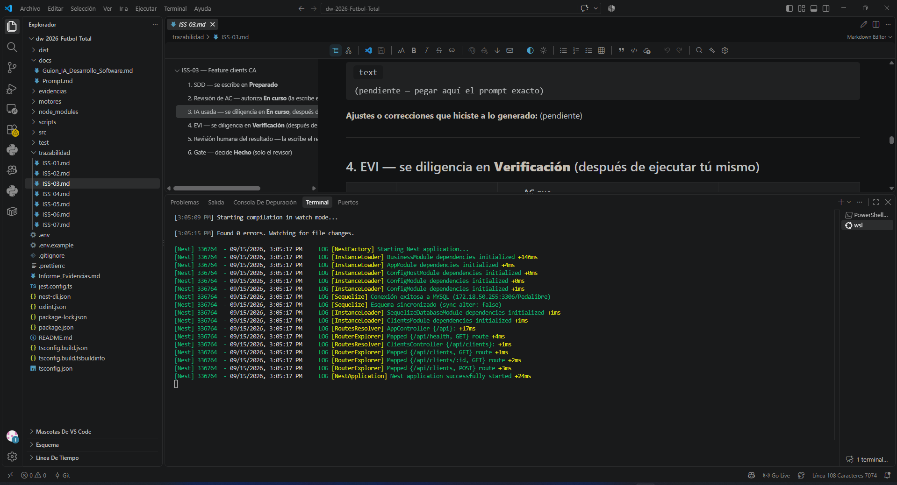

El servidor inicia con la conexión de datos, sincronización segura y las rutas `GET /api/clients`, `GET /api/clients/:id` y `POST /api/clients` registradas.

## Commit técnico — ISS-03

La feature Clients se consolidó con sus cuatro capas, el seeder idempotente y las validaciones HTTP requeridas.

```text
0b2faad feat(iss-03): feature clients CA
```

### Evidencia 22 — Commit y push de ISS-03

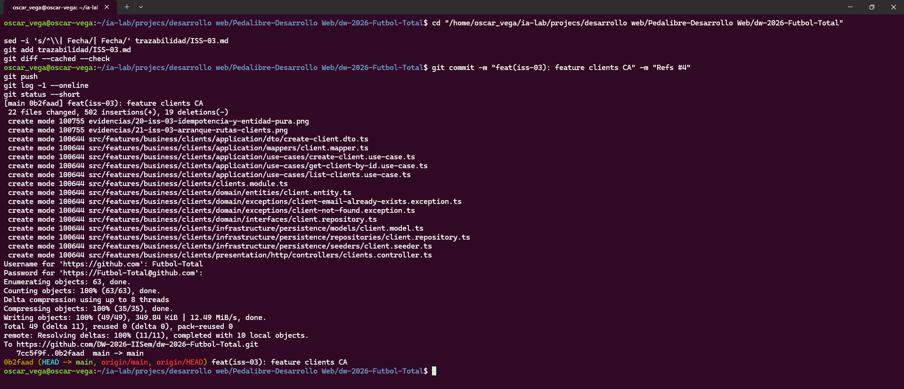

El commit técnico fue enviado a `origin/main` con referencia al Issue `#4`.

### Evidencia 23 — ISS-03 en revisión humana

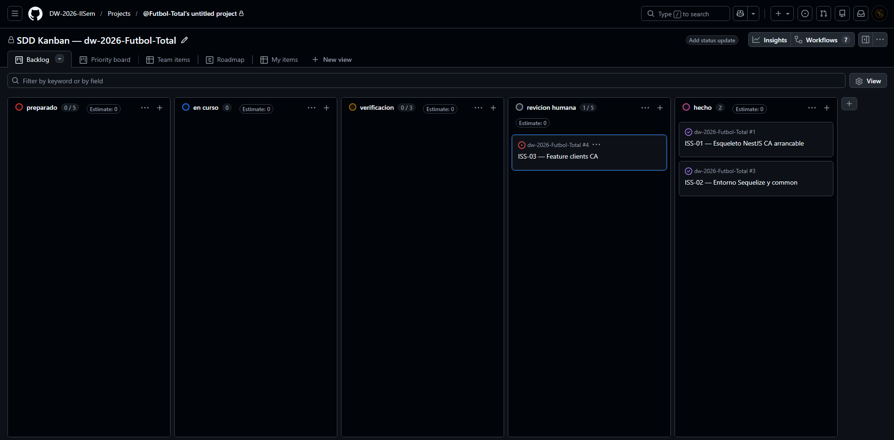

La tarjeta pasó a **Revisión humana** después de ejecutar los criterios de aceptación, registrar las EVI y hacer el push del commit técnico.

### Evidencia 24 — Gate de ISS-03 registrado y enviado

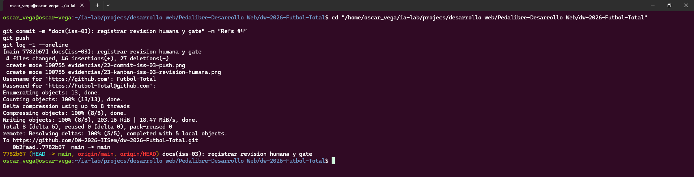

El Gate aprobado, la revisión humana y sus evidencias se registraron en el commit `7782b67` con `Refs #4`.

### Evidencia 25 — ISS-03 cerrada en Kanban

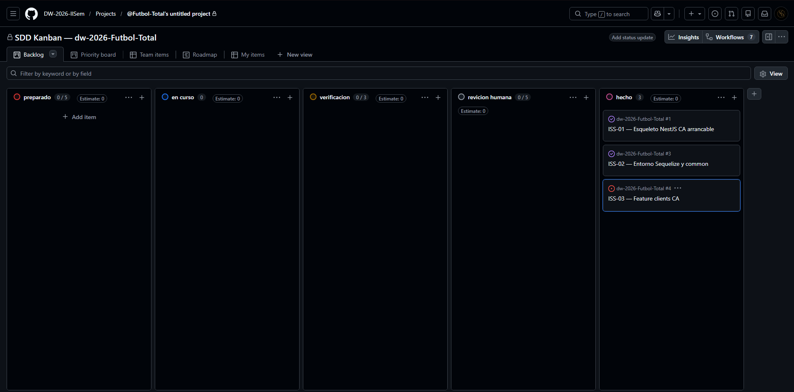

El tablero confirma que ISS-01, ISS-02 e ISS-03 están en **Hecho**, sin tarjetas pendientes en los estados intermedios.

## Inicio de ISS-04 — Feature product-types CA

El Issue GitHub `#5` se creó como tarea real y se ubicó en **Preparado**, después de cerrar ISS-03.

### Evidencia 26 — ISS-04 en Preparado

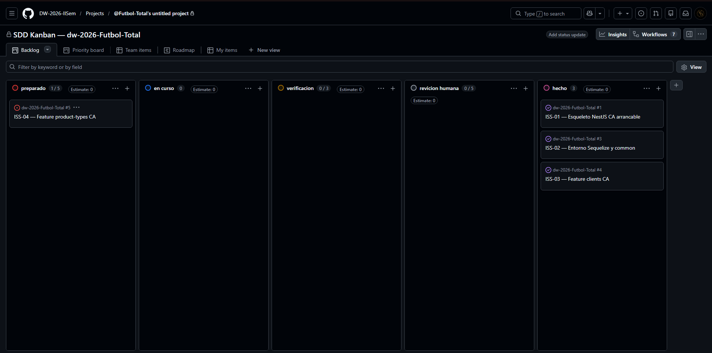

## Verificación funcional de ISS-04

La feature ProductTypes se comprobó contra la base de datos con rutas HTTP, seeder idempotente y entidad de dominio pura.

### Evidencia 27 — Arranque y rutas de ProductTypes

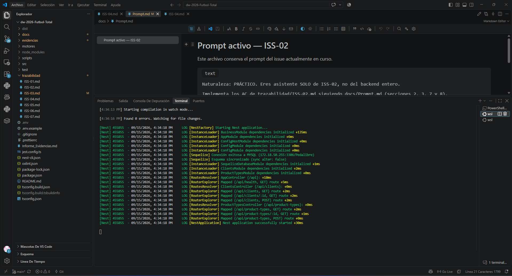

El servidor registra las rutas `GET /api/product-types`, `GET /api/product-types/:id` y `POST /api/product-types`, junto con la conexión y sincronización segura.

### Evidencia 28 — Idempotencia y entidad ProductType pura

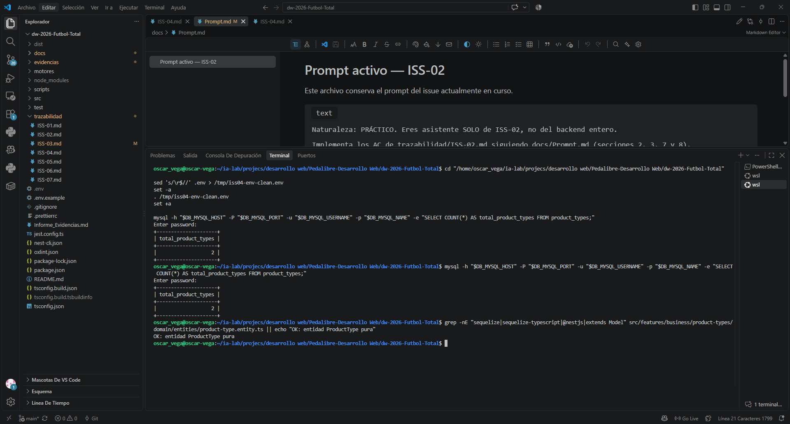

El conteo de `product_types` se mantuvo en `2` antes y después del reinicio; la búsqueda no encontró dependencias de NestJS/Sequelize ni `extends Model` en la entidad de dominio.

## Commit técnico — ISS-04

La feature ProductTypes se consolidó siguiendo el patrón de Clients, con el seeder idempotente y las validaciones HTTP requeridas.

```text
f15fa0f feat(iss-04): feature product-types CA
```

### Evidencia 29 — Commit y push de ISS-04

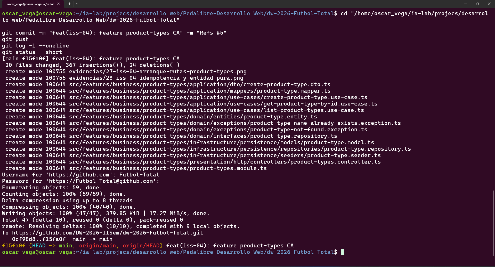

El commit técnico fue enviado a `origin/main` con referencia al Issue `#5`.

### Evidencia 30 — ISS-04 cerrada en Kanban

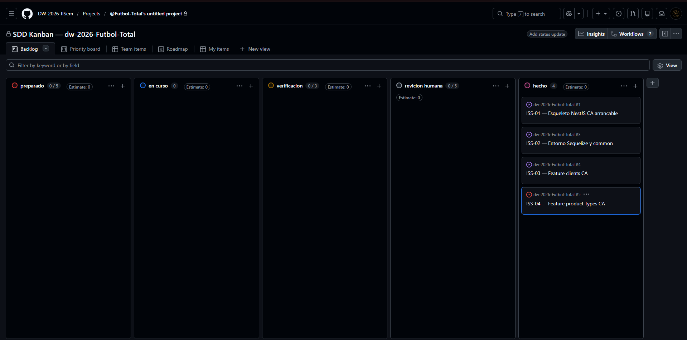

El tablero confirma que ISS-01, ISS-02, ISS-03 e ISS-04 se encuentran en **Hecho**.

## Inicio de ISS-05 — Feature products CA

El Issue GitHub `#6` se creó como tarea real y se ubicó en **Preparado**, después de cerrar ISS-04.

### Evidencia 31 — ISS-05 en Preparado

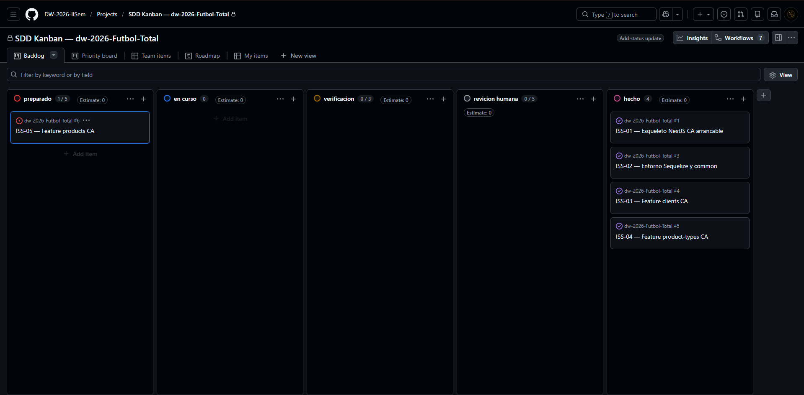

## Verificación funcional de ISS-05

La feature Products se verificó mediante sus rutas HTTP, reglas de validación, relación con ProductTypes, seeder idempotente y entidad de dominio pura.

### Evidencia 32 — Arranque y rutas de Products

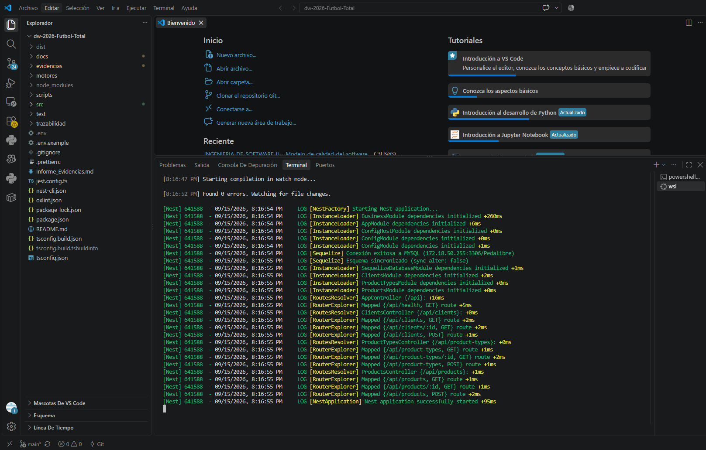

El servidor registra `GET /api/products`, `GET /api/products/:id` y `POST /api/products`, además de inicializar el módulo Products y sincronizar el esquema sin alteraciones destructivas.

### Evidencia 33 — Idempotencia y entidad Product pura

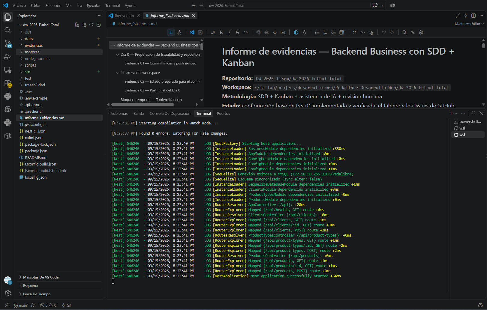

El conteo de `products` permaneció en `2` después del reinicio. La entidad no tiene dependencias de NestJS ni Sequelize y contiene `reduceStock` con la excepción de stock insuficiente.

## Commit técnico — ISS-05

La feature Products quedó integrada con ProductTypes, validaciones de entrada, reglas de disponibilidad del tipo y persistencia segura.

```text
0019924 feat(iss-05): feature products CA
```

### Evidencia 34 — Commit y push de ISS-05

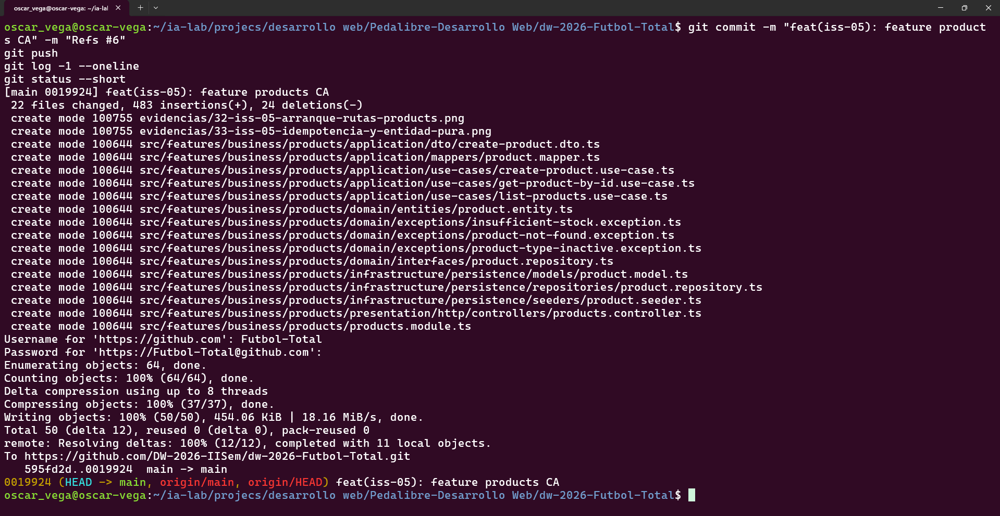

El commit técnico fue enviado a `origin/main` con referencia al Issue `#6`.

### Evidencia 35 — ISS-05 en revisión humana

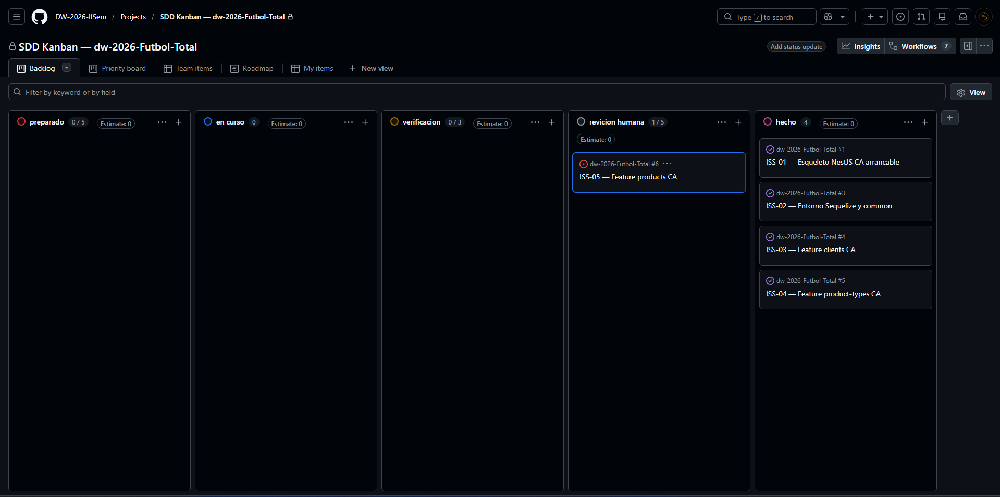

La tarjeta pasó a **Revisión humana** tras completar las evidencias, marcar los criterios de aceptación y enviar el commit técnico.

### Evidencia 36 — ISS-05 cerrada en Kanban

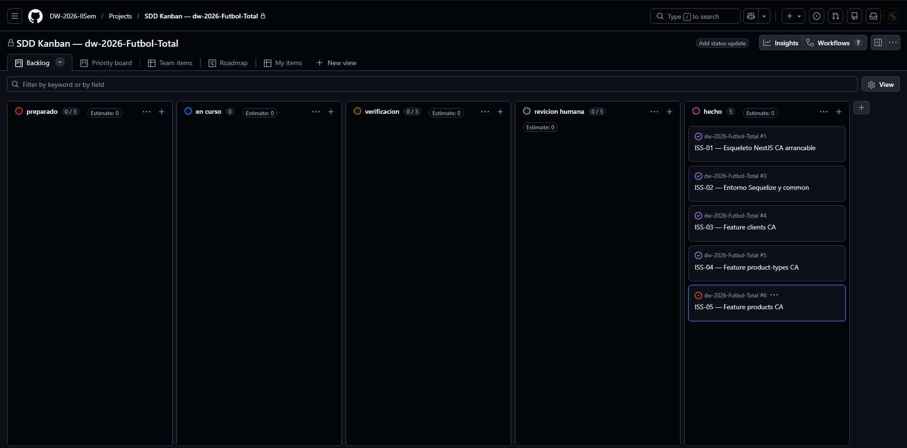

El tablero confirma que ISS-05 alcanzó **Hecho** después de la revisión humana aprobada y el Gate registrado.

## Inicio de ISS-06 — Feature sales CA

El Issue GitHub `#7` se creó como tarea real y se ubicó en **Preparado**, tras cerrar ISS-05.

### Evidencia 38 — ISS-06 en Preparado

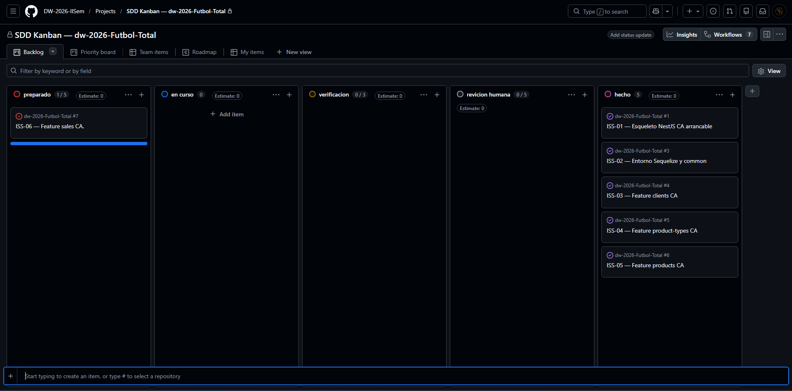

## Verificación funcional de ISS-06

La feature Sales se verificó contra la base de datos, comprobando el descuento de stock, los rechazos sin persistencia parcial y la consulta de una venta con sus detalles.

### Evidencia 39 — Arranque y rutas de Sales

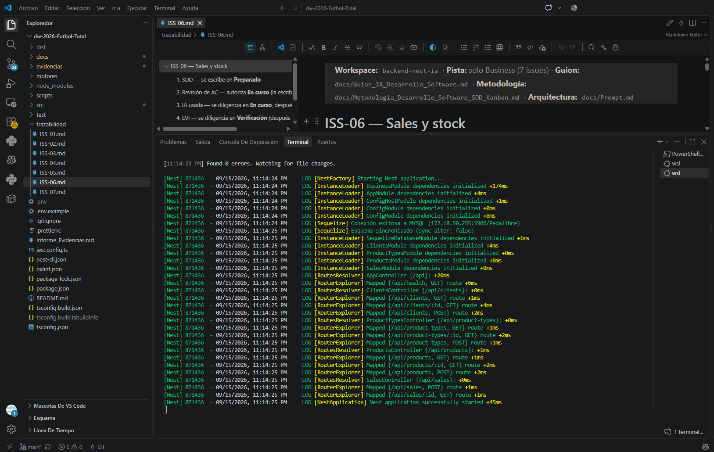

Nest registra `POST /api/sales` y `GET /api/sales/:id`, y carga SalesModule después de Clients y Products.

### Evidencia 40 — Venta válida y stock insuficiente

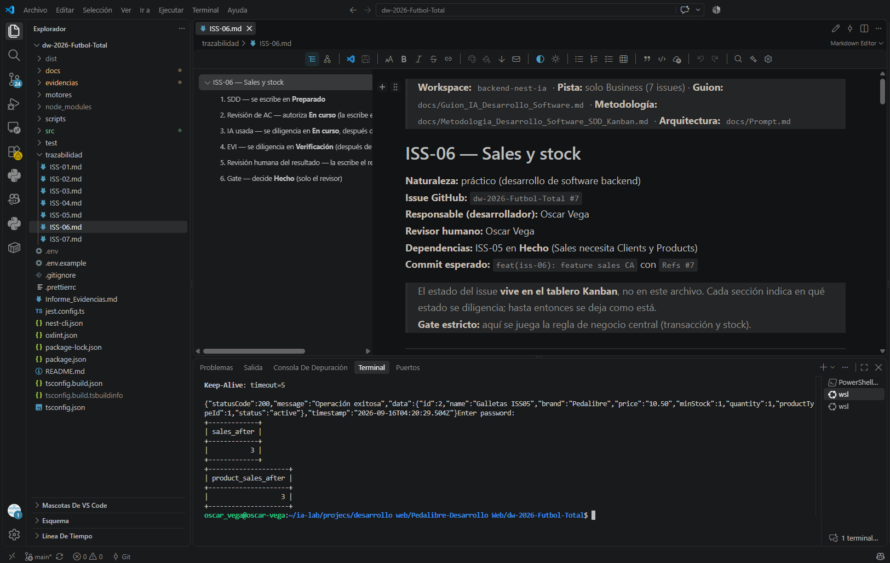

La venta válida creó Sale y ProductSale, redujo el stock según el pedido; una solicitud posterior con cantidad insuficiente devolvió `409` y mantuvo los conteos.

### Evidencia 41 — Atomicidad ante fallo de un ítem

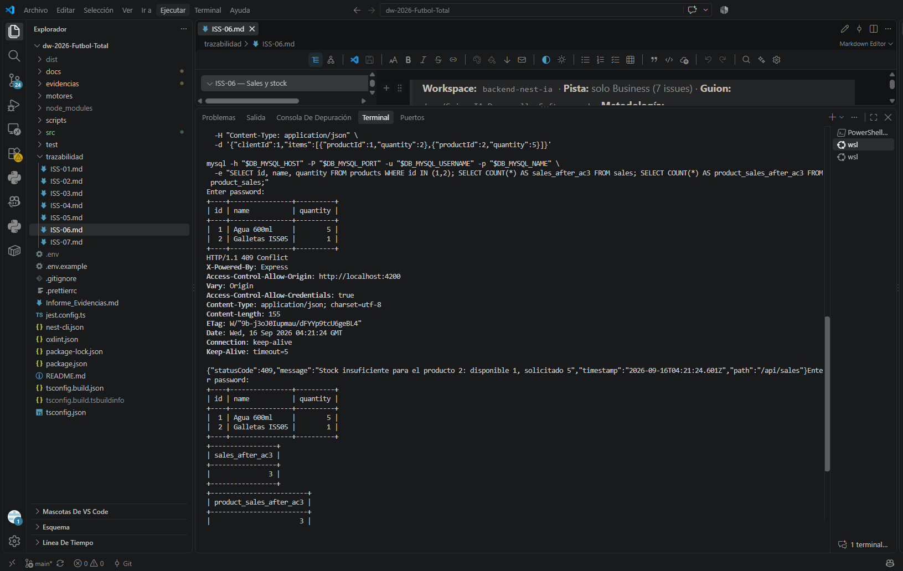

Al fallar el segundo producto por stock insuficiente, los productos A y B conservaron sus cantidades y no se crearon filas adicionales en `sales` ni `product_sales`.

### Evidencia 42 — Validación y consulta de venta

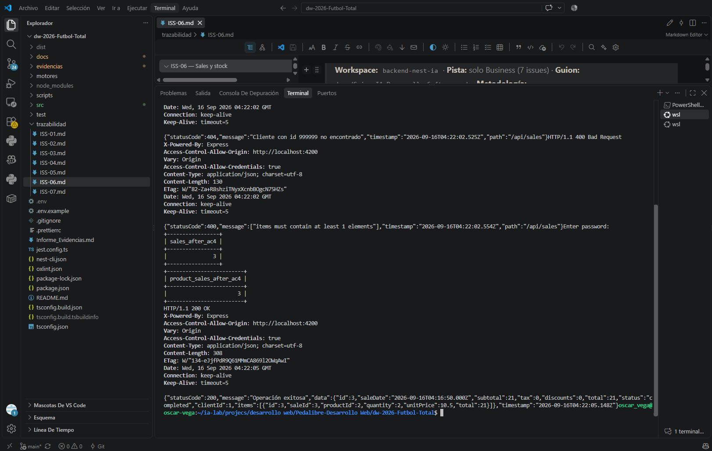

Un cliente inexistente devolvió `404`, una lista de ítems vacía devolvió `400`, y `GET /api/sales/3` devolvió cliente, total e ítems.

### Evidencia 43 — Transacción y entidades puras

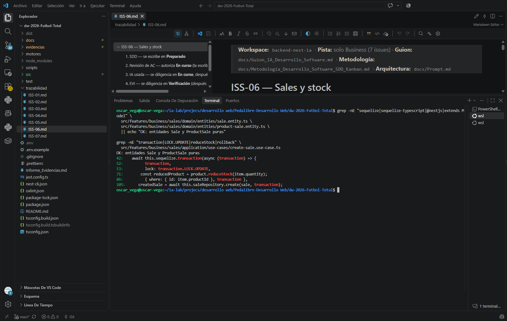

Las entidades Sale y ProductSale no dependen de NestJS ni Sequelize. El use-case contiene la transacción, `LOCK.UPDATE`, `reduceStock` y persistencia asociada a la transacción.
