# Informe de evidencias - Pedalibre app Express

**Proyecto:** `Pedalibre-app-exprex`  
**Ubicacion:** `~/ia-lab/projecs/desarrollo web/Pedalibre-Desarrollo Web/dw-2026-Futbol-Total/Pedalibre-app-exprex`  
**Metodologia:** desarrollo incremental, comprobacion manual, evidencia visual y commits periodicos.

## Diagnostico inicial

Realice la primera revision desde la terminal WSL. Confirme que el proyecto usa Express 5, TypeScript y Sequelize. La estructura disponible incluye configuracion, conexion de base de datos, controlador y rutas de clientes; por ello, el punto de partida corresponde a la implementacion inicial de la feature Client del manual de trazabilidad.

Tambien confirme que esta carpeta todavia no esta registrada por el repositorio Git de la carpeta padre. Mantendre el trabajo y las evidencias dentro de este directorio, sin modificar archivos fuera de el.

### Evidencia 01 - Estado inicial

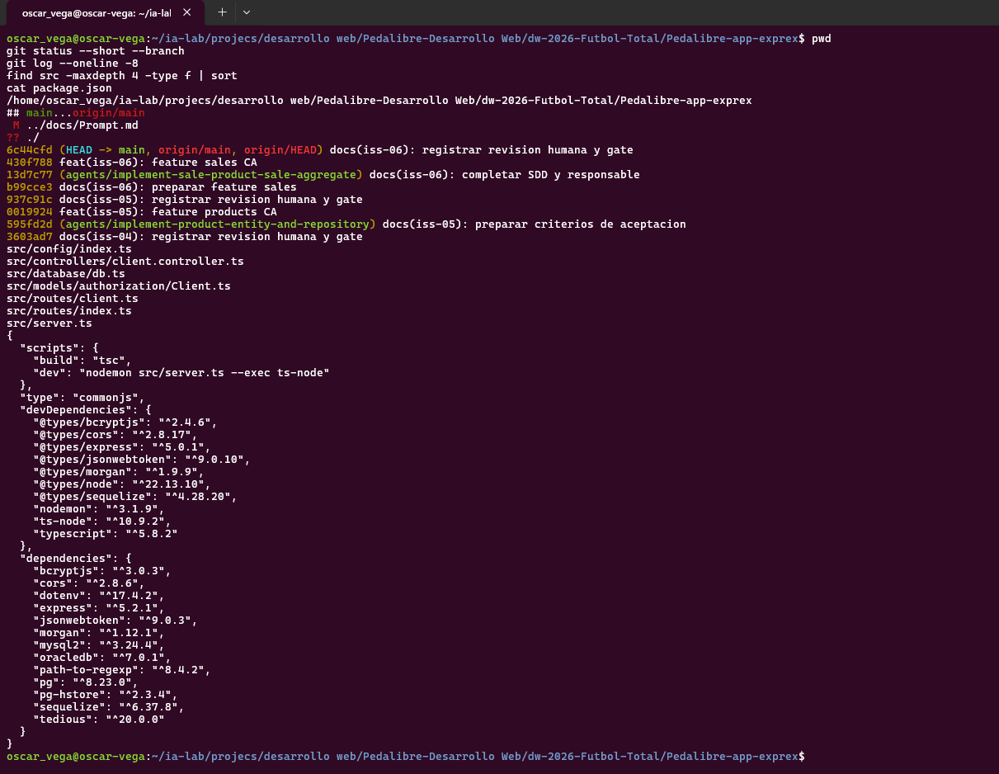

Ejecute:

```bash
pwd
git status --short --branch
git log --oneline -8
find src -maxdepth 4 -type f | sort
cat package.json
```

**Resultado:** identifique el directorio de trabajo, las dependencias y los archivos iniciales. La siguiente comprobacion sera la compilacion TypeScript antes de iniciar o modificar una funcionalidad.


## Comparacion con el manual - ISS-01

Ejecute la comprobacion de estructura y compilacion antes de continuar el desarrollo. Detecte que existen src/config y src/routes, pero faltan src/database/seeders, src/features/business/client y src/features/business/client/http.

La compilacion TypeScript no supero la verificacion. El error TS2307 muestra que src/models/authorization/Client.ts importa ../database/db, una ruta que no existe desde esa ubicacion. Esta situacion confirma que no debo avanzar a las operaciones CRUD ni a los ISS posteriores hasta normalizar la estructura de ISS-01 y resolver la compilacion.

### Evidencia 02 - Comparacion de estructura y compilacion

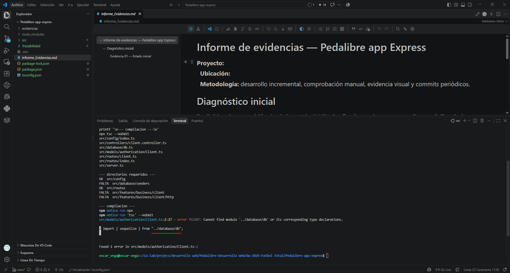

Ejecute find src -type f | sort, la comprobacion de los cinco directorios requeridos y npx tsc --noEmit.

**Resultado:** ISS-01 permanece incompleto. Registre las tres carpetas faltantes y el error TS2307 como condiciones que debo resolver antes de iniciar ISS-03-A.


## Cierre de estructura y compilacion - ISS-01

Corrijo la ruta relativa del import de Sequelize en el modelo heredado Client y ejecuto la compilacion TypeScript sin emitir archivos. La creacion de las carpetas requeridas queda pendiente de una comprobacion independiente.

### Evidencia 03 - Compilacion TypeScript exitosa

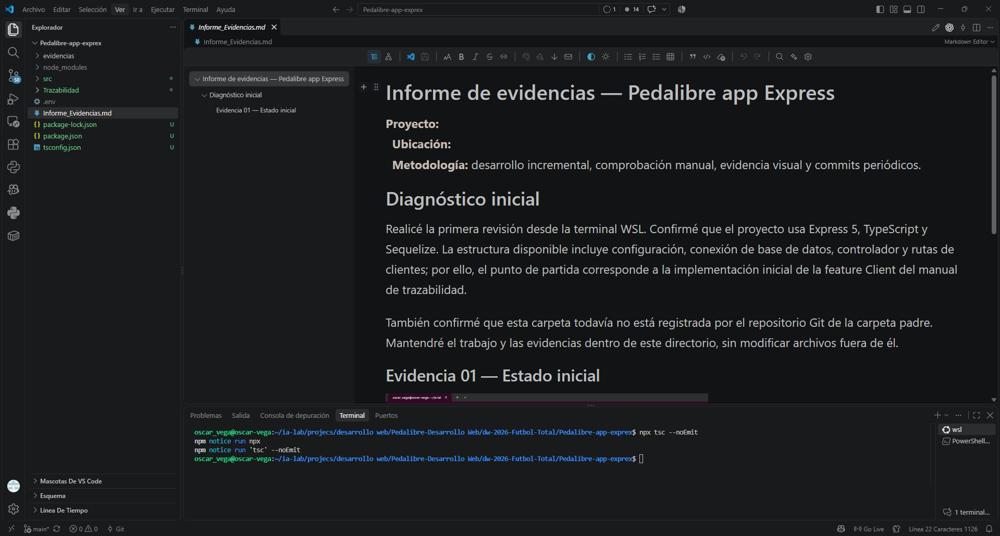

**Resultado:** npx tsc --noEmit finalizo sin errores. Con esto elimine el bloqueo de compilacion detectado en la Evidencia 02. Las carpetas requeridas por ISS-01 y la migracion del modelo Client a la estructura oficial permanecen pendientes.


## Estructura requerida creada - ISS-01

Creo las carpetas src/database/seeders y src/features/business/client indicadas por el manual. Verifico el arbol de directorios y ejecuto otra vez la compilacion TypeScript.

### Evidencia 04 - Estructura de ISS-01 y compilacion

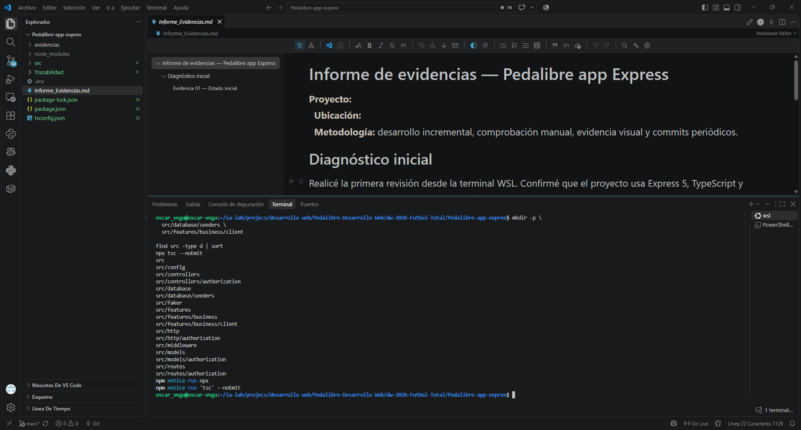

**Resultado:** el arbol ya incluye src/database/seeders y src/features/business/client. La compilacion termina sin errores. Antes de cerrar ISS-01 debo ejecutar npm run dev, como exige el manual.


## Arranque con base de datos - ISS-01

Inicio el servidor con npm run dev. Confirmo que nodemon ejecuta ts-node, que la aplicacion usa el puerto 3001, que MySQL responde y que Sequelize sincroniza la base de datos.

### Evidencia 05 - Servidor y base de datos operativos

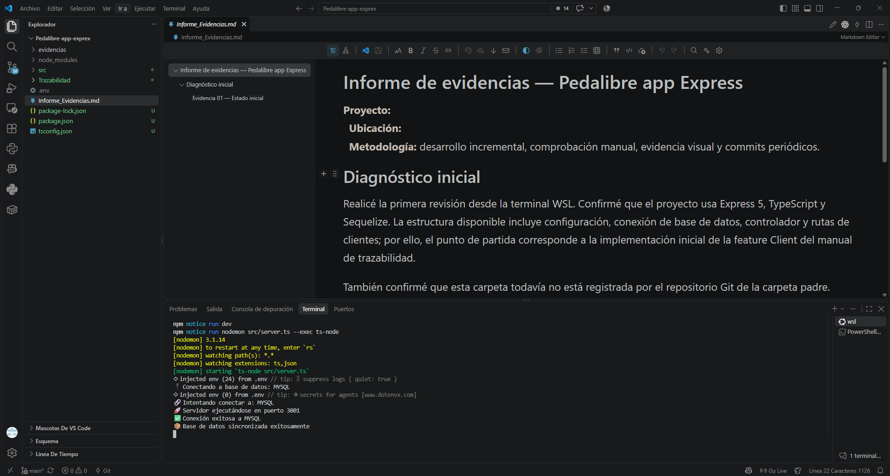

**Resultado:** el servidor inicia, la conexion a MySQL es exitosa y la base de datos se sincroniza. Con las evidencias de estructura y compilacion, ISS-01 queda comprobado para el alcance inicial.


## Commit de seguimiento - ISS-01

Registro la base inicial, la estructura creada, el informe y las cinco evidencias del hito ISS-01 en un commit exclusivo de Pedalibre-app-exprex. Envio el commit a la rama remota main.

### Evidencia 06 - Commit y push exitosos

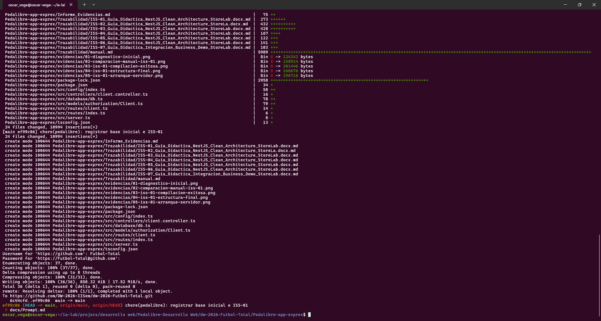

**Commit:** ef99c06 chore(pedalibre): registrar base inicial e ISS-01

**Resultado:** GitHub recibio 36 objetos y actualizo main. El estado final conserva solamente la modificacion externa docs/Prompt.md, que no forma parte de este proyecto ni de este commit.


## Verificacion de infraestructura - ISS-02

Verifico las dependencias de Sequelize, los archivos de infraestructura y la compilacion TypeScript. Confirmo que mysql2, oracledb, pg-hstore, pg, sequelize y tedious estan instalados, y que existen src/database/db.ts y src/database/seeders.

### Evidencia 07 - Dependencias y archivos de ISS-02

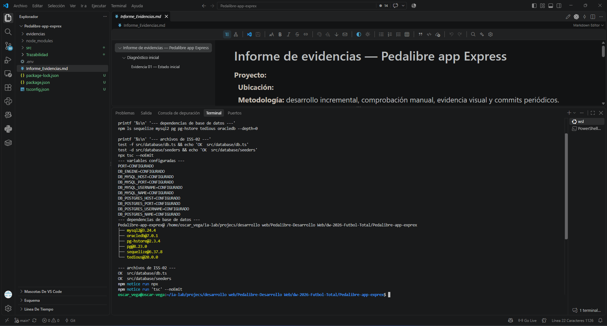

**Resultado:** las dependencias requeridas estan disponibles, la infraestructura de base de datos existe y TypeScript compila sin errores. La evidencia muestra los nombres de las variables de entorno sin revelar sus valores.


## Configuracion segura y motores - ISS-02

Reviso las variables de entorno sin imprimir sus valores y comparo los motores declarados con la implementacion de src/database/db.ts. Confirmo bloques de configuracion para MySQL, PostgreSQL, MSSQL y Oracle. El modulo actual implementa MySQL y PostgreSQL como motores seleccionables.

### Evidencia 08 - Variables y motores configurados

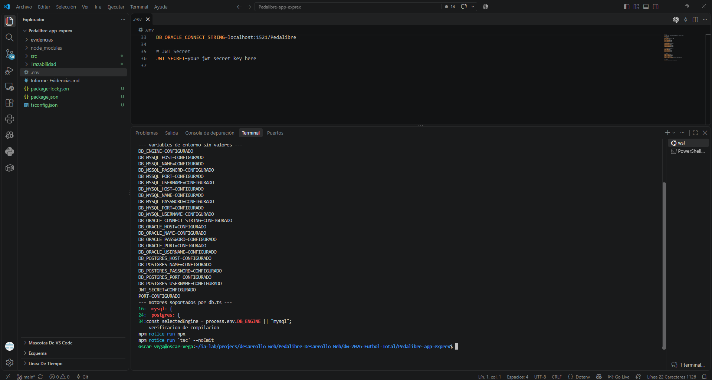

**Resultado:** las variables requeridas existen sin exponer valores en la salida de la terminal. db.ts declara MySQL y PostgreSQL, y npx tsc --noEmit finaliza sin errores. ISS-02 queda comprobado.


## Commit de seguimiento - ISS-02

Registro la documentacion de la verificacion de ISS-02 y las evidencias pendientes desde el commit anterior. Envio el commit a origin/main.

### Evidencia 09 - Commit y push de ISS-02

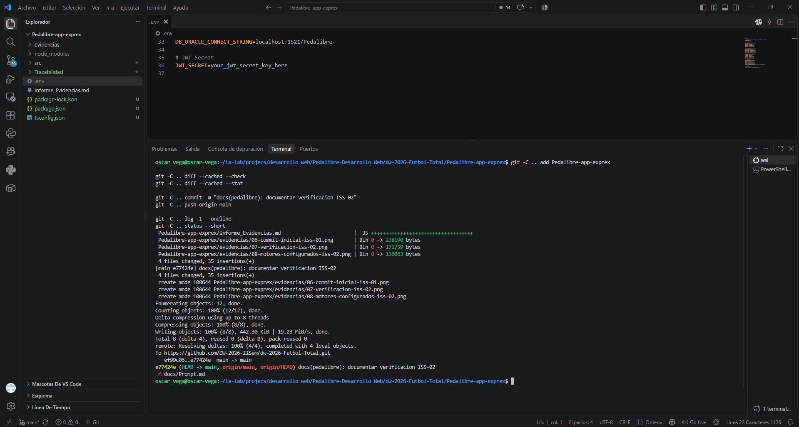

**Commit:** e77424e docs(pedalibre): documentar verificacion ISS-02

**Resultado:** el remoto main se actualizo correctamente. Solo permanece modificada la ruta externa docs/Prompt.md, que no pertenece a Pedalibre-app-exprex.


## Diagnostico de Client - ISS-03-A

Comparo la feature Client requerida por el manual con la implementacion heredada. Confirmo que faltan client.model.ts, client.controller.ts, client.routes.ts y la carpeta http dentro de src/features/business/client.

El modelo heredado usa status ACTIVE e INACTIVE, defaultValue ACTIVE y timestamps false. Aunque TypeScript compila, este modelo no cumple la convencion ni la ubicacion definida para ISS-03-A.

### Evidencia 10 - Diagnostico previo de ISS-03-A

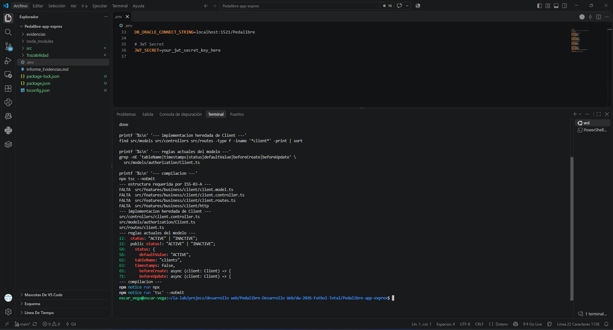

**Resultado:** debo crear la feature Client oficial sin eliminar todavia el codigo heredado. El siguiente paso sera construir el modelo nuevo y verificar su compilacion.


## Modelo oficial de Client - ISS-03-A

Creo el modelo oficial en src/features/business/client y la carpeta http. El modelo usa status active e inactive, default inactive, timestamps true y hooks de bcrypt para proteger la contrasena.

### Evidencia 11 - Modelo y carpeta HTTP de Client

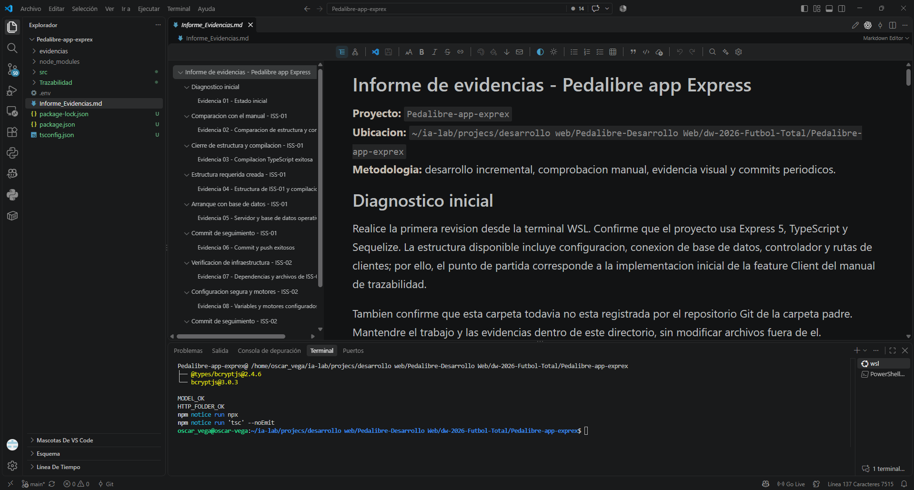

**Resultado:** bcryptjs y sus tipos estan instalados. El modelo y la carpeta HTTP existen, y npx tsc --noEmit finaliza sin errores.


## Esqueletos de Client - ISS-03-A

Creo los archivos client.controller.ts y client.routes.ts en la feature oficial. Mantengo los metodos como esqueletos porque el CRUD inicia en los sub-ISS posteriores.

### Evidencia 12 - Controller y routes de Client

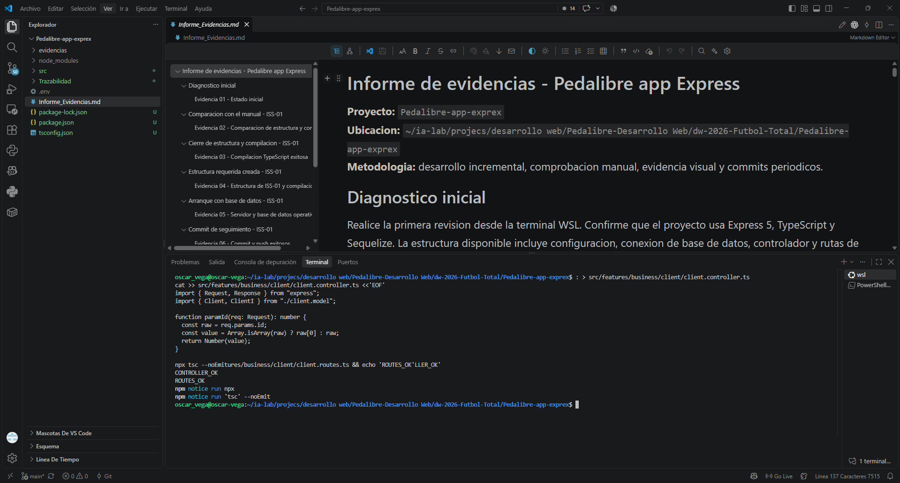

**Resultado:** controller y routes oficiales existen. La compilacion TypeScript termina sin errores.


## Cableado de Client - ISS-03-A

Reemplazo el agregador de rutas heredado y conecto el modelo Client oficial con App. El arranque ahora crea Routes, registra la feature y sincroniza Sequelize con alter true para alinear timestamps sin recrear la base de datos.

### Evidencia 13 - Cableado y compilacion de Client

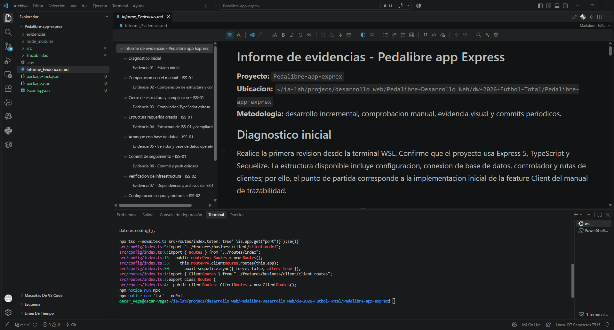

**Resultado:** config importa el modelo y Routes; routePrv registra Client; la sincronizacion usa force false y alter true. TypeScript termina sin errores.


## Arranque y sincronizacion de Client - ISS-03-A

Inicio la aplicacion despues de conectar el modelo Client oficial. Confirmo que nodemon ejecuta el servidor, MySQL responde y Sequelize sincroniza la base de datos con la configuracion actual.

### Evidencia 14 - Arranque con Client sincronizado

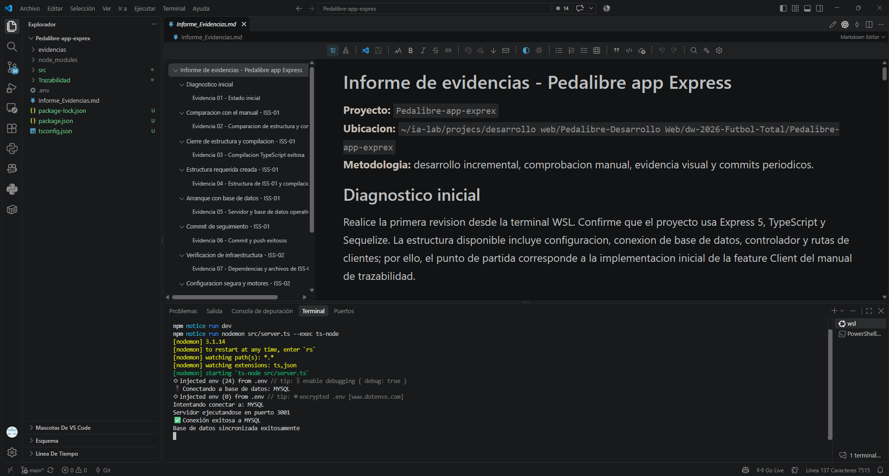

**Resultado:** el servidor inicia en el puerto 3001, MySQL responde correctamente y la sincronizacion termina sin error.


## Estructura real de clients - ISS-03-A

Consulto directamente la tabla clients despues de sincronizar la aplicacion. Verifico que Sequelize aplico la estructura del modelo oficial.

### Evidencia 15 - Tabla clients con timestamps

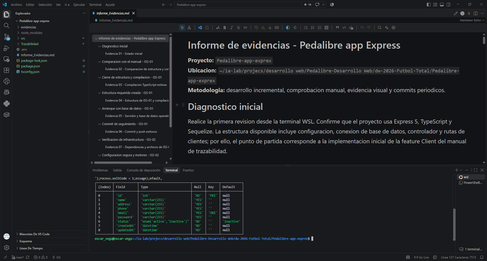

**Resultado:** la tabla contiene id, name, address, phone, email, password, status, createdAt y updatedAt. status usa enum active e inactive y su valor por defecto es inactive. ISS-03-A queda comprobado.


## Commit funcional - ISS-03-A

Registro la fundacion de la feature Client, incluyendo modelo oficial, esqueletos, cableado y comprobaciones.

### Evidencia 16 - Commit y push de ISS-03-A

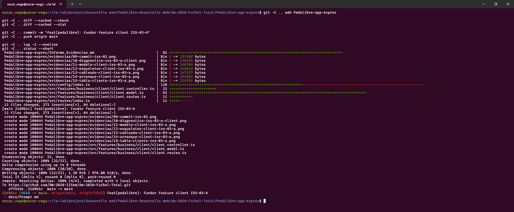

**Commit:** 21d9b1c feat(pedalibre): fundar feature client ISS-03-A

**Resultado:** el commit se envio correctamente a origin/main.

## Consultas de Client - ISS-03-B

Implemente GET /api/clientes y GET /api/clientes/:id. Durante la primera comprobacion detecte que las respuestas exponian el campo password. Corrijo el problema excluyendo password en las consultas publicas antes de cerrar el hito.

### Evidencia 17 - Implementacion y compilacion de consultas

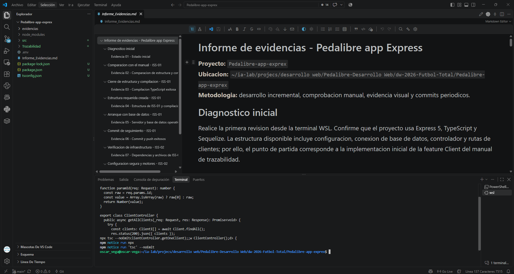

### Evidencia 18 - Prueba inicial de consultas

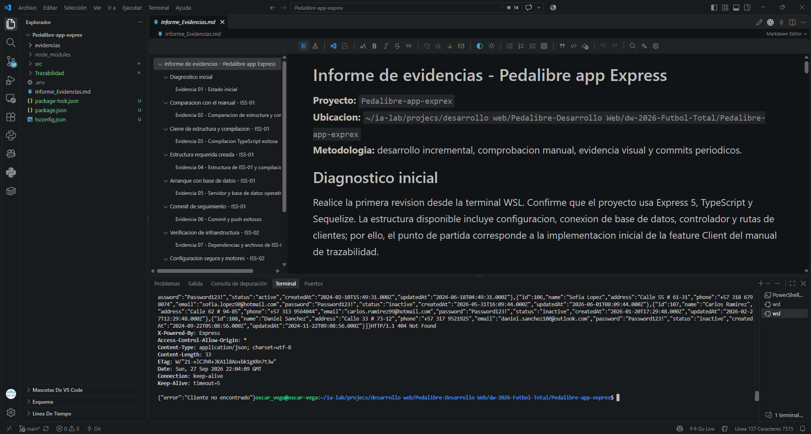

### Evidencia 19 - Password oculto y cliente inexistente

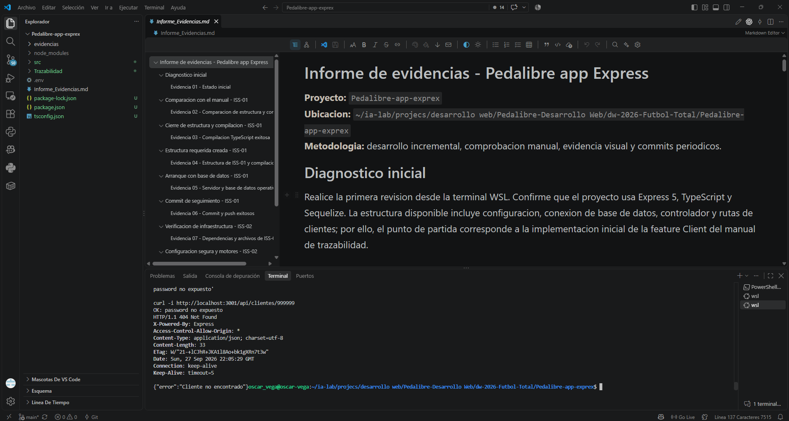

### Evidencia 20 - Consulta individual segura

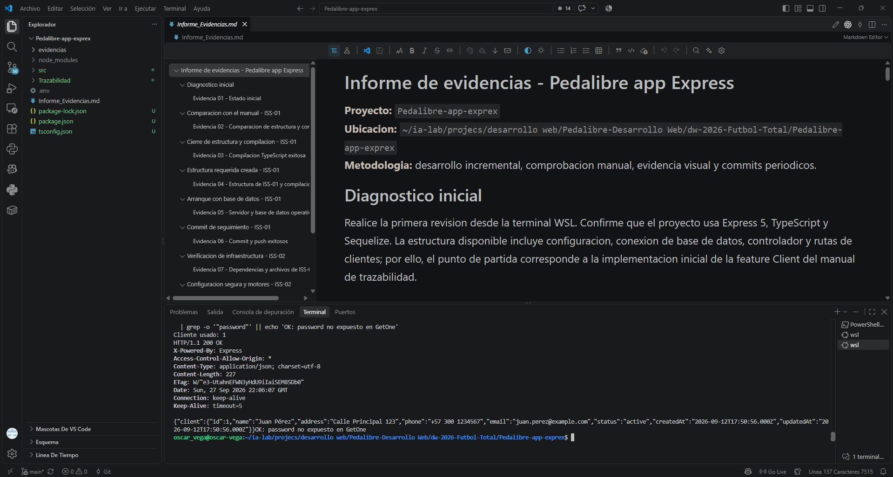

**Resultado:** GET /api/clientes/:id responde 200 para un cliente existente y 404 para uno inexistente. Las respuestas publicas no exponen password.

### Evidencia 21 - Commit y push de ISS-03-B

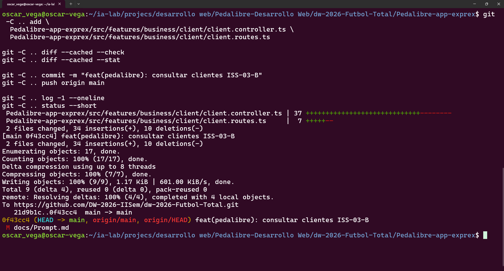

**Commit:** 0f43cc4 feat(pedalibre): consultar clientes ISS-03-B

## Creacion de Client - ISS-03-C

Implemente POST /api/clientes. La creacion devuelve el cliente sin password, usa inactive por defecto y responde 409 cuando el correo ya existe. Tambien comprobe en la base de datos que la contrasena se almacena como hash bcrypt.

### Evidencia 22 - Implementacion y compilacion de creacion

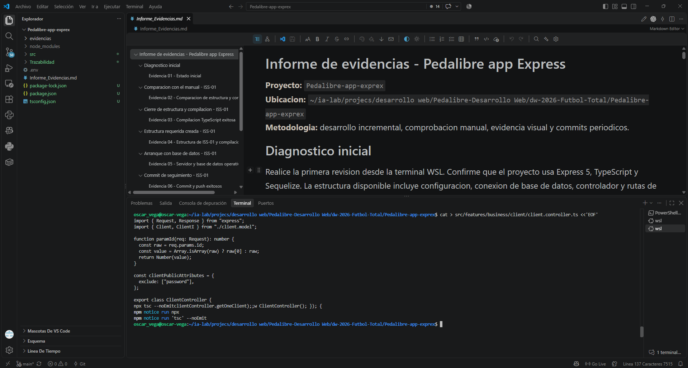

### Evidencia 23 - Creacion y correo duplicado

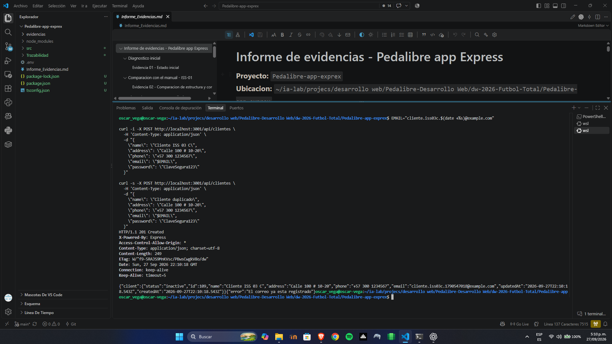

### Evidencia 24 - Hash bcrypt y conflicto 409

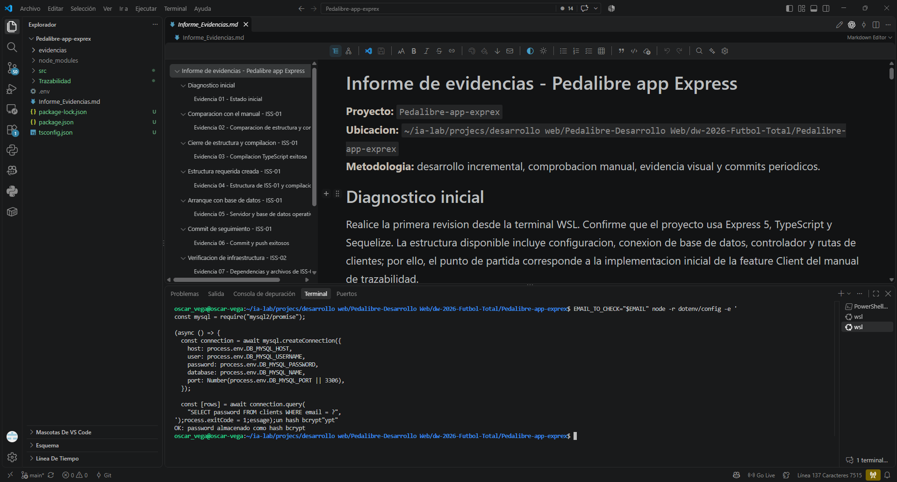

**Resultado:** POST crea un cliente con 201, devuelve status inactive sin password, rechaza el correo duplicado con 409 y persiste la contrasena como hash bcrypt.

### Evidencia 25 - Commit y push de ISS-03-C

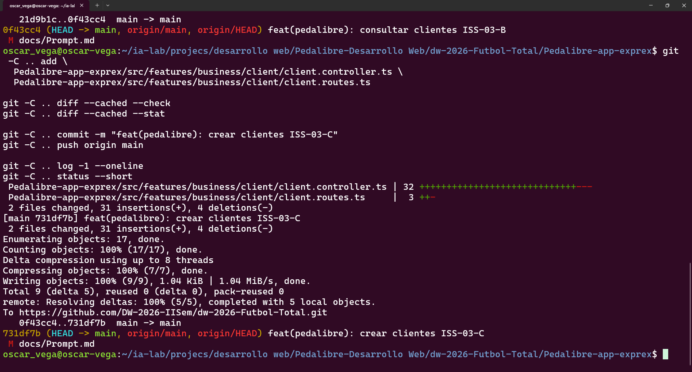

**Commit:** 731df7b feat(pedalibre): crear clientes ISS-03-C


## Actualizacion de Client - ISS-03-D

Implemente PUT y PATCH con una lista de campos permitidos. Durante la primera prueba detecte que Express perdia el contexto this del controller; corrijo las rutas con funciones envolventes. Tambien ajusto el tipado de status para respetar active e inactive.

### Evidencia 26 - Correccion de tipado de actualizacion

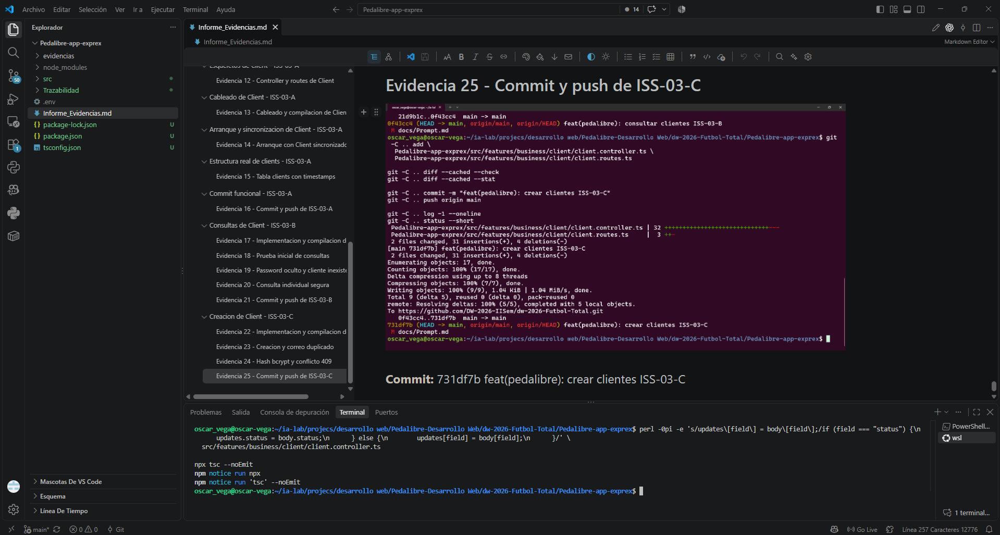

### Evidencia 27 - Error de contexto detectado

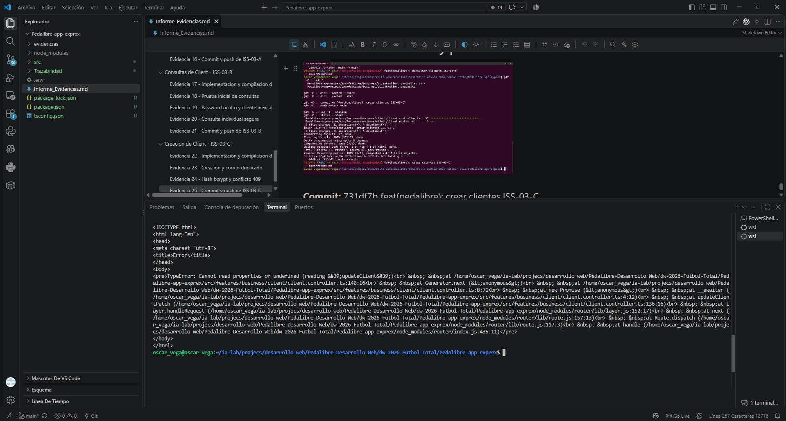

### Evidencia 28 - PATCH, PUT y validacion de cuerpo vacio

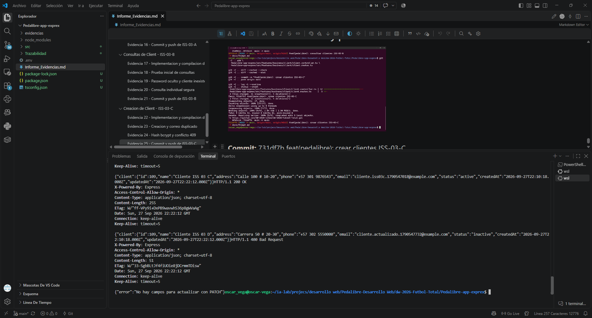

**Resultado:** PATCH actualizo telefono y status con 200. PUT actualizo los datos completos con 200. PATCH sin campos respondio 400. Las respuestas no exponen password.


### Evidencia 29 - Commit y push de ISS-03-D

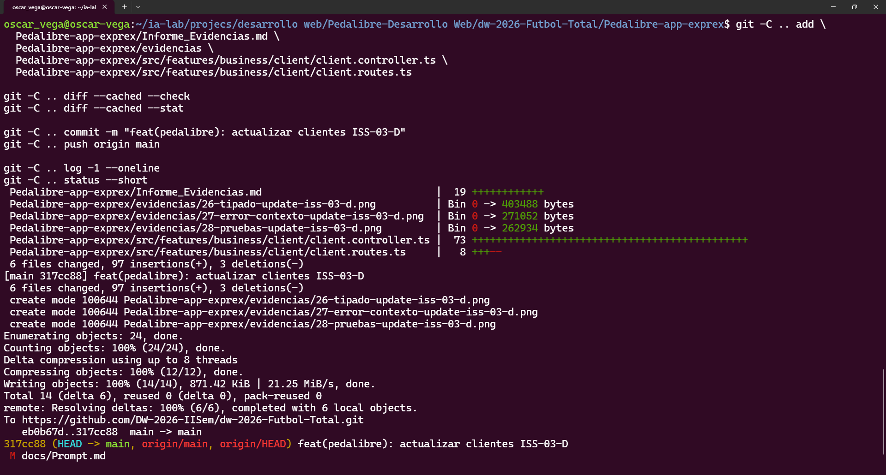

**Commit:** 317cc88 feat(pedalibre): actualizar clientes ISS-03-D

**Resultado:** el codigo de PUT y PATCH, el informe y las evidencias de ISS-03-D fueron enviados correctamente a origin/main.


## Eliminacion fisica y logica - ISS-03-E

Implemente DELETE fisico y PATCH deactivate. En la primera comprobacion el identificador dinamico no se transfirio al proceso Node y la URL quedo incompleta. Corrijo la prueba usando el id real creado y verifico el ciclo completo.

### Evidencia 30 - Implementacion y compilacion de eliminacion

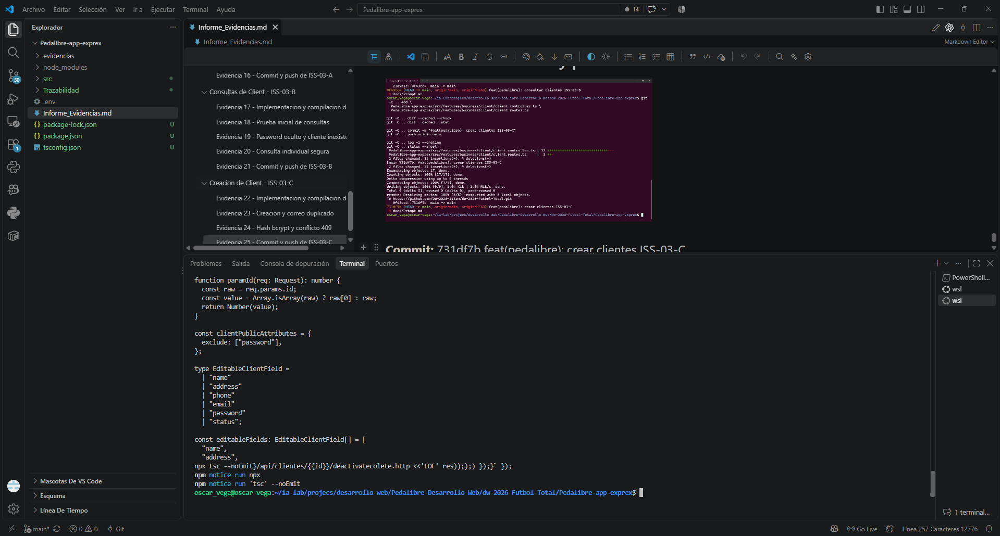

### Evidencia 31 - Diagnostico de identificador vacio

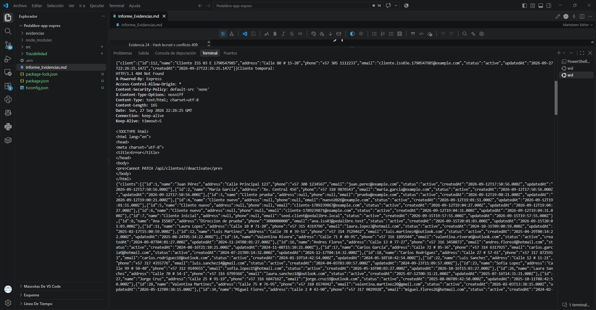

### Evidencia 32 - Baja logica y borrado fisico verificados

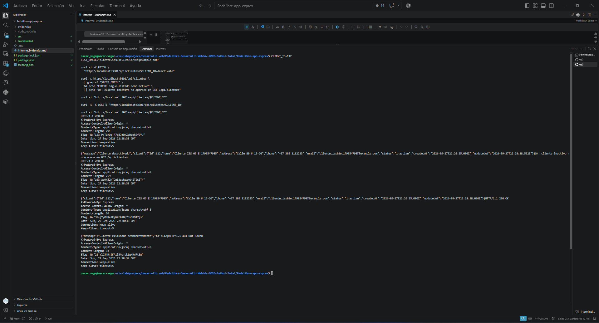

**Resultado:** PATCH deactivate devuelve 200 e inactiva el cliente. GET /api/clientes deja de listarlo, GET por id lo conserva como inactive, DELETE lo elimina con 200 y el GET posterior devuelve 404. ISS-03-E queda comprobado.
