# Informe de ejecución — Pedalibre

## Introducción

Este informe registra la ejecución individual del manual de ingeniería de sistemas para el proyecto **Pedalibre**. El trabajo comienza con **ISS-00 — Requisitos previos**. Se avanzará siguiendo el manual y registrando en orden qué se hizo, qué resultado se obtuvo y qué evidencia lo demuestra.

El manual de referencia es `Guia-unificada.md`, sección ISS-00 — Requisitos previos. El proyecto de referencia que aparece en el manual se llama `app-storelab-express-ii`; en este trabajo se aplica el procedimiento a Pedalibre. El contexto del proyecto contempla MySQL, PostgreSQL, Oracle y Microsoft SQL Server (MSSQL). Para el primer `sync`, el manual recomienda MySQL; por eso ISS-00 comprobará MySQL, sin afirmar que los otros motores están verificados.

## Forma de completar el informe

Una sola persona ejecuta el procedimiento y completa este informe de forma progresiva. Al inicio solo se documenta la introducción y el paso que se va a realizar. Después de ejecutar el paso, se incorporan su resultado real, fecha y captura; únicamente entonces se añade el siguiente paso. Así, las secciones futuras no aparecen como trabajo ya realizado ni se rellenan con resultados supuestos.

Para cada paso: consultar el manual, ejecutar la instrucción en orden, verificar el resultado, guardar una captura legible en [`trazabilidad/`](trazabilidad/) y completar su registro aquí antes de continuar. Usar nombres secuenciales como `E-ISS00-P01-01-version-node.png`. No mostrar credenciales, tokens, contraseñas ni datos personales.

Toda diferencia respecto al manual se registra cuando ocurre, indicando la instrucción de referencia, la adaptación, la justificación contextual o técnica y cómo se verificó. Si puede afectar un requisito obligatorio, no se avanza hasta resolverla o marcar el criterio como pendiente/bloqueado.

Al completar un ISS, se revisa su GATE. Los commits se realizan en hitos estables y se registran aquí cuando se creen.

## ISS-00 — Requisitos previos

**Objetivo del manual:** dejar listo el entorno para el laboratorio.  
**Dependencias:** ninguna.  
**Referencia:** `Guia-unificada.md`, sección ISS-00 — Requisitos previos.  
**Contexto:** Pedalibre contempla MySQL, PostgreSQL, Oracle y Microsoft SQL Server (MSSQL). Para el primer `sync`, el manual recomienda MySQL; se comprobará ese motor en ISS-00.

### Paso 1 — Comprobar Node.js *(completado)*

**Referencia:** ISS-00, “Pasos”; criterio de versión de Node.js.  
**Acción:** en una terminal del entorno donde se trabajará en Pedalibre, ejecutar:

```text
node -v
```

**Captura:** mostrar el comando y su salida completa y legible. La terminal debe permitir reconocer que la consulta se hizo en el entorno de trabajo; no incluir información sensible.

**Registro de ejecución:**

- **Fecha:** 2026-10-04.
- **Hora:** no visible en la captura.
- **Resultado observado:** `node -v` respondió `v24.21.0`.
- **Criterio del manual:** Node.js v20 o superior (v24.x en el laboratorio).
- **Estado:** Cumple.
- **Evidencia:** [`E-ISS00-P01-01-version-node.png`](trazabilidad/E-ISS00-P01-01-version-node.png).

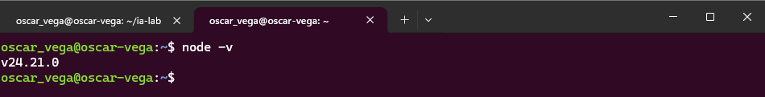

**Criterio de Node.js en ISS-00:** cumplido.

**Conclusión:** Comprobé la versión de Node.js y confirmé que `v24.21.0` cumple el requisito del manual.

### Paso 2 — Comprobar npm *(completado)*

**Referencia:** ISS-00, “Pasos”; criterio de que `npm -v` responda.  
**Acción:** en la misma terminal del entorno de trabajo, ejecutar:

```text
npm -v
```

**Captura:** mostrar el comando y la versión que devuelve npm, con texto legible.

**Registro de ejecución:**

- **Fecha:** 2026-10-04.
- **Resultado observado:** `npm -v` respondió `12.1.0`.
- **Criterio del manual:** `npm -v` responde.
- **Estado:** Cumple.
- **Evidencia:** [`E-ISS00-P02-01-version-npm.png`](trazabilidad/E-ISS00-P02-01-version-npm.png).

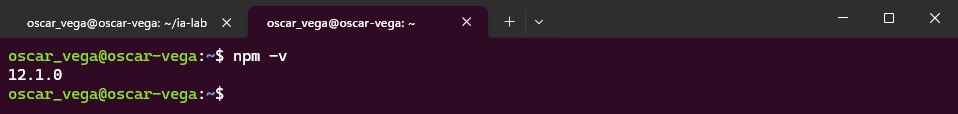

**Conclusión:** Comprobé que npm responde y registré la versión `12.1.0`.

### Paso 3 — Comprobar acceso a MySQL *(completado)*

**Referencia:** ISS-00, criterio de motor de base de datos accesible.  
**Acción:** comprobar que el servicio MySQL que se usará con Pedalibre está accesible. No mostrar contraseñas ni datos de conexión secretos.

**Registro de ejecución:**

- **Fecha:** 2026-10-04.
- **Resultado observado:** `mysql -h 127.0.0.1 -u root -p -e "SELECT 1;"` se ejecutó correctamente y devolvió `1`.
- **Criterio del manual:** un motor de base de datos es accesible; MySQL es el recomendado para el primer `sync`.
- **Estado:** Cumple.
- **Evidencia:** [`E-ISS00-P03-01-acceso-mysql.png`](trazabilidad/E-ISS00-P03-01-acceso-mysql.png).

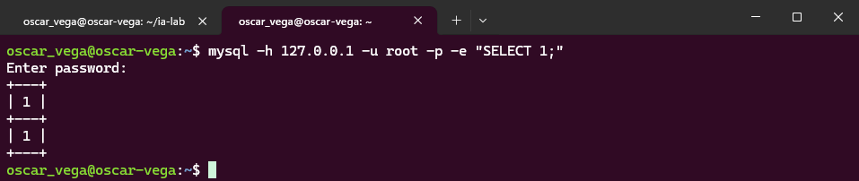

**Conclusión:** Verifiqué que pude conectarme a MySQL y que la consulta `SELECT 1` devolvió `1`.

### Paso 4 — Verificación conjunta de Node.js y npm *(completado)*

**Referencia:** ISS-00, “Verificación del ISS”.  
**Acción:** ejecutar en la misma terminal:

```bash
node -v && npm -v
```

**Registro de ejecución:**

- **Fecha:** 2026-10-04.
- **Resultado observado:** `node -v` respondió `v24.21.0` y `npm -v` respondió `12.1.0`.
- **Criterio del manual:** verificar las versiones de Node.js y npm.
- **Estado:** Cumple.
- **Evidencia:** [`E-ISS00-P04-01-verificacion-node-npm.png`](trazabilidad/E-ISS00-P04-01-verificacion-node-npm.png).

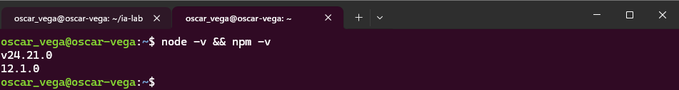

**Conclusión:** Verifiqué en una sola ejecución que Node.js está en la versión `v24.21.0` y npm en la versión `12.1.0`; ambas respuestas coinciden con los resultados registrados en los pasos anteriores.

## Cierre de ISS-00

Completé los criterios de aceptación indicados por el manual: confirmé Node.js v20 o superior, verifiqué que npm responde y comprobé que MySQL es accesible mediante `SELECT 1`. La verificación conjunta de Node.js y npm también terminó correctamente.

**Resultado del GATE de ISS-00:** cumplido.  
**Desviaciones respecto al manual:** ninguna.  
**Evidencias:** `E-ISS00-P01-01` a `E-ISS00-P04-01`, guardadas en [`trazabilidad/`](trazabilidad/).

## ISS-01 — Esqueleto del proyecto

**Objetivo del manual:** preparar el proyecto npm con TypeScript, Express, estructura por features y servidor HTTP base.  
**Dependencia:** ISS-00, completado.  
**Referencia:** `Guia-unificada.md`, ISS-01, subítem 2.1 — Inicializar npm y scripts.

**Adaptación de ubicación:** el manual muestra crear una carpeta de ejemplo `app-storelab-express`. Como el espacio de trabajo para Pedalibre ya fue definido como `Proyecto Backend-2026`, la inicialización se realizará directamente ahí, sin crear una carpeta anidada con el nombre de ejemplo. Se conserva el objetivo del paso: inicializar npm en la raíz de trabajo.

### Paso 1 — Inicializar npm *(completado)*

**Acción:** abrir una terminal y ejecutar:

```bash
cd "/home/oscar_vega/ia-lab/projecs/desarrollo web/Pedalibre-Desarrollo Web/dw-2026-Futbol-Total/Proyecto Backend-2026"
npm init -y
```

**Captura:** mostrar que la terminal está en `Proyecto Backend-2026` y el resultado de `npm init -y`.

**Registro de ejecución:**

- **Fecha:** 2026-10-04.
- **Resultado observado:** `npm init -y` creó `package.json` con el nombre `proyecto-backend-2026` y `"type": "commonjs"`.
- **Estado:** Cumple.
- **Evidencia:** [`E-ISS01-P01-01-inicializar-npm.png`](trazabilidad/E-ISS01-P01-01-inicializar-npm.png).

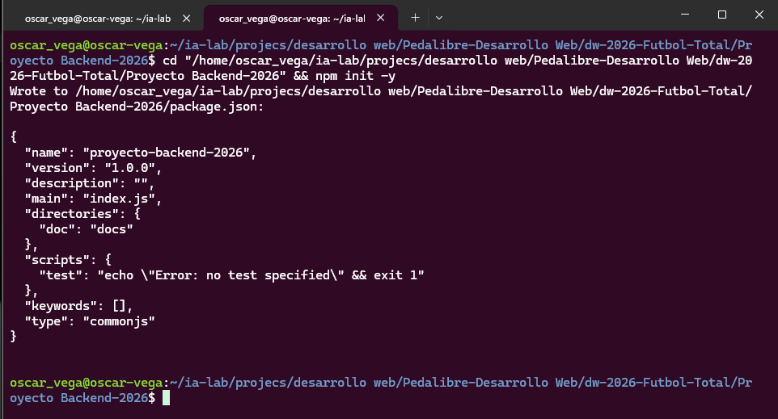

**Conclusión:** Inicialicé npm dentro de `Proyecto Backend-2026` y confirmé que se creó `package.json`.

**Adaptación:** inicialicé el proyecto en la carpeta existente `Proyecto Backend-2026` en lugar de crear `app-storelab-express` como muestra el manual. La carpeta `docs/` ya existía, por lo que no fue necesario crearla de nuevo.

### Paso 2 — Configurar scripts y tipo de módulo *(completado)*

**Referencia:** ISS-01, subítem 2.1 — Inicializar npm y scripts.  
**Acción:** desde `Proyecto Backend-2026`, ejecutar:

```bash
npm pkg set "scripts.build=tsc" "scripts.dev=nodemon --watch src --ext ts --exec ts-node -- src/server.ts" "type=commonjs"
node -e "const p=require('./package.json'); console.log(JSON.stringify({scripts:p.scripts,type:p.type},null,2))"
```

**Captura:** mostrar los comandos y confirmar que `build`, `dev` y `type: commonjs` aparecen en la salida.

**Registro de ejecución:**

- **Fecha:** 2026-10-04.
- **Resultado observado:** `package.json` contiene los scripts `build: tsc` y `dev: nodemon --watch src --ext ts --exec ts-node -- src/server.ts`, además de `"type": "commonjs"`.
- **Estado:** Cumple.
- **Evidencia:** [`E-ISS01-P02-01-scripts-package.png`](trazabilidad/E-ISS01-P02-01-scripts-package.png).

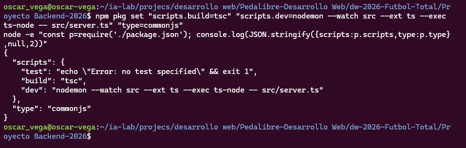

**Conclusión:** Configuré y verifiqué los scripts `build` y `dev` y confirmé que el proyecto usa módulos CommonJS.

### Paso 3 — Crear la estructura de carpetas *(completado)*

**Referencia:** ISS-01, subítem 2.2 — Estructura de carpetas (features).  
**Acción:** desde `Proyecto Backend-2026`, ejecutar:

```bash
mkdir -p src/config src/database/seeders src/routes src/shared/errors src/shared/http src/shared/database src/features/business/clients
find src -type d | sort
```

**Captura:** mostrar el comando y el árbol de directorios creado.

**Registro de ejecución:**

- **Fecha:** 2026-10-04.
- **Resultado observado:** se crearon las carpetas `config`, `database/seeders`, `routes`, `shared` y `features/business/clients`, incluidas las subcarpetas solicitadas.
- **Estado:** Cumple.
- **Evidencia:** [`E-ISS01-P03-01-estructura-carpetas.png`](trazabilidad/E-ISS01-P03-01-estructura-carpetas.png).

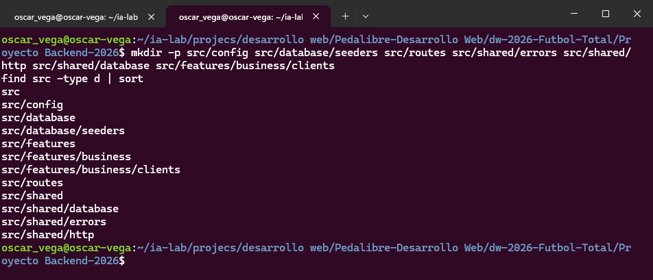

**Conclusión:** Creé y verifiqué la estructura base de `src/` requerida por el manual.

### Paso 4 — Instalar dependencias base *(completado; auditoría pendiente)*

**Referencia:** ISS-01, subítem 2.3 — Dependencias base (Express + TypeScript).  
**Acción:** desde `Proyecto Backend-2026`, ejecutar:

```bash
npm install express@^5.2.1 cors@^2.8.6 dotenv@^17.4.2 morgan@^1.12.1
npm install -D typescript@~5.9.2 ts-node@^10.9.2 nodemon@^3.1.14 @types/node@^22.20.3 @types/express@^5.0.6 @types/cors@^2.8.19 @types/morgan@^1.9.10
npm ls --depth=0
```

**Captura:** mostrar la instalación y la salida de `npm ls --depth=0`.

**Registro de ejecución:**

- **Fecha:** 2026-10-04.
- **Resultado observado:** se instalaron las dependencias y `npm ls --depth=0` mostró el árbol esperado. npm informó 3 vulnerabilidades de severidad alta.
- **Estado del criterio de dependencias:** Cumple.
- **Estado de revisión de vulnerabilidades:** Pendiente; no ignorar ni remediar automáticamente.
- **Evidencia:** [`E-ISS01-P04-01-dependencias-base.png`](trazabilidad/E-ISS01-P04-01-dependencias-base.png).

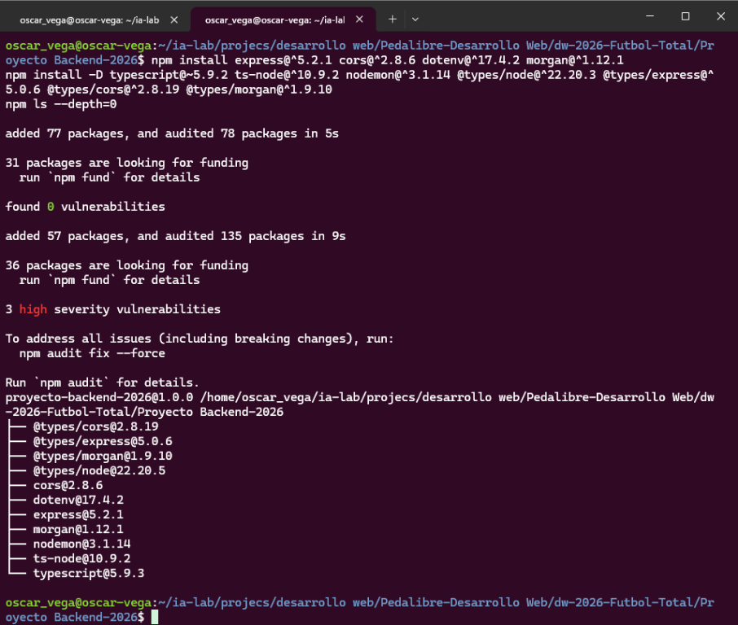

**Conclusión:** Instalé y comprobé las dependencias base. También registré que npm reporta tres vulnerabilidades altas, cuya causa y alcance aún debo revisar.

### Paso 5 — Revisar vulnerabilidades de dependencias *(registrado)*

**Acción:** ejecuté `npm audit` para identificar las vulnerabilidades reportadas durante la instalación.

**Resultado observado:** npm reportó **17 vulnerabilidades: 7 altas y 10 moderadas**. La salida identifica, entre otras, alertas altas en `braces` (consumo no controlado de recursos) y `cross-spawn` (ReDoS), y alertas moderadas relacionadas con `decode-uri-component`, `got` y `undici`. La salida indica que existen correcciones disponibles con `npm audit fix`; no se aplicó ninguna corrección en esta revisión.

**Evidencia:** [`E-ISS01-P05-01-npm-audit.png`](trazabilidad/E-ISS01-P05-01-npm-audit.png).

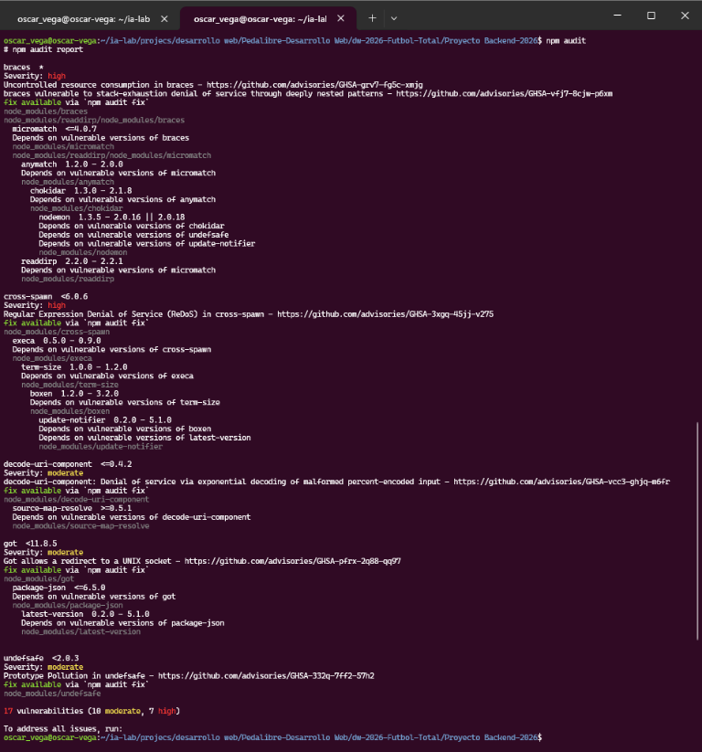

**Conclusión:** Revisé el informe de npm y confirmé que hay vulnerabilidades transitivas en el árbol de dependencias. No ejecuté una corrección automática; dejo registrado el hallazgo para decidir su tratamiento sin introducir cambios no verificados.

### Paso 6 — Configurar TypeScript *(archivo creado; verificación pendiente)*

**Referencia:** ISS-01, subítem 2.4 — TypeScript (`tsconfig.json`).  
**Acción:** desde `Proyecto Backend-2026`, ejecutar:

```bash
cat > tsconfig.json <<'EOF'
{
  "compilerOptions": {
    "rootDir": "./src",
    "outDir": "./dist",
    "module": "commonjs",
    "target": "ES2020",
    "lib": ["ES2020"],
    "types": ["node"],
    "esModuleInterop": true,
    "resolveJsonModule": true,
    "sourceMap": true,
    "strict": true,
    "skipLibCheck": true,
    "moduleDetection": "force",
    "isolatedModules": true,
    "forceConsistentCasingInFileNames": true
  },
  "include": ["src/**/*"],
  "exclude": ["node_modules", "dist"]
}
EOF
test -f tsconfig.json && npx tsc --showConfig | head -20
```

**Captura:** mostrar la creación de `tsconfig.json` y las opciones principales reportadas, especialmente `rootDir`, `outDir` y `strict`.

**Registro de ejecución — completar después de realizar el paso:**

- **Fecha:** 2026-10-04.
- **Resultado observado:** `tsconfig.json` existe con las opciones requeridas. La primera comprobación devolvió `TS18003` porque todavía no había archivos TypeScript en `src/`. Después de crear `src/server.ts`, `npx tsc --showConfig` mostró la configuración efectiva, incluyendo `rootDir`, `outDir` y `strict`, sin ese error.
- **Estado:** Cumple; configuración reconocida por TypeScript después de crear el primer archivo fuente.
- **Evidencia:** configuración inicial en [`E-ISS01-P06-01-tsconfig.png`](trazabilidad/E-ISS01-P06-01-tsconfig.png); verificación posterior al añadir los archivos fuente en [`E-ISS01-P09-01-typescript.png`](trazabilidad/E-ISS01-P09-01-typescript.png).

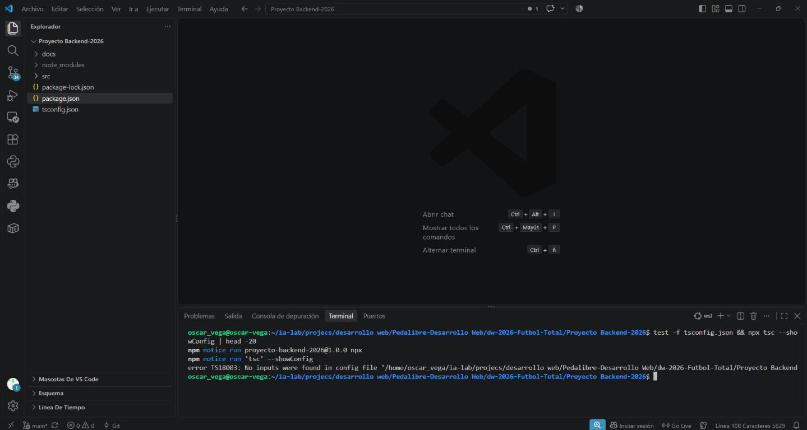

**Conclusión:** Creé `tsconfig.json` con `rootDir`, `outDir` y `strict` según el manual. Tras crear los archivos fuente, comprobaré que TypeScript los compile.

### Paso 7 — Crear `src/server.ts` *(completado)*

**Referencia:** ISS-01, subítem 2.5.1 — Servidor y App (esqueleto HTTP).  
**Acción:** desde `Proyecto Backend-2026`, ejecutar:

```bash
cat > src/server.ts <<'EOF'
import { App } from './config/index';

async function main() {
    const app = new App();
    await app.listen();
}

main();
EOF
```

**Captura:** mostrar el explorador del proyecto con `server.ts` dentro de `src/` y la verificación de configuración TypeScript que se ejecutó después de crearlo.

**Registro de ejecución:**

- **Fecha:** 2026-10-04.
- **Resultado observado:** existe `src/server.ts` con la importación de `App`, la función `main` y la llamada a `app.listen()` indicadas por el manual.
- **Estado:** Cumple.
- **Evidencia:** [`E-ISS01-P07-01-server-ts.png`](trazabilidad/E-ISS01-P07-01-server-ts.png).

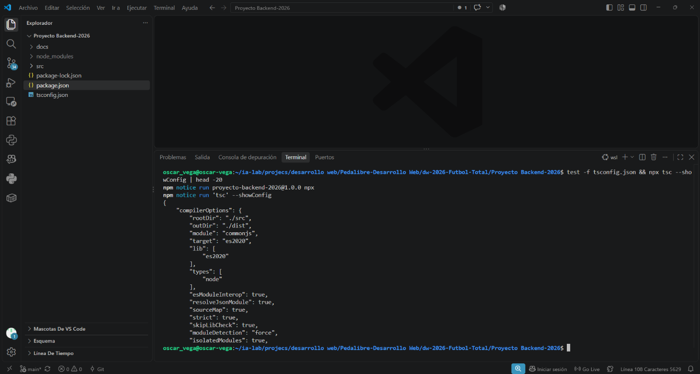

**Conclusión:** Creé `src/server.ts` con la importación de `App` y el arranque de `app.listen()`.

### Paso 8 — Crear el esqueleto de `src/config/index.ts` *(completado)*

**Referencia:** ISS-01, subítem 2.5.2 — `src/config/index.ts` (esqueleto).  
**Acción:** desde `Proyecto Backend-2026`, crear `src/config/index.ts` con:

```bash
cat > src/config/index.ts <<'EOF'
import dotenv from "dotenv";
import express, { Application } from "express";
import cors from "cors";
import morgan from "morgan";

dotenv.config();

export class App {
  public app: Application;

  constructor(private port?: number | string) {
    this.app = express();
    this.settings();
    this.middlewares();
    this.routes();
  }

  private settings(): void {
    this.app.set("port", this.port || process.env.PORT || 4000);
  }

  private middlewares(): void {
    this.app.use(morgan("dev"));
    this.app.use(cors());
    this.app.use(express.json());
    this.app.use(express.urlencoded({ extended: false }));
  }

  private routes(): void {}

  private async dbConnection(): Promise<void> {}

  async listen(): Promise<void> {
    await this.dbConnection();
    await this.app.listen(this.app.get("port"));
    console.log(`Servidor ejecutándose en puerto ${this.app.get("port")}`);
  }
}
EOF
```

Este esqueleto incluye los métodos exigidos para ISS-01. La conexión real a la base de datos y el registro de rutas quedan como placeholders para los ISS siguientes.

**Registro de ejecución:**

- **Fecha:** 2026-10-04.
- **Resultado observado:** `src/config/index.ts` contiene la clase `App` y los métodos `settings`, `middlewares`, `routes`, `dbConnection` y `listen`. La conexión y las rutas permanecen como placeholders.
- **Estado:** Cumple el esqueleto de ISS-01.
- **Evidencia:** [`E-ISS01-P08-01-app-esqueleto.png`](trazabilidad/E-ISS01-P08-01-app-esqueleto.png).

**Conclusión:** Creé la clase `App` y dejé como placeholders las rutas y la conexión real a la base de datos, tal como corresponde al esqueleto inicial.

### Paso 9 — Verificar TypeScript y la estructura *(completado)*

**Referencia:** Verificación del ISS-01.  
**Acción:** ejecutar dentro de `Proyecto Backend-2026`:

```bash
npx tsc --noEmit
find src -type f | sort
```

**Captura:** mostrar que TypeScript termina sin errores y el listado de archivos fuente.

**Registro de ejecución:**

- **Fecha:** 2026-10-04.
- **Resultado observado:** `npx tsc --noEmit` terminó sin errores y `find src -type f | sort` listó `src/config/index.ts` y `src/server.ts`.
- **Estado:** Cumple.
- **Evidencia:** [`E-ISS01-P09-01-verificacion-typescript.png`](trazabilidad/E-ISS01-P09-01-verificacion-typescript.png).

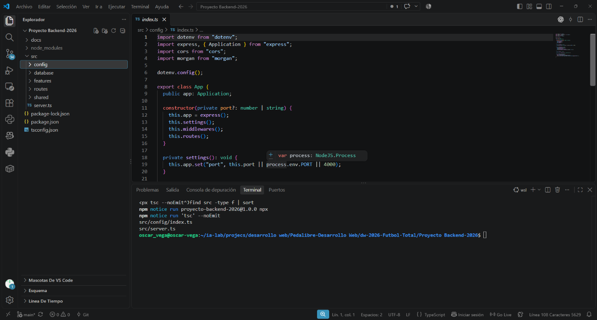

**Conclusión:** Verifiqué que TypeScript compila sin errores y que los dos archivos fuente están en las rutas esperadas.

### Paso 10 — Probar el arranque del servidor *(completado)*

**Referencia:** ISS-01, “Cierre del ISS”.  
**Acción:** ejecutar desde `Proyecto Backend-2026`:

```bash
npm run dev
```

Confirmar que el servidor arranca sin errores y detenerlo con `Ctrl+C`.

**Registro de ejecución:**

- **Fecha:** 2026-10-04.
- **Resultado observado:** `npm run dev` inició nodemon/ts-node y mostró `Servidor ejecutándose en puerto 4000`.
- **Estado:** Cumple. Después de la captura detuve el servidor con `Ctrl+C`, según indica el manual.
- **Evidencia:** [`E-ISS01-P10-01-arranque-servidor.png`](trazabilidad/E-ISS01-P10-01-arranque-servidor.png).

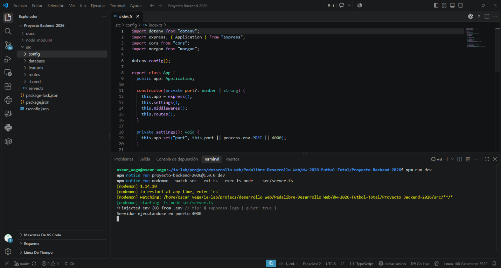

**Conclusión:** Inicié el servidor con `npm run dev`, confirmé que se ejecutó en el puerto 4000 y luego lo detuve con `Ctrl+C`.

**Commit del hito ISS-01:** `74e35364b03b0eb8c7804166433bc15e3953bf4d` — `feat(pedalibre): completar ISS-01 esqueleto` (creado y enviado por el responsable).

## ISS-02 — Infraestructura de base de datos

**Objetivo del manual:** instalar los drivers, configurar `.env`, crear el módulo Sequelize y reservar `seeders/` para un ISS posterior.  
**Dependencia:** ISS-01, completado y enviado a `origin/main`.  
**Referencia:** `Guia-unificada.md`, ISS-02, subítem 3.1 — Drivers Sequelize y `.env`.

### Paso 1 — Instalar Sequelize y drivers *(paquetes instalados; advertencias pendientes de revisar)*

**Acción:** desde `Proyecto Backend-2026`, ejecutar:

```bash
npm install sequelize@^6.37.8 mysql2@^3.24.4 pg@^8.23.0 pg-hstore@^2.3.4 tedious@^20.0.0 oracledb@^7.0.1
npm install -D @types/sequelize@^6.12.0
npm ls sequelize mysql2 pg pg-hstore tedious oracledb @types/sequelize --depth=0
```

**Captura:** mostrar la instalación y el listado de paquetes instalados.

**Registro de ejecución:**

- **Fecha:** 2026-10-04.
- **Resultado observado:** `npm ls` muestra Sequelize `6.37.8`, `mysql2` `3.24.4`, `pg` `8.23.1`, `pg-hstore` `2.3.4`, `tedious` `20.0.3`, `oracledb` `7.0.1` y `@types/sequelize` `6.12.0`.
- **Advertencias:** npm bloqueó los scripts de instalación de `tedious` y `oracledb`, que requieren revisión/aprobación explícita. npm también informó 19 vulnerabilidades (12 moderadas y 7 altas).
- **Estado:** Los paquetes están instalados; queda pendiente revisar los scripts bloqueados y el informe de auditoría antes de afirmar que los drivers están listos para conectarse.
- **Evidencia:** [`E-ISS02-P01-01-drivers.png`](trazabilidad/E-ISS02-P01-01-drivers.png).

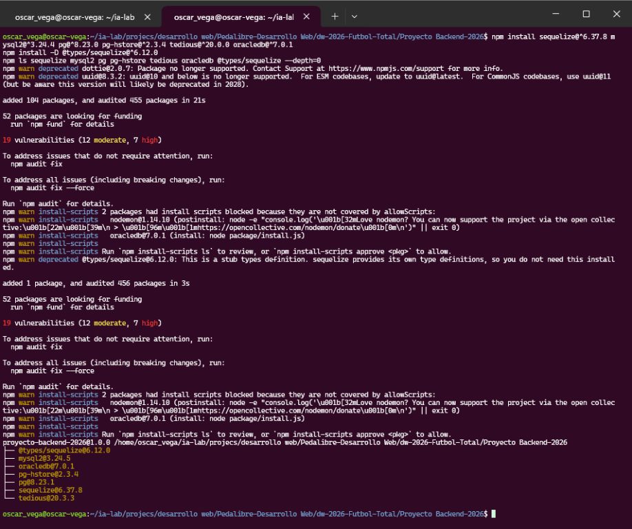

**Conclusión:** Instalé y confirmé la presencia de los drivers requeridos. También registré los scripts bloqueados de `tedious` y `oracledb` y las vulnerabilidades reportadas; no ejecuté aprobaciones ni reparaciones automáticas.

### Paso 2 — Crear la configuración local `.env` *(configurado; evidencia pendiente)*

**Referencia:** ISS-02, subítem 3.1 — Drivers Sequelize y `.env`.  
**Acción:** crear `.env` con los valores de entorno proporcionados para Pedalibre y bloques separados para MySQL, PostgreSQL, MSSQL y Oracle.

**Adaptación respecto al manual:** el ejemplo del ISS usa `DB_ENGINE` y nombres genéricos por motor. Para Pedalibre se usa `DB_DIALECT` y variables namespaced (`DB_MYSQL_*`, `DB_POSTGRES_*`, `DB_MSSQL_*`, `DB_ORACLE_*`), de acuerdo con la configuración proporcionada para seleccionar y validar el dialecto activo.

**Protección:** `.env` está excluido por `.gitignore`; mantenerlo local y no agregarlo al commit. Cualquier captura debe mostrar solo los nombres de variables y el dialecto activo, nunca sus valores de credenciales.

**Registro de ejecución:**

- **Fecha:** 2026-10-04.
- **Resultado observado:** `.env` local creado con `PORT=3002`, `NODE_ENV=development`, `DB_DIALECT=mysql` y bloques de configuración para los cuatro motores.
- **Estado:** Configuración creada; `.env` permanece local e ignorado por Git. La lectura de las variables se verificará al probar el módulo de base de datos.
- **Evidencia:** sin captura para proteger los valores secretos; se confirmó con `git check-ignore` que `.env` está ignorado.

**Nota de seguridad:** las credenciales compartidas en la conversación quedaron expuestas. Cambiarlas por credenciales fuertes y únicas en los servidores y actualizar el `.env` local antes de usar el entorno fuera de pruebas.

### Paso 3 — Crear `src/database/db.ts` *(archivo creado y compilado)*

**Referencia:** ISS-02, subítem 3.2 — Configuración Sequelize.  
**Adaptación:** usar `DB_DIALECT` y los bloques `DB_<MOTOR>_*` definidos para Pedalibre, y validar únicamente las variables del motor seleccionado. El Sequelize 6 instalado incluye dialectos para MySQL, PostgreSQL, MSSQL y Oracle; Oracle utilizará `DB_ORACLE_CONNECT_STRING`.

**Acción:** crear `src/database/db.ts` exportando `sequelize`, `getDatabaseInfo` y `testConnection`. El código debe fallar explícitamente si falta `DB_DIALECT`, si un valor de configuración requerido del dialecto activo está ausente o si se selecciona un motor no soportado. `getDatabaseInfo` no debe devolver contraseñas.

**Registro de ejecución:**

- **Fecha:** 2026-10-04.
- **Resultado observado:** `src/database/db.ts` exporta `sequelize`, `getDatabaseInfo` y `testConnection`; requiere `DB_DIALECT` y las variables del motor seleccionado, y `getDatabaseInfo` no incluye la contraseña. `npx tsc --noEmit` terminó sin errores.
- **Estado:** Cumple el criterio de creación y compilación del módulo.
- **Evidencia:** [`E-ISS02-P03-01-db-ts-typescript.png`](trazabilidad/E-ISS02-P03-01-db-ts-typescript.png).

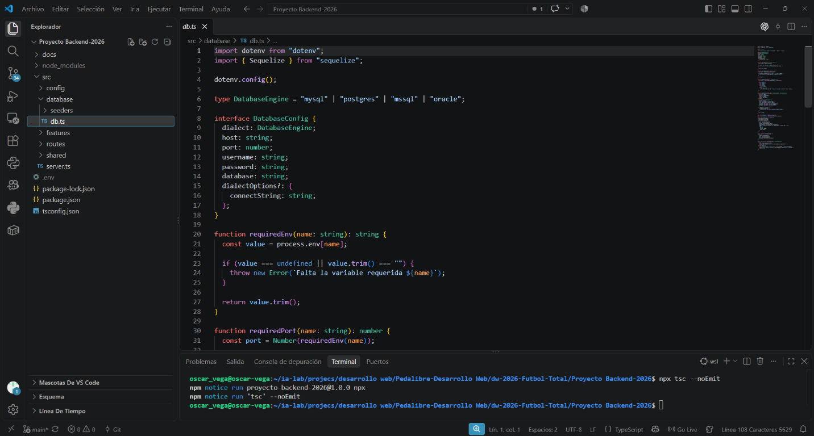

**Conclusión:** Implementé el módulo de Sequelize para los dialectos configurados, oculté la contraseña en la información de diagnóstico y comprobé que el archivo compila.

**Pendiente:** probar que la configuración activa de `.env` se carga correctamente y comprobar la conexión al MySQL configurado para Pedalibre.

### Paso 4 — Validar la configuración MySQL seleccionada *(completado)*

**Acción:** cargar el módulo y confirmar el dialecto activo sin mostrar datos de conexión ni credenciales.

**Registro de ejecución:**

- **Fecha:** 2026-10-04.
- **Resultado observado:** el módulo cargó 24 variables de `.env` y `getDatabaseInfo().engine` devolvió `mysql`, sin mostrar credenciales.
- **Estado:** Cumple la validación de configuración del motor seleccionado.
- **Evidencia:** [`E-ISS02-P04-01-config-mysql-validada.png`](trazabilidad/E-ISS02-P04-01-config-mysql-validada.png).

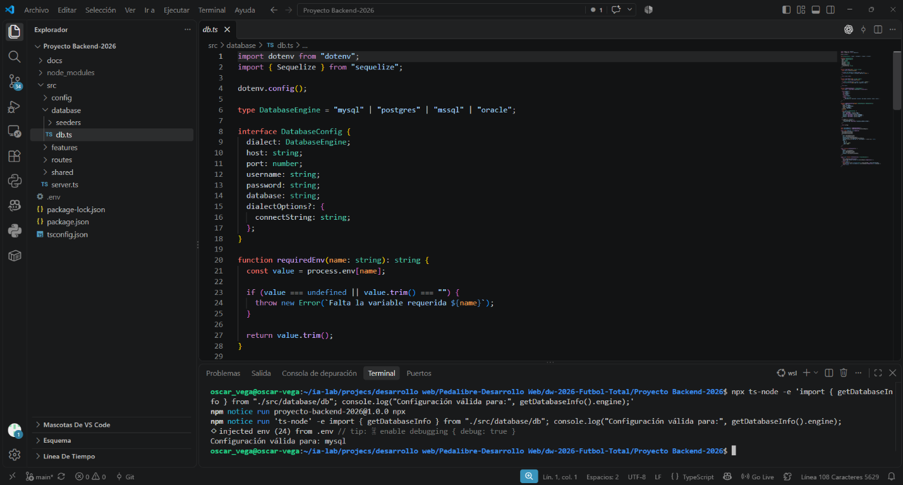

**Conclusión:** Comprobé que el módulo leyó la configuración local y seleccionó MySQL sin imprimir credenciales.

### Paso 5 — Probar conexión al MySQL de Pedalibre *(completado)*

**Acción:** desde `Proyecto Backend-2026`, ejecutar:

```bash
npx ts-node -e 'import { sequelize } from "./src/database/db"; sequelize.authenticate().then(async () => { console.log("Conexión MySQL exitosa"); await sequelize.close(); }).catch(async () => { console.error("No fue posible conectar con MySQL"); await sequelize.close(); process.exitCode = 1; });'
```

**Captura:** mostrar solo el resultado de conexión. Revisar que no aparezcan credenciales antes de guardarla.

**Registro de ejecución:**

- **Fecha:** 2026-10-04.
- **Resultado observado:** Sequelize autenticó contra MySQL y ejecutó `SELECT 1+1 AS result`; la terminal mostró `Conexión MySQL exitosa`.
- **Estado:** Cumple.
- **Evidencia:** [`E-ISS02-P05-01-conexion-mysql.png`](trazabilidad/E-ISS02-P05-01-conexion-mysql.png).

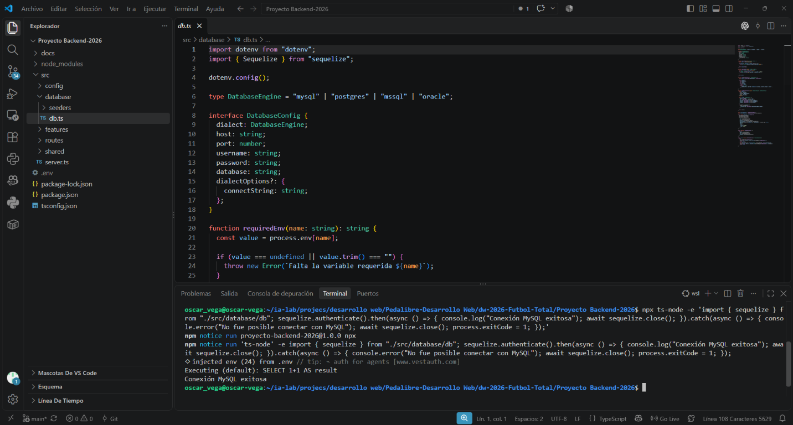

**Conclusión:** Comprobé que Pedalibre puede conectarse al servidor MySQL configurado y que Sequelize ejecuta una consulta de prueba.

### Paso 6 — Confirmar carpeta `seeders/` reservada *(completado)*

**Referencia:** ISS-02, subítem 3.3 — Carpeta seeders (reservada).  
**Acción:** comprobar que existe la carpeta y que todavía no contiene seeders ni runner:

```bash
test -d src/database/seeders && find src/database/seeders -maxdepth 1 -type f -print
```

La carpeta debe existir y el comando no debe listar archivos. No crear lógica de seeders en ISS-02.

**Registro de ejecución:**

- **Fecha:** 2026-10-04.
- **Resultado observado:** la carpeta `src/database/seeders/` existe; `find` no listó archivos en ella.
- **Estado:** Cumple; reservada y sin lógica de seeders.
- **Evidencia:** [`E-ISS02-P06-01-seeders-reservada.png`](trazabilidad/E-ISS02-P06-01-seeders-reservada.png).

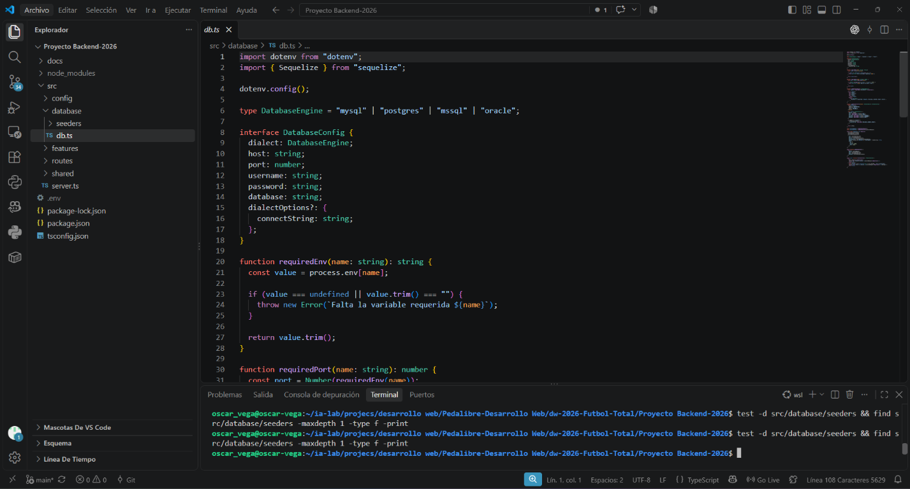

**Conclusión:** Confirmé que `seeders/` está creada y permanece vacía, tal como requiere ISS-02.

### Paso 7 — Verificar ISS-02 *(completado)*

**Acción:** desde `Proyecto Backend-2026`, ejecutar:

```bash
npx tsc --noEmit
test -f src/database/db.ts && test -f .env && test -d src/database/seeders && echo "Verificación ISS-02 correcta"
```

**Captura:** mostrar que TypeScript no reporta errores y aparece `Verificación ISS-02 correcta`. No mostrar el contenido de `.env`.

**Registro de ejecución:**

- **Fecha:** 2026-10-04.
- **Resultado observado:** `npx tsc --noEmit` terminó sin errores; existen `src/database/db.ts`, `.env` y `src/database/seeders/`. La terminal imprimió `Verificación ISS-02 correcta`.
- **Estado:** Cumple.
- **Evidencia:** [`E-ISS02-P07-01-verificacion.png`](trazabilidad/E-ISS02-P07-01-verificacion.png).

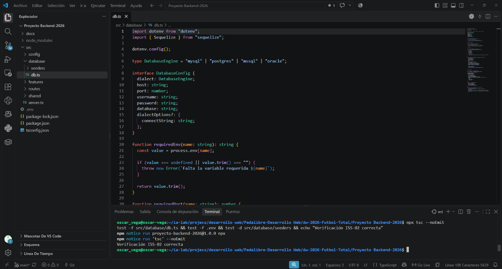

**Conclusión:** Verifiqué que el módulo compila, que existen los archivos requeridos y que `seeders/` está creada.

### Paso 8 — Arrancar el servidor para cerrar ISS-02 *(completado)*

**Acción:** ejecutar desde `Proyecto Backend-2026`:

```bash
npm run dev
```

Confirmar que inicia sin errores y que usa el puerto `3002` indicado por `.env`; luego detenerlo con `Ctrl+C`. Si falla, guardar la salida sin secretos y registrar el error antes de corregir.

**Registro de ejecución:**

- **Fecha:** 2026-10-04.
- **Resultado observado:** `npm run dev` inició nodemon/ts-node y mostró `Servidor ejecutándose en puerto 3002`.
- **Estado:** Cumple. Después de tomar la captura, detuve el servidor con `Ctrl+C`.
- **Evidencia:** [`E-ISS02-P08-01-arranque-servidor.png`](trazabilidad/E-ISS02-P08-01-arranque-servidor.png).

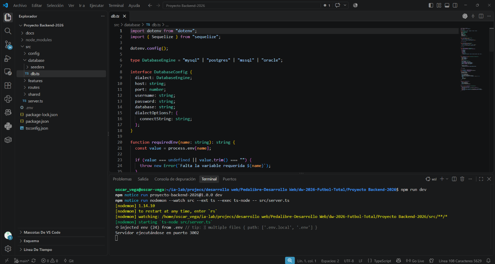

**Conclusión:** Inicié el servidor, confirmé que tomó el puerto 3002 de la configuración y lo detuve con `Ctrl+C`.

### Cierre y GATE de ISS-02

Completé la instalación de drivers, la configuración local de `.env`, el módulo Sequelize y la comprobación de la carpeta `seeders/`. TypeScript compila sin errores, la conexión al MySQL configurado tuvo éxito y el servidor inició en el puerto 3002.

**Resultado del GATE de ISS-02:** cumplido para el alcance verificado.  
**Pendientes técnicos registrados:** advertencias de scripts bloqueados de instalación y vulnerabilidades npm; Oracle está configurado en el módulo, pero su conexión no se ha probado. `.env` permanece local y excluido de Git.

**Commit del hito ISS-02:** `6e97ba1bde83c4dbc6fe2a56181f8cb84851d1e7` — `feat(pedalibre): completar ISS-02 infraestructura de base de datos` (creado y enviado por el responsable).

## ISS-03-A — Feature Client: fundación

**Objetivo:** preparar el feature Client con arquitectura por capas.  
**Dependencia:** ISS-02, completado y enviado a `origin/main`.  
**Referencia:** `Guia-unificada.md`, ISS-03-A, subítem 4.0.1 — `src/shared/errors/app-error.ts`.

### Paso 1 — Crear `AppError` *(completado)*

**Acción:** desde `Proyecto Backend-2026`, crear `src/shared/errors/app-error.ts`:

```bash
cat > src/shared/errors/app-error.ts <<'EOF'
/**
 * Error de aplicación con código HTTP asociado.
 *
 * Lo lanzan los services cuando una regla de negocio no se cumple.
 * Los controllers lo traducen a una respuesta HTTP.
 */
export class AppError extends Error {
  public readonly statusCode: number;

  public constructor(statusCode: number, message: string) {
    super(message);
    this.name = "AppError";
    this.statusCode = statusCode;
  }
}
EOF
```

**Captura:** mostrar el archivo en `src/shared/errors/`.

**Registro de ejecución:**

- **Fecha:** 2026-10-04.
- **Resultado observado:** `src/shared/errors/app-error.ts` define `AppError`, que extiende `Error` y expone `statusCode`.
- **Estado:** Cumple.
- **Evidencia:** [`E-ISS03A-P01-01-app-error.png`](trazabilidad/E-ISS03A-P01-01-app-error.png).

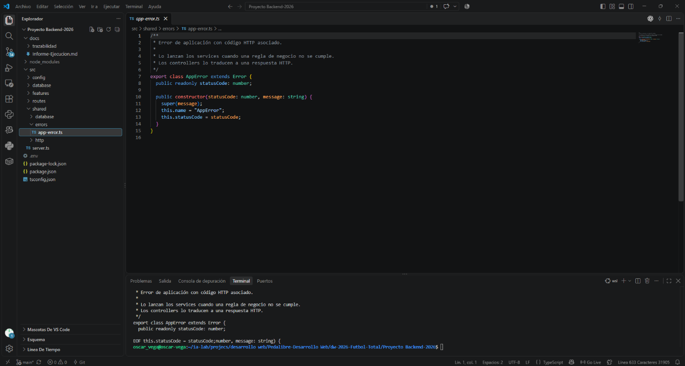

**Conclusión:** Creé el error de aplicación con su código HTTP para que los controllers puedan convertir errores de negocio en respuestas HTTP.

### Paso 2 — Crear `BaseController` *(completado)*

**Referencia:** ISS-03-A, subítem 4.0.2 — `src/shared/http/base-controller.ts`.  
**Acción:** crear `src/shared/http/base-controller.ts`:

```bash
cat > src/shared/http/base-controller.ts <<'EOF'
import { Request, Response } from "express";
import { AppError } from "../errors/app-error";

export abstract class BaseController {
  protected async run(res: Response, work: () => Promise<void>): Promise<void> {
    try {
      await work();
    } catch (error) {
      this.handleError(res, error);
    }
  }

  protected paramId(req: Request): number {
    const raw = req.params.id;
    const value = Array.isArray(raw) ? raw[0] : raw;

    if (!value || !/^\d+$/.test(value) || Number(value) < 1) {
      throw new AppError(400, "Invalid id: must be a positive integer");
    }
    return Number(value);
  }

  protected handleError(res: Response, error: unknown): void {
    if (error instanceof AppError) {
      res.status(error.statusCode).json({ error: error.message });
      return;
    }
    res.status(500).json({ error: "Internal server error", detail: String(error) });
  }
}
EOF
```

**Captura:** mostrar el archivo en `src/shared/http/`.

**Registro de ejecución:**

- **Fecha:** 2026-10-04.
- **Resultado observado:** `src/shared/http/base-controller.ts` define `run`, valida `:id` como entero positivo en `paramId` y traduce `AppError` a su código HTTP en `handleError`.
- **Estado:** Cumple.
- **Evidencia:** [`E-ISS03A-P02-01-base-controller.png`](trazabilidad/E-ISS03A-P02-01-base-controller.png).

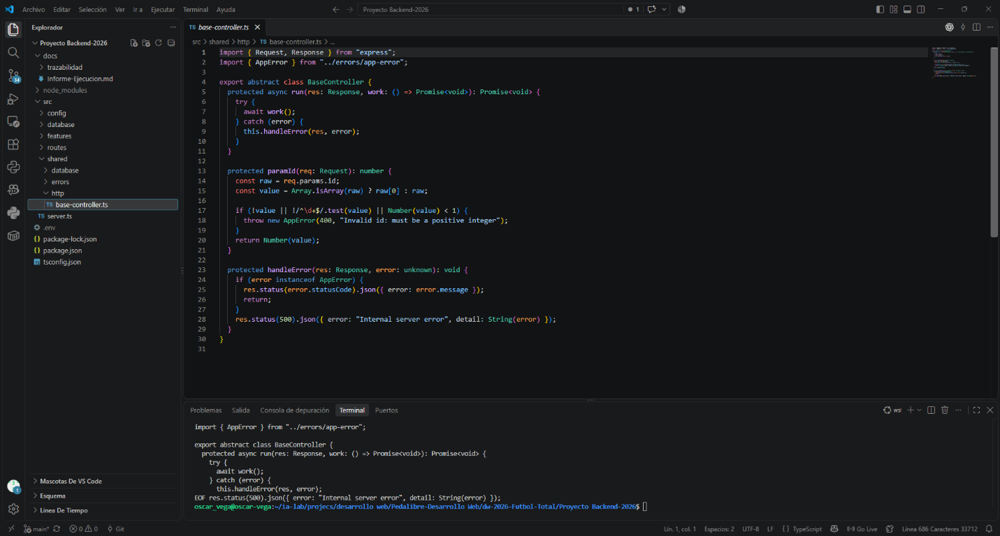

**Conclusión:** Creé la clase base que centraliza el manejo de errores y la validación de identificadores de los controllers.

### Paso 3 — Crear el helper de transacciones *(completado)*

**Referencia:** ISS-03-A, subítem 4.0.3 — `src/shared/database/with-transaction.ts`.  
**Acción:** crear `src/shared/database/with-transaction.ts`:

```bash
cat > src/shared/database/with-transaction.ts <<'EOF'
import { Transaction } from "sequelize";
import { sequelize } from "../../database/db";

export async function withTransaction<T>(
  work: (transaction: Transaction) => Promise<T>
): Promise<T> {
  const transaction = await sequelize.transaction();
  let committed = false;

  try {
    const result = await work(transaction);
    await transaction.commit();
    committed = true;
    return result;
  } catch (error) {
    if (!committed) {
      await transaction.rollback().catch(() => undefined);
    }
    throw error;
  }
}
EOF
```

**Captura:** mostrar el archivo en `src/shared/database/`.

**Registro de ejecución:**

- **Fecha:** 2026-10-04.
- **Resultado observado:** `withTransaction` abre una transacción, confirma al completar el trabajo y revierte si ocurre un error antes del commit.
- **Estado:** Cumple.
- **Evidencia:** [`E-ISS03A-P03-01-with-transaction.png`](trazabilidad/E-ISS03A-P03-01-with-transaction.png).

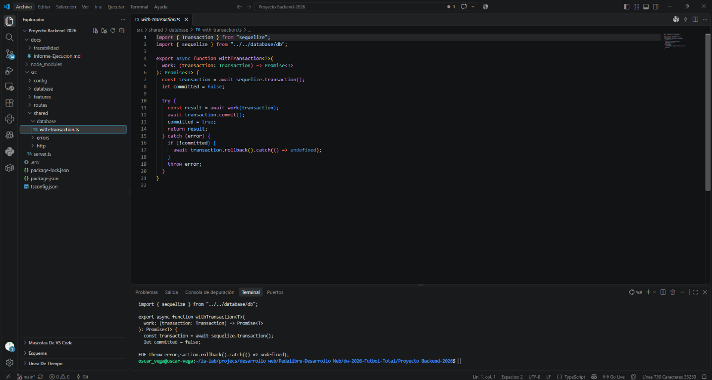

**Conclusión:** Creé el helper para ejecutar operaciones dentro de una transacción y asegurar commit o rollback según el resultado.

### Paso 4 — Instalar bcryptjs *(completado)*

**Referencia:** ISS-03-A, subítem 4.1 — Modelo Client.  
**Acción:** desde `Proyecto Backend-2026`, ejecutar:

```bash
npm install bcryptjs@^3.0.3
npm install -D @types/bcryptjs@^3.0.0
```

**Captura:** mostrar el resultado de la instalación.

**Registro de ejecución:**

- **Fecha:** 2026-10-04.
- **Resultado observado:** npm instaló `bcryptjs` y `@types/bcryptjs`. npm reportó 19 vulnerabilidades (12 moderadas y 7 altas) y volvió a advertir que los scripts de `tedious` y `oracledb` están bloqueados.
- **Estado:** Cumple la instalación solicitada; las advertencias quedan registradas, sin ejecutar reparaciones automáticas.
- **Evidencia:** [`E-ISS03A-P04-01-bcryptjs.png`](trazabilidad/E-ISS03A-P04-01-bcryptjs.png).

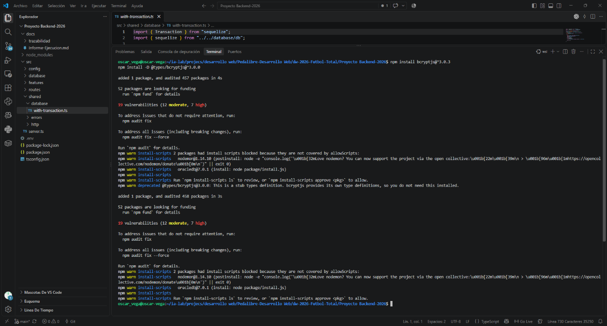

**Conclusión:** Instalé bcryptjs y sus tipos para proteger las contraseñas del modelo Client. Registré las advertencias de npm sin aplicar correcciones automáticas.

### Paso 5 — Crear el modelo Client *(completado)*

**Referencia:** ISS-03-A, subítem 4.1 — Modelo Client.  
**Acción:** crear `src/features/business/clients/client.model.ts`:

```bash
cat > src/features/business/clients/client.model.ts <<'EOF'
import { DataTypes, Model } from "sequelize";
import { sequelize } from "../../../database/db";
import bcrypt from "bcryptjs";

export interface ClientI {
  id?: number;
  name: string;
  address: string;
  phone: string;
  email: string;
  password: string;
  status: "active" | "inactive";
  createdAt?: Date;
  updatedAt?: Date;
}

export class Client extends Model {
  public id!: number;
  public name!: string;
  public address!: string;
  public phone!: string;
  public email!: string;
  public password!: string;
  public status!: "active" | "inactive";
  public readonly createdAt!: Date;
  public readonly updatedAt!: Date;
}

Client.init(
  {
    name: { type: DataTypes.STRING, allowNull: true },
    address: { type: DataTypes.STRING, allowNull: true },
    phone: {
      type: DataTypes.STRING,
      allowNull: true,
      validate: { notEmpty: { msg: "Phone cannot be empty" } },
    },
    email: {
      type: DataTypes.STRING,
      allowNull: true,
      unique: true,
      validate: { isEmail: { msg: "Email must be a valid email address" } },
    },
    password: { type: DataTypes.STRING, allowNull: true },
    status: {
      type: DataTypes.ENUM("active", "inactive"),
      defaultValue: "inactive",
      allowNull: false,
    },
  },
  {
    sequelize,
    modelName: "Client",
    tableName: "clients",
    timestamps: true,
    hooks: {
      beforeCreate: async (client: Client) => {
        if (client.password) {
          const salt = await bcrypt.genSalt(10);
          client.password = await bcrypt.hash(client.password, salt);
        }
      },
      beforeUpdate: async (client: Client) => {
        if (client.changed("password") && client.password) {
          const salt = await bcrypt.genSalt(10);
          client.password = await bcrypt.hash(client.password, salt);
        }
      },
      beforeBulkCreate: async (clients: Client[]) => {
        for (const client of clients) {
          if (client.password) {
            const salt = await bcrypt.genSalt(10);
            client.password = await bcrypt.hash(client.password, salt);
          }
        }
      },
    },
  },
);
EOF
```

**Captura:** mostrar el modelo en `src/features/business/clients/`.

**Registro de ejecución:**

- **Fecha:** 2026-10-04.
- **Resultado observado:** se creó `client.model.ts` con la interfaz y el modelo Client, estado `active`/`inactive`, timestamps y hooks bcrypt para creación, actualización y creación masiva.
- **Estado:** Archivo creado; falta verificar la compilación TypeScript.
- **Evidencia:** [`E-ISS03A-P05-01-modelo-client.png`](trazabilidad/E-ISS03A-P05-01-modelo-client.png).

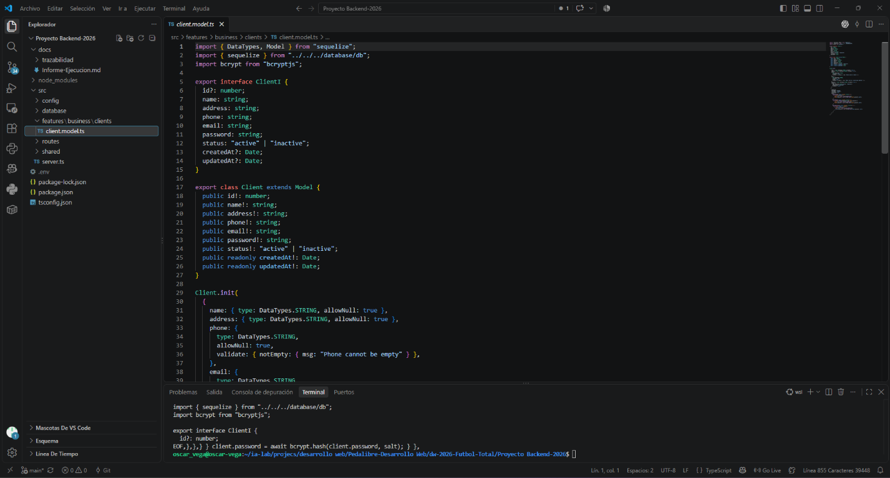

**Conclusión:** Creé el modelo Client con los campos, el estado predeterminado inactivo, las marcas de tiempo y el hash de contraseña previsto para sus operaciones de escritura. La compilación queda pendiente de verificación.

### Paso 6 — Verificar compilación TypeScript *(completado)*

**Acción:** desde `Proyecto Backend-2026`, ejecutar:

```bash
npx tsc --noEmit
```

**Captura:** mostrar el comando y su resultado en la terminal. Si aparecen errores, no registrar este paso como cumplido; corregirlos y repetir la verificación.

**Registro de ejecución:**

- **Fecha:** 2026-10-04.
- **Resultado observado:** `npx tsc --noEmit` terminó y devolvió el prompt sin mostrar errores.
- **Estado:** Cumple.
- **Evidencia:** [`E-ISS03A-P06-01-compilacion-modelo-client.png`](trazabilidad/E-ISS03A-P06-01-compilacion-modelo-client.png).

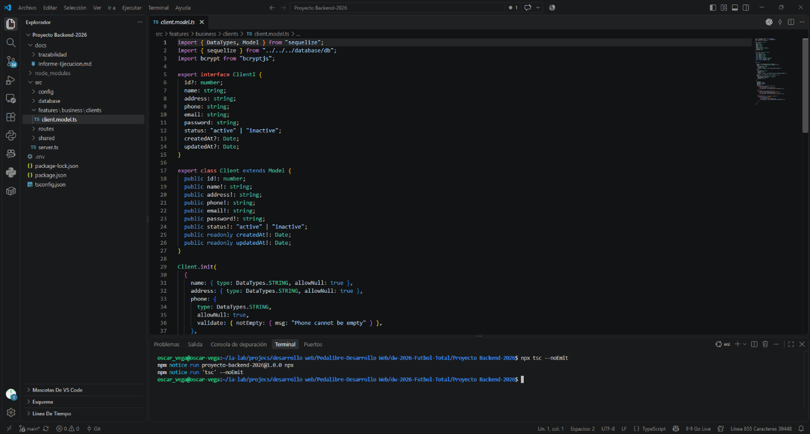

**Conclusión:** Verifiqué el modelo Client con el compilador TypeScript; el comando terminó sin reportar errores.

### Paso 7 — Crear carpetas HTTP y DTO *(completado)*

**Referencia:** ISS-03-A, subítem 4.2 — DTO + esqueletos.  
**Acción:** desde `Proyecto Backend-2026`, ejecutar:

```bash
mkdir -p src/features/business/clients/http src/features/business/clients/dto
```

**Captura:** mostrar el árbol del proyecto con ambas carpetas bajo `src/features/business/clients/`.

**Registro de ejecución:**

- **Fecha:** 2026-10-04.
- **Resultado observado:** se crearon las carpetas `http/` y `dto/` dentro de `src/features/business/clients/`.
- **Estado:** Cumple.
- **Evidencia:** [`E-ISS03A-P07-01-carpetas-http-dto.png`](trazabilidad/E-ISS03A-P07-01-carpetas-http-dto.png).

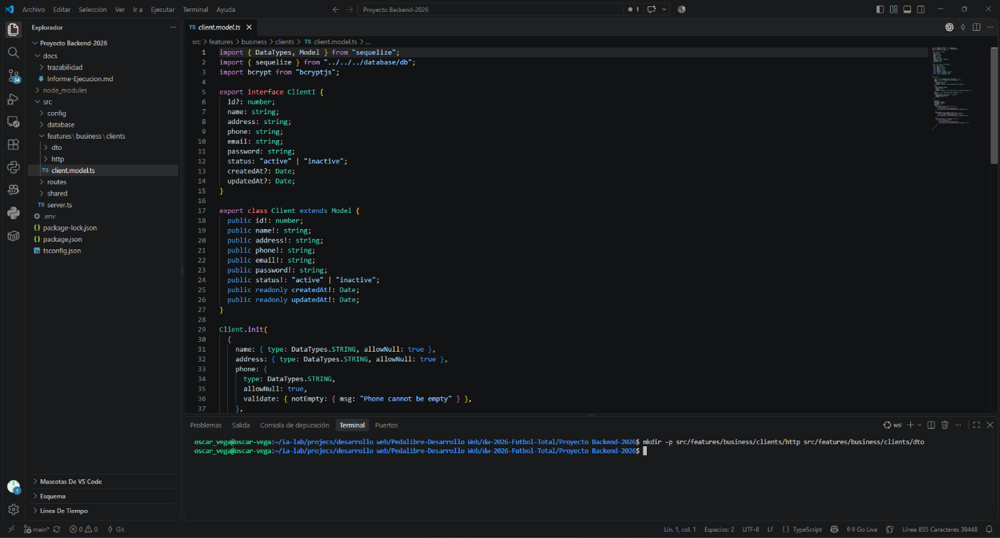

**Conclusión:** Creé las carpetas reservadas para las solicitudes HTTP de prueba y los objetos de transferencia de datos del feature Clients.

### Paso 8 — Crear DTO de creación *(completado)*

**Referencia:** ISS-03-A, subítem 4.2 — DTO `CreateClientDto`.  
**Acción:** desde `Proyecto Backend-2026`, ejecutar:

```bash
cat > src/features/business/clients/dto/create-client.dto.ts <<'EOF'
/** Datos de entrada de `POST /api/clientes`. */
export interface CreateClientDto {
  name: string;
  address: string;
  phone: string;
  email: string;
  password: string;
  /** Opcional: por defecto `active`. Tras crearlo, el estado sólo cambia con el borrado lógico. */
  status?: "active" | "inactive";
}
EOF
```

**Captura:** mostrar el archivo completo `create-client.dto.ts` en el editor.

**Registro de ejecución:**

- **Fecha:** 2026-10-04.
- **Resultado observado:** se creó `CreateClientDto` con los datos de entrada requeridos y el estado opcional `active`/`inactive`.
- **Estado:** Cumple.
- **Evidencia:** [`E-ISS03A-P08-01-create-client-dto.png`](trazabilidad/E-ISS03A-P08-01-create-client-dto.png).

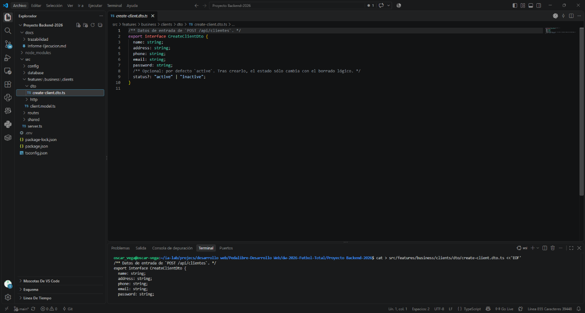

**Conclusión:** Definí los datos aceptados para crear un cliente y dejé el estado como campo opcional, conforme al contrato del manual.

### Paso 9 — Crear DTO de actualización *(completado)*

**Referencia:** ISS-03-A, subítem 4.2 — DTO `UpdateClientDto`.  
**Acción:** crear el archivo desde `Proyecto Backend-2026`:

```bash
cat > src/features/business/clients/dto/update-client.dto.ts <<'EOF'
/**
 * Datos de entrada de `PUT /api/clientes/:id` (reemplazo completo).
 *
 * `status` no se incluye: el estado sólo cambia con el borrado lógico.
 */
export interface UpdateClientDto {
  name: string;
  address: string;
  phone: string;
  email: string;
  /** Si no se envía, el service conserva el hash actual. */
  password?: string;
}
EOF
```

**Captura:** mostrar el archivo completo `update-client.dto.ts` en el editor.

**Registro de ejecución:**

- **Fecha:** 2026-10-04.
- **Resultado observado:** se creó `UpdateClientDto` para reemplazo completo; incluye los datos requeridos y contraseña opcional, sin permitir cambiar el estado mediante PUT.
- **Estado:** Cumple.
- **Evidencia:** [`E-ISS03A-P09-01-update-client-dto.png`](trazabilidad/E-ISS03A-P09-01-update-client-dto.png).

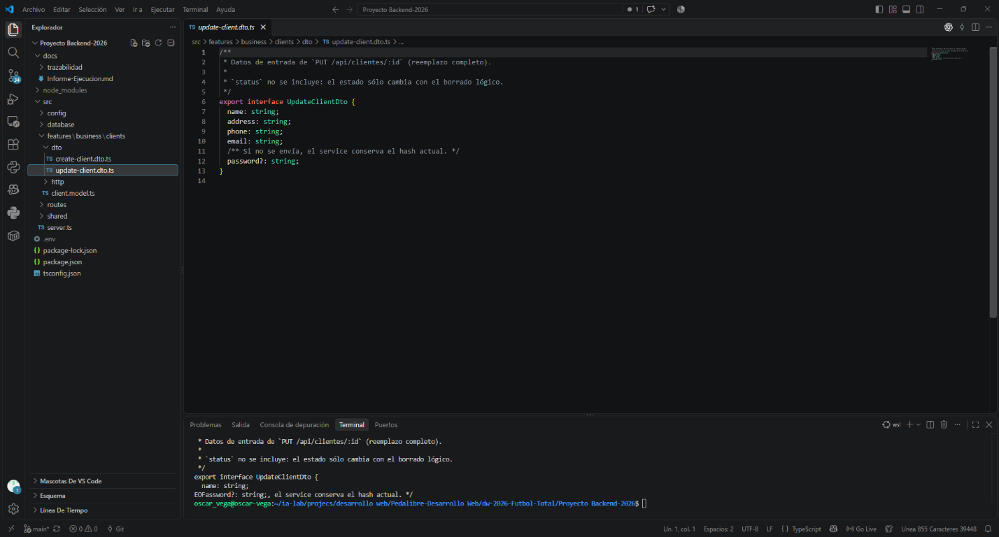

**Conclusión:** Definí el contrato de actualización completa. Dejé fuera el estado para que su modificación quede reservada al borrado lógico.

### Paso 10 — Crear DTO de actualización parcial *(completado)*

**Referencia:** ISS-03-A, subítem 4.2 — DTO `PatchClientDto`.  
**Acción:** crear desde `Proyecto Backend-2026`:

```bash
cat > src/features/business/clients/dto/patch-client.dto.ts <<'EOF'
import { UpdateClientDto } from "./update-client.dto";

/** Datos de entrada de `PATCH /api/clientes/:id` (actualización parcial). */
export type PatchClientDto = Partial<UpdateClientDto>;
EOF
```

**Captura:** mostrar el archivo completo `patch-client.dto.ts` en el editor.

**Registro de ejecución:**

- **Fecha:** 2026-10-04.
- **Resultado observado:** se creó `PatchClientDto` como `Partial<UpdateClientDto>`. La captura muestra el comando y el resultado en la terminal, y el archivo en el árbol del proyecto.
- **Estado:** Cumple.
- **Evidencia:** [`E-ISS03A-P10-01-patch-client-dto.png`](trazabilidad/E-ISS03A-P10-01-patch-client-dto.png).

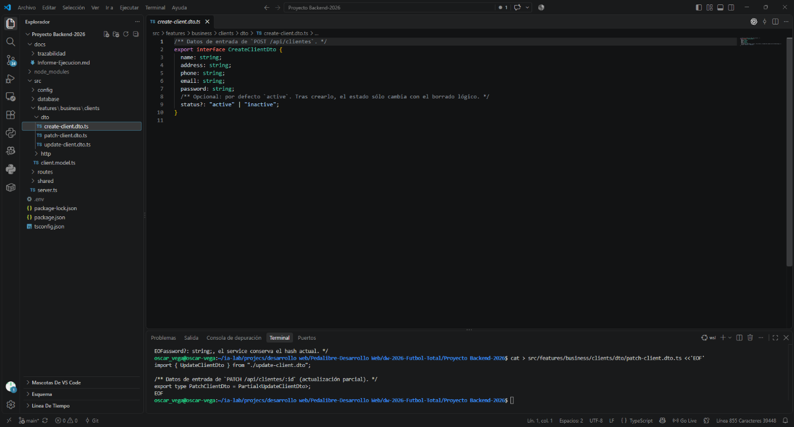

**Conclusión:** Definí el DTO para actualizar parcialmente un cliente reutilizando los campos permitidos por `UpdateClientDto`.

### Paso 11 — Crear DTO de respuesta *(completado)*

**Referencia:** ISS-03-A, subítem 4.2 — DTO `ClientResponseDto`.  
**Acción:** crear el archivo desde `Proyecto Backend-2026`:

```bash
cat > src/features/business/clients/dto/client-response.dto.ts <<'EOF'
import { Client, ClientI } from "../client.model";

/**
 * Respuesta HTTP de un cliente. Lo usan GET de clientes y las respuestas de
 * creación, actualización y borrado lógico.
 * La contraseña nunca se expone.
 */
export type ClientResponseDto = Omit<ClientI, "password">;

/** Convierte el modelo en un objeto plano sin la contraseña. */
export function toClientResponse(client: Client): ClientResponseDto {
  const { password, ...safe } = client.toJSON() as ClientI & { password?: string };
  return safe;
}
EOF
```

**Captura:** mostrar el archivo completo `client-response.dto.ts` en el editor.

**Registro de ejecución:**

- **Fecha:** 2026-10-04.
- **Resultado observado:** se creó `ClientResponseDto` y el mapper `toClientResponse`, que devuelve los datos del modelo sin la contraseña.
- **Estado:** Cumple.
- **Evidencia:** [`E-ISS03A-P11-01-client-response-dto.png`](trazabilidad/E-ISS03A-P11-01-client-response-dto.png).

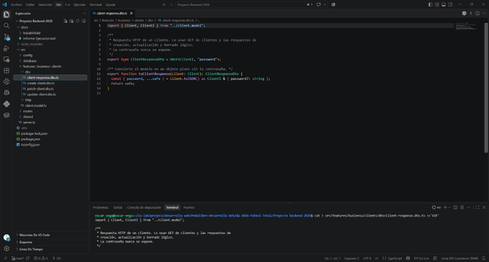

**Conclusión:** Definí el DTO de respuesta y su mapper; comprobé visualmente que la contraseña se excluye de la salida prevista para HTTP.

### Paso 12 — Crear el índice de exportación de DTOs *(completado)*

**Referencia:** ISS-03-A, subítem 4.2 — `dto/index.ts`.  
**Acción:** crear el archivo desde `Proyecto Backend-2026`:

```bash
cat > src/features/business/clients/dto/index.ts <<'EOF'
export * from "./create-client.dto";
export * from "./update-client.dto";
export * from "./patch-client.dto";
export * from "./client-response.dto";
EOF
```

**Captura:** mostrar el archivo completo `dto/index.ts` en el editor.

**Registro de ejecución:**

- **Fecha:** 2026-10-04.
- **Resultado observado:** `dto/index.ts` exporta los DTOs de creación, actualización completa, actualización parcial y respuesta.
- **Estado:** Cumple.
- **Evidencia:** [`E-ISS03A-P12-01-dto-index.png`](trazabilidad/E-ISS03A-P12-01-dto-index.png).

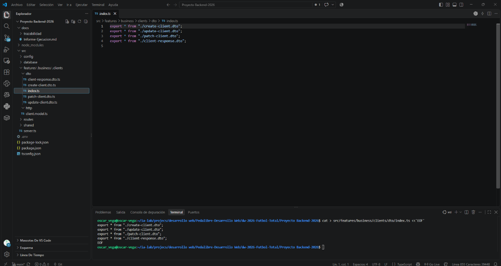

**Conclusión:** Centralicé las exportaciones de los cuatro DTOs en el punto de entrada de la carpeta.

### Paso 13 — Crear esqueleto del repository *(completado)*

**Referencia:** ISS-03-A, subítem 4.2 — Repository.  
**Acción:** crear desde `Proyecto Backend-2026`:

```bash
cat > src/features/business/clients/clients.repository.ts <<'EOF'
import { Client } from "./client.model";

/**
 * Capa Repository del feature Clients.
 * Única responsable de hablar con Sequelize (el modelo `Client`).
 */
export class ClientsRepository {
  // ================== READ ==================
  // (rellenar en ISS-03-B) findAllActive, findById

  // ================== CREATE ==================
  // (rellenar en ISS-03-C) create

  // ================== UPDATE ==================
  // (rellenar en ISS-03-D) update

  // ================== DELETE ==================
  // (rellenar en ISS-03-E) delete
}
EOF
```

**Captura:** mostrar el archivo completo `clients.repository.ts` en el editor.

**Registro de ejecución:**

- **Fecha:** 2026-10-04.
- **Resultado observado:** se creó `ClientsRepository` con la importación de `Client` y secciones reservadas para READ, CREATE, UPDATE y DELETE de las siguientes ISS.
- **Estado:** Cumple el criterio de esqueleto.
- **Evidencia:** [`E-ISS03A-P13-01-clients-repository.png`](trazabilidad/E-ISS03A-P13-01-clients-repository.png).

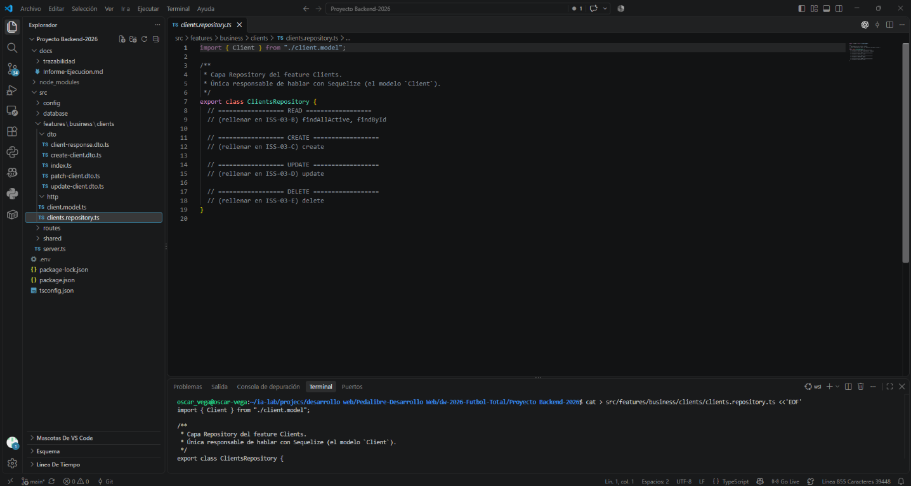

**Conclusión:** Creé el esqueleto del repository con la separación por operaciones definida para completar el CRUD en las ISS posteriores.

### Paso 14 — Crear esqueleto del service *(completado)*

**Referencia:** ISS-03-A, subítem 4.2 — Service.  
**Acción:** crear desde `Proyecto Backend-2026`:

```bash
cat > src/features/business/clients/clients.service.ts <<'EOF'
import { ClientsRepository } from "./clients.repository";

/**
 * Capa Service del feature Clients.
 * Reglas de negocio; no conoce req/res ni Sequelize (delega en el repository).
 */
export class ClientsService {
  public constructor(
    private readonly repository: ClientsRepository = new ClientsRepository()
  ) {}

  // ================== READ ==================
  // (rellenar en ISS-03-B) getAll, getOne

  // ================== CREATE ==================
  // (rellenar en ISS-03-C) create

  // ================== UPDATE ==================
  // (rellenar en ISS-03-D) updatePut, updatePatch

  // ================== DELETE ==================
  // (rellenar en ISS-03-E) deletePhysical, deleteLogical
}
EOF
```

**Captura:** mostrar el archivo completo `clients.service.ts` en el editor.

**Registro de ejecución:**

- **Fecha:** 2026-10-04.
- **Resultado observado:** se creó `ClientsService`, que recibe `ClientsRepository` y reserva secciones para las operaciones CRUD que se completarán en ISS-03-B a ISS-03-E.
- **Estado:** Cumple el criterio de esqueleto.
- **Evidencia:** [`E-ISS03A-P14-01-clients-service.png`](trazabilidad/E-ISS03A-P14-01-clients-service.png).

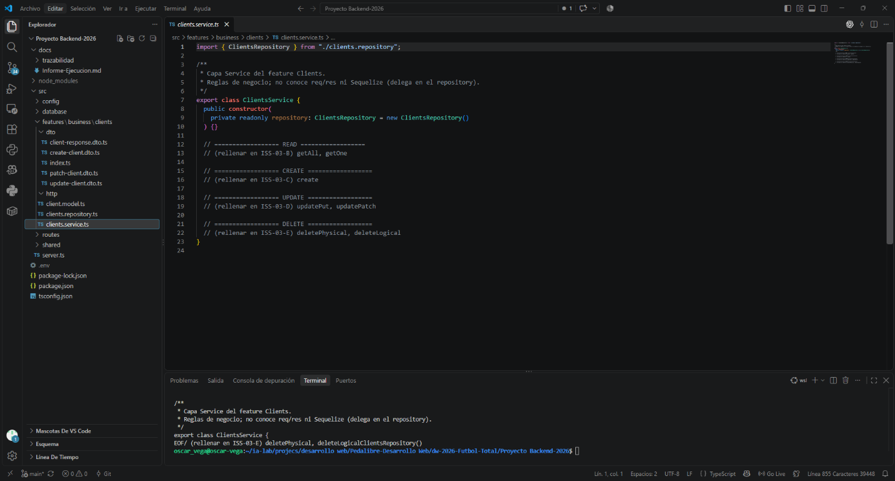

**Conclusión:** Creé el esqueleto del service con inyección del repository y reservé las operaciones de negocio para las ISS posteriores.

### Paso 15 — Crear esqueleto del controller *(completado)*

**Referencia:** ISS-03-A, subítem 4.2 — Controller.  
**Acción:** crear desde `Proyecto Backend-2026`:

```bash
cat > src/features/business/clients/clients.controller.ts <<'EOF'
import { Request, Response } from "express";
import { BaseController } from "../../../shared/http/base-controller";
import { ClientsService } from "./clients.service";

/**
 * Capa Controller del feature Clients.
 * Solo HTTP: lee req, llama al service y arma res.
 */
export class ClientsController extends BaseController {
  public constructor(
    private readonly service: ClientsService = new ClientsService()
  ) {
    super();
  }

  // ================== READ ==================
  // (rellenar en ISS-03-B) getAll, getOne

  // ================== CREATE ==================
  // (rellenar en ISS-03-C) create

  // ================== UPDATE ==================
  // (rellenar en ISS-03-D) updatePut, updatePatch

  // ================== DELETE ==================
  // (rellenar en ISS-03-E) deletePhysical, deleteLogical
}
EOF
```

**Captura:** mostrar el archivo completo `clients.controller.ts` en el editor.

**Registro de ejecución:**

- **Fecha:** 2026-10-04.
- **Resultado observado:** se creó `ClientsController`, que extiende `BaseController`, recibe `ClientsService` y reserva las operaciones para ISS-03-B a ISS-03-E.
- **Estado:** Cumple el criterio de esqueleto.
- **Evidencia:** [`E-ISS03A-P15-01-clients-controller.png`](trazabilidad/E-ISS03A-P15-01-clients-controller.png).

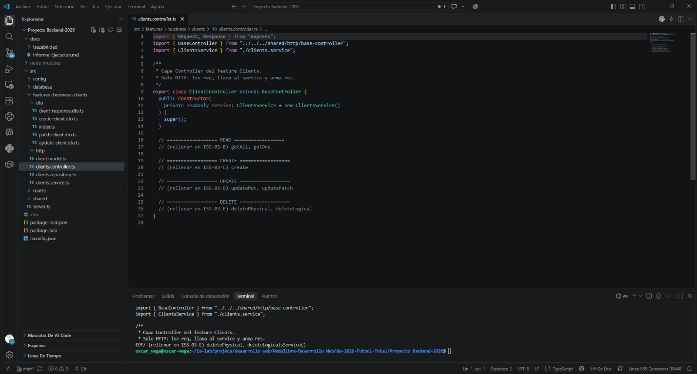

**Conclusión:** Creé el esqueleto del controller con su dependencia del service y las áreas de operaciones pendientes.

### Paso 16 — Crear esqueleto de rutas *(completado)*

**Referencia:** ISS-03-A, subítem 4.2 — Routes.  
**Acción:** crear desde `Proyecto Backend-2026`:

```bash
cat > src/features/business/clients/clients.routes.ts <<'EOF'
import { Application } from "express";
import { ClientsController } from "./clients.controller";

export class ClientsRoutes {
  public clientsController: ClientsController = new ClientsController();

  public routes(app: Application): void {
    // Rutas del feature, sin autenticación ni middleware JWT en esta fase.
    // Se completarán en ISS-03-B a ISS-03-E.
  }
}
EOF
```

**Captura:** mostrar el archivo completo `clients.routes.ts` en el editor.

**Registro de ejecución:**

- **Fecha:** 2026-10-04.
- **Resultado observado:** se creó `ClientsRoutes` con una instancia de `ClientsController` y el método `routes(app)` reservado, sin endpoints ni middleware JWT en esta fase.
- **Estado:** Cumple el criterio de esqueleto.
- **Evidencia:** [`E-ISS03A-P16-01-clients-routes.png`](trazabilidad/E-ISS03A-P16-01-clients-routes.png).

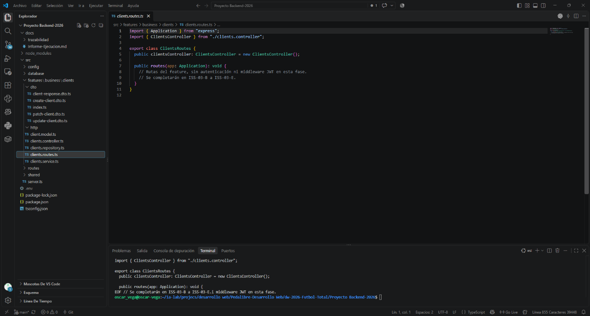

**Conclusión:** Reservé la estructura de rutas del feature para completarla en las ISS siguientes, manteniendo la indicación del manual de no añadir autenticación en esta fase.

### Paso 17 — Crear agregador de rutas *(completado)*

**Referencia:** ISS-03-A, subítem 4.3 — Agregador Routes.  
**Acción:** crear desde `Proyecto Backend-2026`:

```bash
cat > src/routes/index.ts <<'EOF'
import { ClientsRoutes } from "../features/business/clients/clients.routes";

export class Routes {
  public clientsRoutes: ClientsRoutes = new ClientsRoutes();
}
EOF
```

**Captura:** mostrar `src/routes/index.ts` completo y el árbol de archivos.

**Registro de ejecución:**

- **Fecha:** 2026-10-04.
- **Resultado observado:** se creó `src/routes/index.ts` con la clase `Routes` y una instancia de `ClientsRoutes`.
- **Estado:** Cumple el criterio del subítem 4.3.
- **Evidencia:** [`E-ISS03A-P17-01-routes-index.png`](trazabilidad/E-ISS03A-P17-01-routes-index.png).

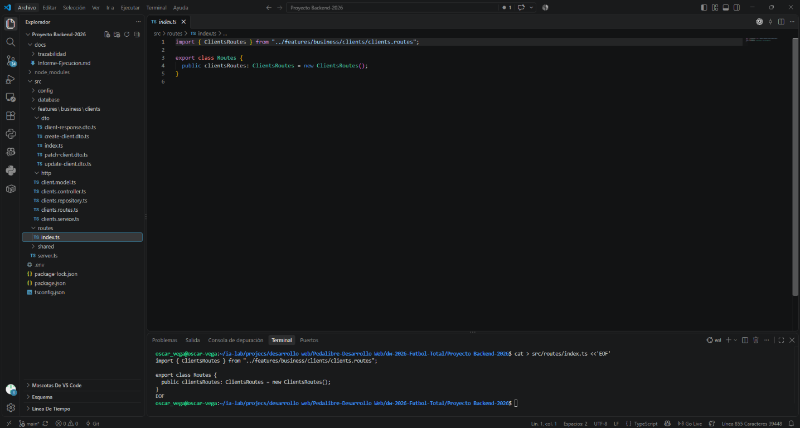

**Conclusión:** Creé el agregador del feature Clients; queda pendiente cablearlo a `App`.

### Paso 18 — Cablear rutas e inicialización de base de datos *(completado)*

**Referencia:** ISS-03-A, subítem 4.3 — integración con `src/config/index.ts`.

El manual indica importar el modelo y la configuración Sequelize, registrar `Routes` en la aplicación y ejecutar `sequelize.sync({ force: false, alter: true })` durante el arranque. La opción `alter: true` puede alterar el esquema existente de la base de datos. El usuario autorizó seguir el manual con esta opción; debe ejecutarse únicamente sobre una base de desarrollo respaldada.

**Adaptación aplicada:** el manual parte de una variante de `src/config/index.ts` con `var cors = require(...)`; el proyecto ya utiliza imports ES (`import cors from "cors"`). Se conservó la estructura e imports actuales y se añadieron el registro de rutas y la inicialización Sequelize.

**Registro de ejecución:**

- **Fecha:** 2026-10-04.
- **Resultado observado:** Sequelize autenticó correctamente en MySQL; `sequelize.sync({ force: false, alter: true })` sincronizó `clients`, incluida la incorporación de `createdAt` y `updatedAt`; el servidor inició en el puerto 3002.
- **Estado:** Cumple. La opción `alter: true` se ejecutó con autorización del usuario; las modificaciones observables del esquema quedan registradas.
- **Evidencia:** [`E-ISS03A-P18-01-db-sync-server.png`](trazabilidad/E-ISS03A-P18-01-db-sync-server.png).

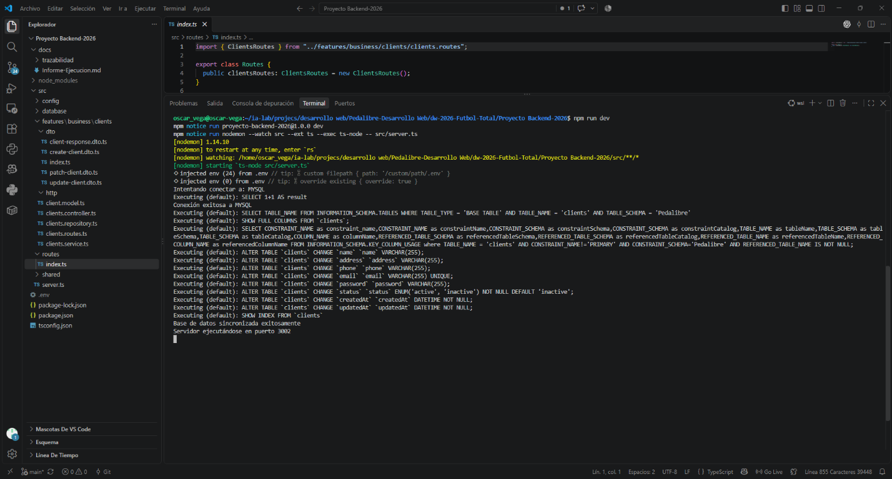

**Conclusión:** Conecté la aplicación a la base seleccionada, sincronicé el modelo Client y comprobé que el servidor inició en el puerto 3002.

### Paso 19 — Detener el servidor de desarrollo *(completado)*

**Acción:** en la terminal donde se ejecuta `npm run dev`, presionar `Ctrl+C` una vez y esperar a que vuelva el prompt.

**Captura:** mostrar la terminación del proceso y el prompt de la terminal.

**Registro de ejecución:**

- **Fecha:** 2026-10-04.
- **Resultado observado:** se presionó `Ctrl+C`; el proceso terminó y la terminal devolvió el prompt.
- **Estado:** Cumple.
- **Evidencia:** [`E-ISS03A-P19-01-detener-servidor.png`](trazabilidad/E-ISS03A-P19-01-detener-servidor.png).

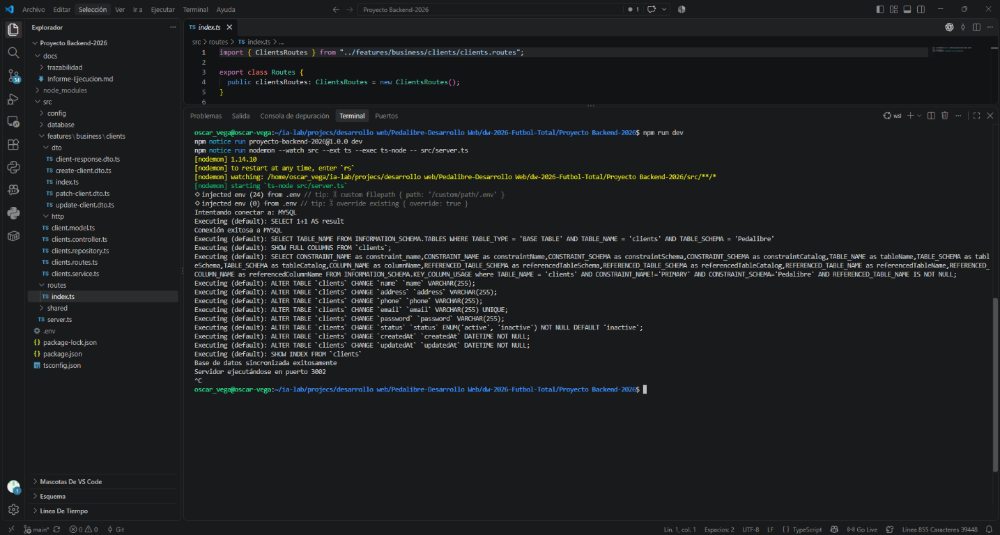

**Conclusión:** Detuve el servidor después de comprobar la conexión a la base de datos y el inicio exitoso.

### Paso 20 — Verificación final TypeScript de ISS-03-A *(completado)*

**Acción:** desde `Proyecto Backend-2026`, ejecutar:

```bash
npx tsc --noEmit
```

**Captura:** mostrar el comando y su resultado final en la terminal.

**Registro de ejecución:**

- **Fecha:** 2026-10-04.
- **Resultado observado:** `npx tsc --noEmit` terminó y devolvió el prompt sin reportar errores.
- **Estado:** Cumple.
- **Evidencia:** [`E-ISS03A-P20-01-verificacion-final.png`](trazabilidad/E-ISS03A-P20-01-verificacion-final.png).

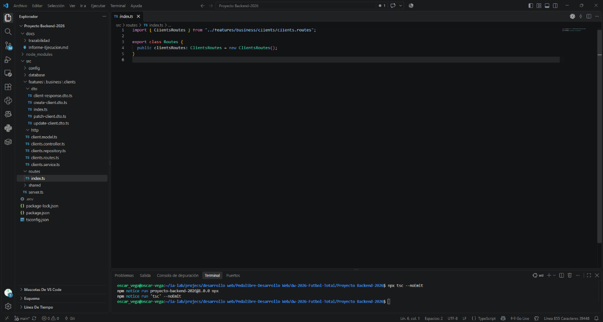

**Conclusión:** Verifiqué la compilación de ISS-03-A con TypeScript y el comando terminó sin mostrar errores.

### Criterios de cierre ISS-03-A

- [x] Carpetas `dto/` y `http/` creadas.
- [x] DTOs create/update/patch/response e índice de exportación creados.
- [x] Esqueletos de repository, service, controller y routes creados.
- [x] Agregador de rutas conectado a `App`.
- [x] Modelo Client importado y sincronización de base verificada.
- [x] Servidor detenido y compilación TypeScript verificada.

**Estado de ISS-03-A:** completado según verificaciones ejecutadas. La implementación de operaciones CRUD queda para ISS-03-B a ISS-03-E.

## ISS-03-B — Lectura de clientes (GetAll y GetOne)

**Objetivo:** implementar la consulta de clientes activos y la búsqueda por identificador, ocultando siempre la contraseña en las respuestas.  
**Dependencia:** ISS-03-A, completado.

**Nota de revisión del manual:** los criterios de ISS-03-B indican rutas sin autenticación, pero el ejemplo de `clients.get.http` más adelante documenta JWT y RBAC. Resolver esa discrepancia antes de configurar la autorización de las rutas; no incluir credenciales reales en capturas ni archivos de evidencia.

### Paso 21 — Implementar consultas del repository *(pendiente)*

**Referencia:** ISS-03-B — `clients.repository.ts`.  
**Acción:** reemplazar el contenido del archivo con el siguiente esqueleto ampliado:

```bash
cat > src/features/business/clients/clients.repository.ts <<'EOF'
import { Transaction } from "sequelize";
import { Client } from "./client.model";

/**
 * Capa Repository del feature Clients.
 * Única responsable de hablar con Sequelize (el modelo `Client`).
 */
export class ClientsRepository {
  // ================== READ ==================
  /** Todos los clientes activos. */
  public async findAllActive(): Promise<Client[]> {
    return Client.findAll({ where: { status: "active" } });
  }

  /** Un cliente por PK (o `null`). Acepta transacción para flujos de ventas. */
  public async findById(id: number, transaction?: Transaction): Promise<Client | null> {
    return Client.findByPk(id, { transaction });
  }

  // ================== CREATE ==================
  // (rellenar en ISS-03-C) create

  // ================== UPDATE ==================
  // (rellenar en ISS-03-D) update

  // ================== DELETE ==================
  // (rellenar en ISS-03-E) delete
}
EOF
```

**Captura:** mostrar el archivo completo en el editor.

**Registro de ejecución:**

- **Fecha:** 2026-10-04.
- **Resultado observado:** `ClientsRepository` implementa `findAllActive` filtrando `status: "active"` y `findById` por clave primaria, con parámetro opcional de transacción.
- **Estado:** Cumple el criterio de repository para lectura.
- **Evidencia:** [`E-ISS03B-P21-01-clients-repository-read.png`](trazabilidad/E-ISS03B-P21-01-clients-repository-read.png).

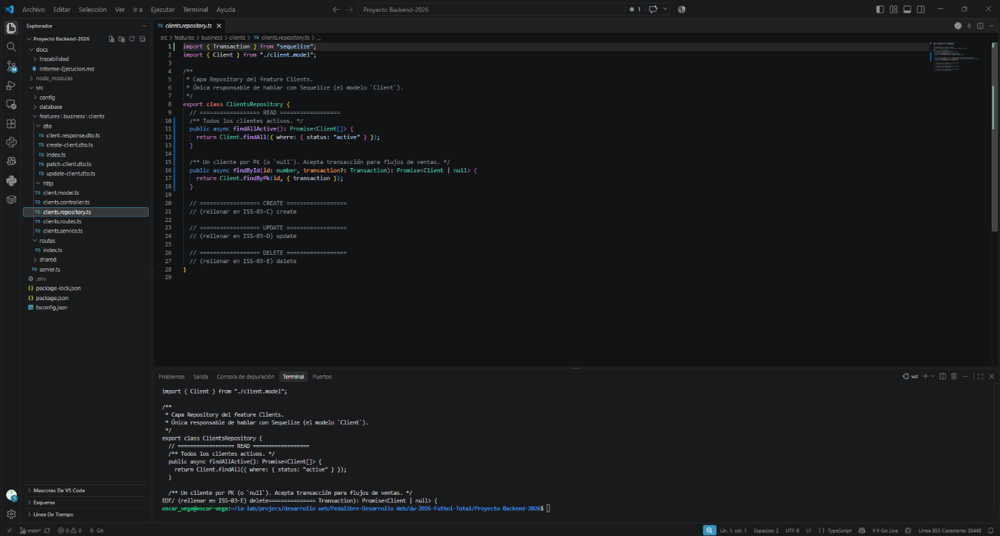

**Conclusión:** Implementé las consultas del repository para listar sólo clientes activos y buscar un cliente por ID.

### Paso 22 — Implementar consultas de lectura del service *(completado)*

**Referencia:** ISS-03-B — `ClientsService.getAll`, `getOne` y helper `findOrFail`.  
**Acción:** reemplazar el contenido de `src/features/business/clients/clients.service.ts`:

```bash
cat > src/features/business/clients/clients.service.ts <<'EOF'
import { AppError } from "../../../shared/errors/app-error";
import { Client } from "./client.model";
import { ClientResponseDto, toClientResponse } from "./dto";
import { ClientsRepository } from "./clients.repository";

/**
 * Capa Service del feature Clients.
 * Reglas de negocio; no conoce req/res ni Sequelize (delega en el repository).
 */
export class ClientsService {
  public constructor(
    private readonly repository: ClientsRepository = new ClientsRepository()
  ) {}

  // ================== READ ==================
  public async getAll(): Promise<ClientResponseDto[]> {
    const clients = await this.repository.findAllActive();
    return clients.map((client) => toClientResponse(client));
  }

  public async getOne(id: number): Promise<ClientResponseDto> {
    return toClientResponse(await this.findOrFail(id));
  }

  // ================== CREATE ==================
  // (rellenar en ISS-03-C) create

  // ================== UPDATE ==================
  // (rellenar en ISS-03-D) updatePut, updatePatch

  // ================== DELETE ==================
  // (rellenar en ISS-03-E) deletePhysical, deleteLogical

  // ================== HELPERS ==================
  private async findOrFail(id: number, onlyActive = true): Promise<Client> {
    const client = await this.repository.findById(id);
    if (!client || (onlyActive && client.status !== "active")) {
      throw new AppError(404, "Client not found");
    }
    return client;
  }
}
EOF
```

**Captura:** mostrar `clients.service.ts` completo en el editor.

**Registro de ejecución:**

- **Fecha:** 2026-10-04.
- **Resultado observado:** el service lista clientes activos, transforma las respuestas para omitir la contraseña y centraliza la regla 404 para clientes inexistentes o inactivos en `findOrFail`.
- **Estado:** Cumple el criterio de service para lectura.
- **Evidencia:** [`E-ISS03B-P22-01-clients-service-read.png`](trazabilidad/E-ISS03B-P22-01-clients-service-read.png).

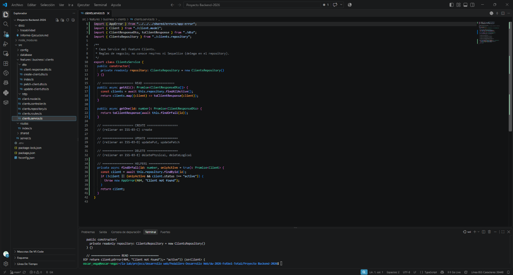

**Conclusión:** Implementé las operaciones de lectura y dejé en un único helper la regla de visibilidad de clientes inactivos.

### Paso 23 — Implementar controladores de lectura *(completado)*

**Referencia:** ISS-03-B — `ClientsController.getAll` y `getOne`.  
**Acción:** reemplazar el contenido de `src/features/business/clients/clients.controller.ts`:

```bash
cat > src/features/business/clients/clients.controller.ts <<'EOF'
import { Request, Response } from "express";
import { BaseController } from "../../../shared/http/base-controller";
import { ClientsService } from "./clients.service";

/**
 * Capa Controller del feature Clients.
 * Solo HTTP: lee req, llama al service y arma res.
 */
export class ClientsController extends BaseController {
  public constructor(
    private readonly service: ClientsService = new ClientsService()
  ) {
    super();
  }

  // ================== READ ==================
  public async getAll(_req: Request, res: Response): Promise<void> {
    await this.run(res, async () => {
      const clients = await this.service.getAll();
      res.status(200).json({ clients });
    });
  }

  public async getOne(req: Request, res: Response): Promise<void> {
    await this.run(res, async () => {
      const client = await this.service.getOne(this.paramId(req));
      res.status(200).json({ client });
    });
  }

  // ================== CREATE ==================
  // (rellenar en ISS-03-C) create

  // ================== UPDATE ==================
  // (rellenar en ISS-03-D) updatePut, updatePatch

  // ================== DELETE ==================
  // (rellenar en ISS-03-E) deletePhysical, deleteLogical
}
EOF
```

**Captura:** mostrar el archivo completo `clients.controller.ts`.

**Registro de ejecución:**

- **Fecha:** 2026-10-04.
- **Resultado observado:** el controller implementa `getAll` y `getOne`; ambos ejecutan el service dentro de `run()` y responden con estado 200.
- **Estado:** Cumple el criterio de controller para lectura.
- **Evidencia:** [`E-ISS03B-P23-01-clients-controller-read.png`](trazabilidad/E-ISS03B-P23-01-clients-controller-read.png).

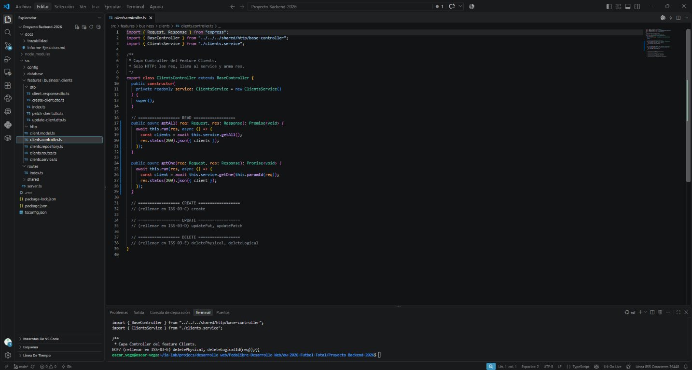

**Conclusión:** Implementé los controladores de lectura y delegué el manejo de errores en `BaseController.run()`.

### Paso 24 — Registrar rutas GET *(completado)*

**Referencia:** ISS-03-B — endpoints GET sin auth según los criterios de aceptación.  
**Acción:** reemplazar el contenido de `src/features/business/clients/clients.routes.ts`:

```bash
cat > src/features/business/clients/clients.routes.ts <<'EOF'
import { Application } from "express";
import { ClientsController } from "./clients.controller";

export class ClientsRoutes {
  public clientsController: ClientsController = new ClientsController();

  public routes(app: Application): void {
    // Lecturas públicas según los criterios de ISS-03-B.
    app
      .route("/api/clientes")
      .get(this.clientsController.getAll.bind(this.clientsController));

    app
      .route("/api/clientes/:id")
      .get(this.clientsController.getOne.bind(this.clientsController));
  }
}
EOF
```

**Captura:** mostrar el archivo completo `clients.routes.ts`.

**Registro de ejecución:**

- **Fecha:** 2026-10-04.
- **Resultado observado:** `clients.routes.ts` registra `GET /api/clientes` y `GET /api/clientes/:id` y enlaza cada endpoint con su controlador.
- **Estado:** Cumple según los criterios de aceptación de ISS-03-B, que especifican estas rutas sin autenticación.
- **Evidencia:** [`E-ISS03B-P24-01-clients-routes-get.png`](trazabilidad/E-ISS03B-P24-01-clients-routes-get.png).

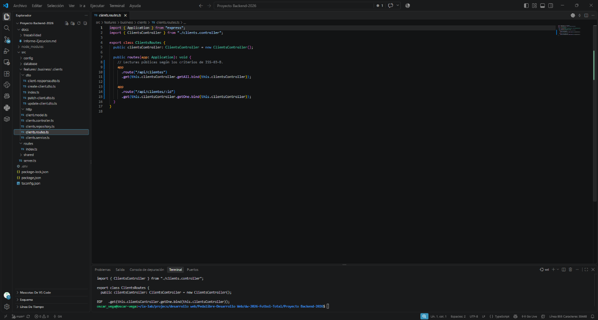

**Conclusión:** Registré las rutas GET de colección y de recurso individual sin middleware JWT, conforme al criterio de la sección ISS-03-B.

### Paso 25 — Crear archivo HTTP para probar GET *(completado)*

**Referencia:** ISS-03-B — `http/clients.get.http`.

**Discrepancia del manual:** los criterios establecen GET sin autenticación; sin embargo, el ejemplo HTTP posterior solicita login, tokens JWT y validaciones RBAC. Además, usa cuentas de ejemplo que no se han verificado en este proyecto y puerto 4000, mientras la aplicación observada arrancó en 3002. La inspección del código fuente no encontró endpoints de sesión ni middleware JWT/RBAC en este proyecto.

**Adaptación acordada:** documentar y ejecutar lecturas públicas sin token. Se puede agregar una solicitud con `Authorization: Bearer` cuando exista un token válido; como las rutas actuales son públicas y no tienen middleware, esa segunda solicitud sólo verifica la respuesta del endpoint y no prueba autenticación ni RBAC. No usar cuentas inventadas ni afirmar que los criterios JWT/RBAC están verificados. El puerto se adapta de 4000 a 3002 según el servidor ejecutado.

**Acción:** crear `src/features/business/clients/http/clients.get.http`:

```bash
cat > src/features/business/clients/http/clients.get.http <<'EOF'
### Feature Clients - GET ALL (público, sin token)
@baseUrl = http://localhost:3002
@id = 1

# @name getAllClientsPublic
GET {{baseUrl}}/api/clientes

### Feature Clients - GET ONE (público, sin token)
# @name getOneClientPublic
GET {{baseUrl}}/api/clientes/{{id}}

### Solicitud con Bearer opcional (la ruta pública no valida el token en ISS-03-B)
# Define un token válido en el entorno de REST Client antes de habilitar esta solicitud.
# No guardar ni capturar el valor del token.
# GET {{baseUrl}}/api/clientes
# Authorization: Bearer {{accessToken}}
EOF
```

**Captura:** mostrar la plantilla sin secretos. Para evidencia de respuesta, ejecutar las solicitudes públicas mientras el servidor está activo y capturar status/body; no incluir valores de tokens.

**Registro de ejecución:**

- **Fecha:** 2026-10-04.
- **Resultado observado:** se creó `clients.get.http` con solicitudes GET públicas a `localhost:3002` y una solicitud Bearer opcional comentada, sin incluir tokens.
- **Estado:** Cumple la adaptación acordada; el ejemplo original con JWT/RBAC no se considera verificado porque el proyecto no tiene esos endpoints/middleware.
- **Evidencia:** [`E-ISS03B-P25-01-clients-get-http.png`](trazabilidad/E-ISS03B-P25-01-clients-get-http.png).

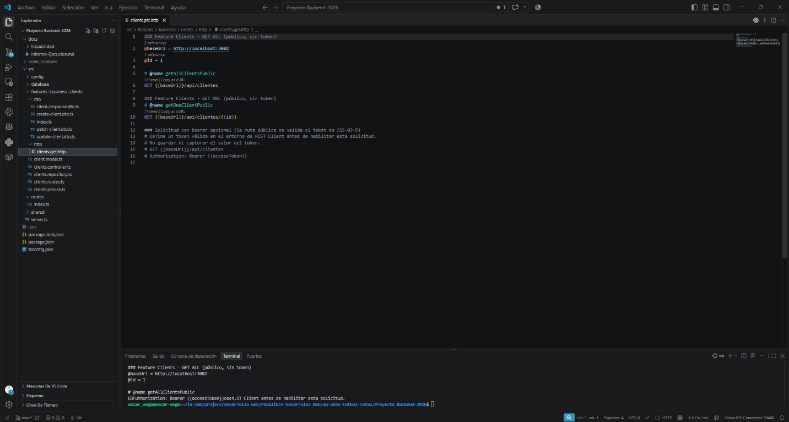

**Conclusión:** Preparé solicitudes públicas para las rutas actuales y dejé documentado que una cabecera Bearer no prueba autorización mientras no exista middleware JWT/RBAC.

### Paso 26 — Verificar compilación de ISS-03-B *(completado)*

**Acción:** desde `Proyecto Backend-2026`, ejecutar:

```bash
npx tsc --noEmit
```

**Captura:** mostrar el comando y el resultado de la compilación.

**Registro de ejecución:**

- **Fecha:** 2026-10-04.
- **Resultado observado:** `npx tsc --noEmit` terminó y devolvió el prompt sin reportar errores.
- **Estado:** Cumple la verificación de compilación.
- **Evidencia:** [`E-ISS03B-P26-01-typescript.png`](trazabilidad/E-ISS03B-P26-01-typescript.png).

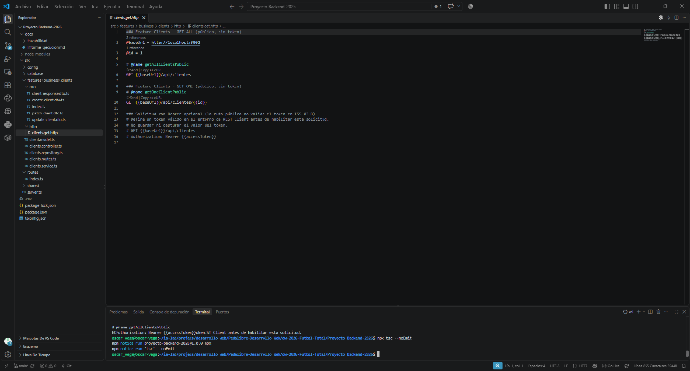

**Conclusión:** Verifiqué que las implementaciones de lectura compilan sin errores de TypeScript.

### Paso 27 — Probar endpoints GET *(en curso)*

**Acción:** iniciar el servidor desde `Proyecto Backend-2026`:

```bash
npm run dev
```

Con el servidor activo, abrir `src/features/business/clients/http/clients.get.http` y ejecutar `GET ALL` y `GET ONE` con REST Client. Registrar los códigos HTTP y cuerpos realmente observados; no asumir si existe un cliente con ID 1.

**Capturas:** registrar por separado el servidor activo y la respuesta de cada solicitud. No mostrar tokens, secretos ni datos personales.

**Registro de ejecución — completar después de realizar el paso:**

- **Fecha:** —
- **Resultado observado:** —
- **Fecha:** 2026-10-04.
- **Resultado observado:** `GET /api/clientes` respondió HTTP 200 y devolvió 56 clientes; `GET /api/clientes/1` respondió HTTP 200. Se comprobó estructuralmente que ninguna respuesta expone el campo `password`. Una solicitud de colección con una cabecera Bearer de marcador también respondió HTTP 200; al no existir middleware de autenticación, esto no demuestra validación JWT/RBAC.
- **Estado:** Parcial. GET ALL y GET ONE (para ID existente e inexistente) están verificados sin token. La solicitud con cabecera Bearer de prueba respondió HTTP 200; por tanto, la ruta no valida autenticación. JWT/RBAC no está implementado ni probado.
- **Evidencia de arranque:** [`E-ISS03B-P27-01-servidor-activo.png`](trazabilidad/E-ISS03B-P27-01-servidor-activo.png).
- **Evidencia de GET ALL:** [`E-ISS03B-P27-02-get-all-http-200.png`](trazabilidad/E-ISS03B-P27-02-get-all-http-200.png).
- **Evidencia de GET ONE existente:** [`E-ISS03B-P27-03-get-one-200.png`](trazabilidad/E-ISS03B-P27-03-get-one-200.png).
- **Evidencia de GET ONE inexistente:** [`E-ISS03B-P27-04-get-one-404.png`](trazabilidad/E-ISS03B-P27-04-get-one-404.png).
- **Evidencia de solicitud con Bearer:** no se adjunta, según lo acordado.

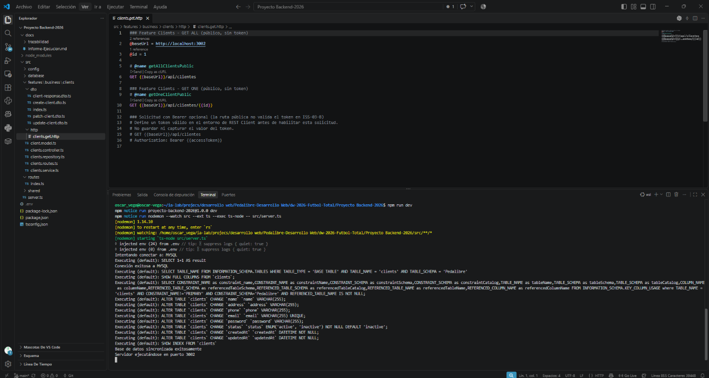

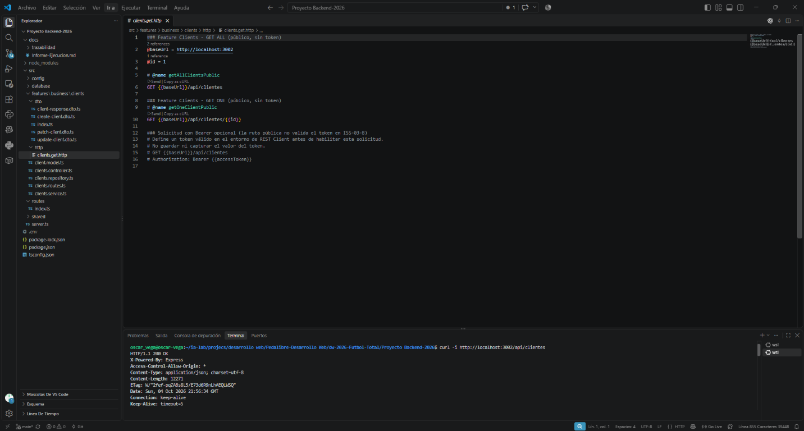

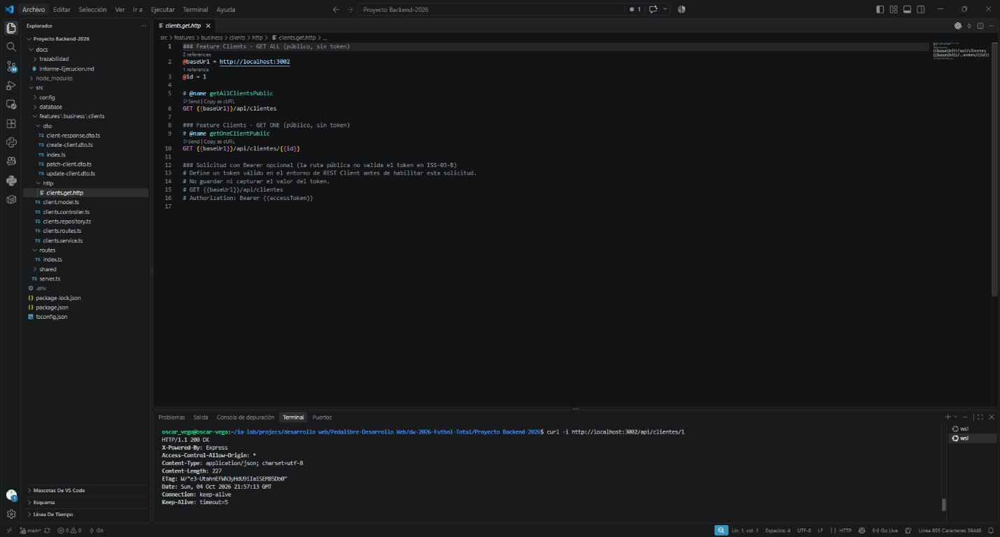

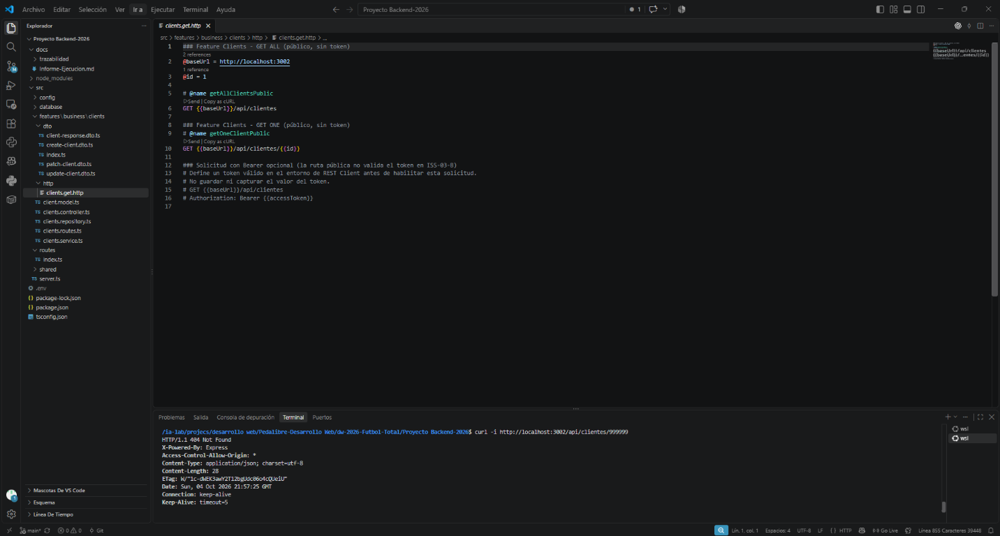

**Conclusión:** GET ALL respondió HTTP 200; GET ONE respondió HTTP 200 para el ID 1 y HTTP 404 para el ID 999999. También ejecuté la solicitud con una cabecera Bearer de prueba y respondió HTTP 200. Registro ese resultado sin evidencia visual adicional. La respuesta no demuestra autenticación: estas rutas no tienen middleware JWT/RBAC.

**Aclaración de trazabilidad:** las capturas de GET ONE muestran solicitudes sin token: `/api/clientes/1` devolvió HTTP 200 y `/api/clientes/999999` devolvió HTTP 404. La solicitud con cabecera Bearer de prueba respondió HTTP 200 y queda registrada sin evidencia visual, según se acordó.


## ISS-03-C — Creación de clientes

### Paso 28 — Implementar creación en el repository *(completado)*

**Referencia:** ISS-03-C — `ClientsRepository.create`.  
**Resultado observado:** el repository importa `CreationAttributes` y su método `create(data)` delega en `Client.create(data)`. La captura muestra el método y las consultas de lectura de ISS-03-B que se conservaron.

- **Fecha:** 2026-10-04.
- **Estado:** Código agregado; compilación pendiente de verificación.
- **Evidencia:** [`E-ISS03C-P28-01-clients-repository-create.png`](trazabilidad/E-ISS03C-P28-01-clients-repository-create.png).

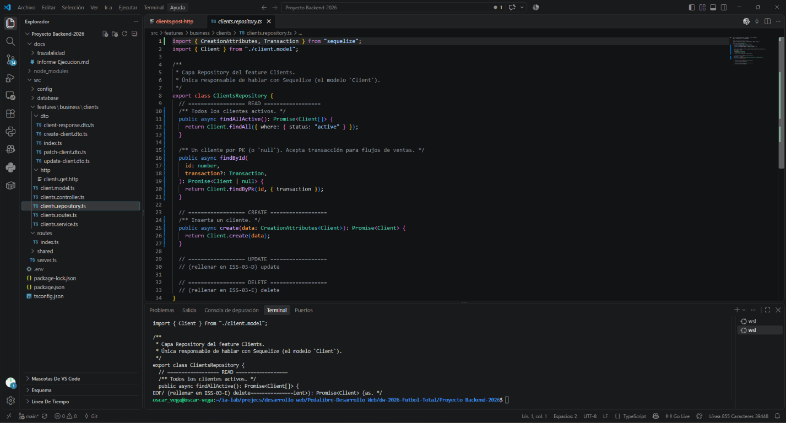

### Paso 29 — Implementar creación en el service *(completado)*

**Referencia:** ISS-03-C — `ClientsService.create`.  
**Resultado observado:** el service recibe `CreateClientDto`, delega la creación al repository, asigna `active` cuando no se especifica estado y transforma la entidad con `toClientResponse` para excluir la contraseña.

- **Fecha:** 2026-10-04.
- **Estado:** Código agregado; compilación pendiente de verificación.
- **Evidencia:** [`E-ISS03C-P29-01-clients-service-create.png`](trazabilidad/E-ISS03C-P29-01-clients-service-create.png).

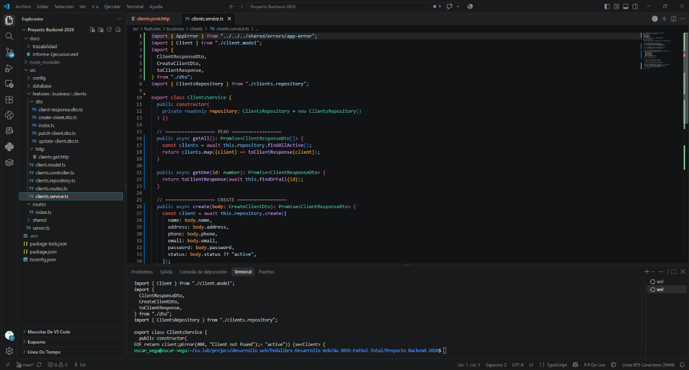

### Paso 30 — Implementar controller create *(completado)*

**Referencia:** ISS-03-C — `ClientsController.create`.  
**Resultado observado:** el controller convierte el cuerpo de la solicitud en `CreateClientDto`, ejecuta el service dentro de `run()` y responde con HTTP 201 al completar la creación.

- **Fecha:** 2026-10-04.
- **Estado:** Código agregado; compilación pendiente de verificación.
- **Evidencia:** [`E-ISS03C-P30-01-clients-controller-create.png`](trazabilidad/E-ISS03C-P30-01-clients-controller-create.png).

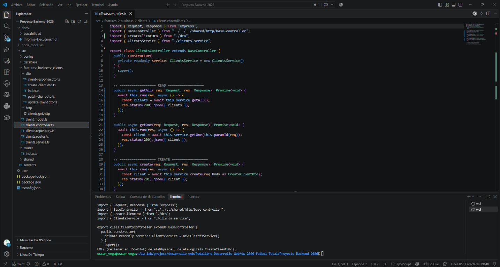

### Paso 31 — Registrar ruta POST *(completado)*

**Referencia:** ISS-03-C — `POST /api/clientes`, indicada sin autenticación en los criterios de aceptación.  
**Resultado observado:** `clients.routes.ts` registra POST en `/api/clientes` y lo vincula al método `create`; conserva las dos rutas GET de ISS-03-B.

- **Fecha:** 2026-10-04.
- **Estado:** Código agregado; compilación pendiente de verificación.
- **Evidencia:** [`E-ISS03C-P31-01-clients-routes-post.png`](trazabilidad/E-ISS03C-P31-01-clients-routes-post.png).

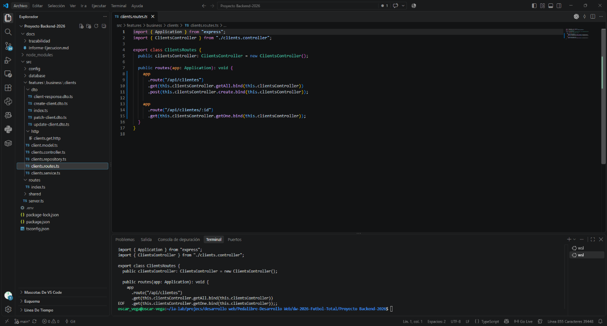

### Paso 32 — Crear solicitud HTTP para POST *(completado)*

**Referencia:** ISS-03-C — `http/clients.create.http`.  
**Resultado observado:** se creó una solicitud POST a `http://localhost:3002/api/clientes`, con los campos requeridos y estado activo. La captura archivada oculta el valor de contraseña para no exponerlo en el informe.

- **Fecha:** 2026-10-04.
- **Estado:** Plantilla creada; su ejecución se registra en el paso 34.
- **Evidencia:** [`E-ISS03C-P32-01-create-http-redacted.png`](trazabilidad/E-ISS03C-P32-01-create-http-redacted.png).

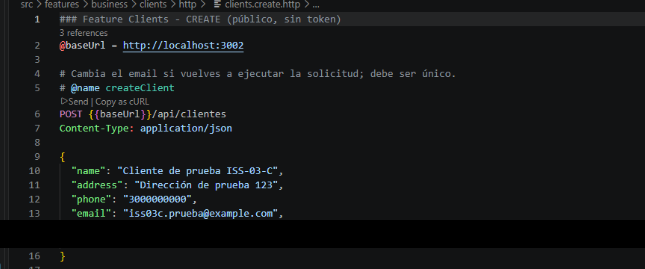

### Paso 33 — Verificar compilación de ISS-03-C *(completado)*

**Resultado observado:** `npx tsc --noEmit` terminó y devolvió el prompt sin errores.

- **Fecha:** 2026-10-04.
- **Estado:** Cumple la verificación de compilación de los cambios implementados hasta este paso.
- **Evidencia:** [`E-ISS03C-P33-01-typescript-redacted.png`](trazabilidad/E-ISS03C-P33-01-typescript-redacted.png). Se archivó solo el recorte de la terminal; la captura completa se omitió porque exponía la contraseña del payload de ejemplo.

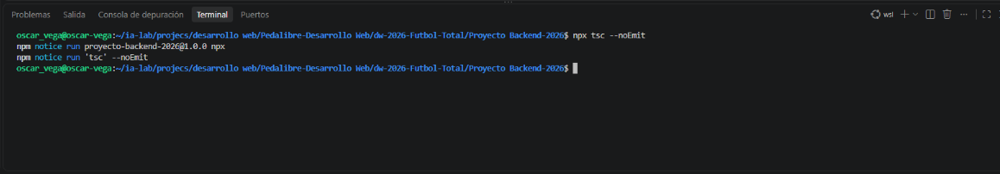

### Paso 34 — Ejecutar POST de creación *(completado)*

**Resultado observado:** `POST /api/clientes` respondió `HTTP/1.1 201 Created`. La terminal confirma la creación exitosa del recurso; la captura archivada se limita al resultado HTTP y no conserva el cuerpo de la solicitud.

- **Fecha:** 2026-10-04.
- **Estado:** Cumple la respuesta HTTP 201 esperada.
- **Evidencia:** [`E-ISS03C-P34-01-post-created-redacted.png`](trazabilidad/E-ISS03C-P34-01-post-created-redacted.png).

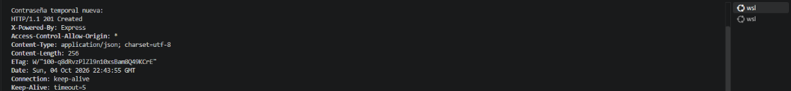

**Cierre ISS-03-C:** repository, service, controller, ruta POST, plantilla HTTP, compilación y respuesta HTTP 201 completados. La creación se probó como endpoint público según el criterio de aceptación; la plantilla JWT/RBAC del manual no aplica porque este proyecto no cuenta con ese middleware.

### Paso 35 — Agregar persistencia de actualización al repository *(completado)*

**Referencia:** ISS-03-D, actualización del repository.  
**Acción:** agregar `update(client, data)` al repository para persistir los cambios sobre la instancia de cliente ya localizada por las capas superiores.

**Resultado observado:** `ClientsRepository.update` recibe una instancia `Client` y `Partial<ClientI>`, y delega la persistencia a `client.update(data)`. Se conservaron las operaciones existentes de lectura y creación.

**Estado:** Implementado; la compilación conjunta se verificará en el paso de validación del ISS-03-D.  
**Evidencia:** [`E-ISS03D-P35-01-repository-update.png`](trazabilidad/E-ISS03D-P35-01-repository-update.png).

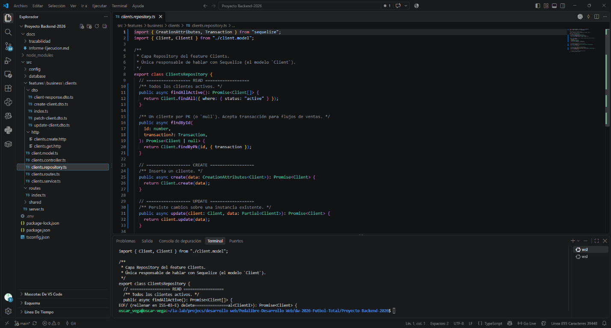

### Paso 36 — Implementar PUT y PATCH en el service *(completado)*

**Referencia:** ISS-03-D, actualización de la capa de servicio.  
**Acción:** implementar `updatePut` para actualizar los campos recibidos como reemplazo y `updatePatch` para modificar únicamente las propiedades presentes en la solicitud. Ambos métodos buscan primero un cliente activo, delegan la persistencia al repository y convierten el resultado a `ClientResponseDto`.

**Resultado observado:** ambos métodos están implementados en `ClientsService`. PATCH construye un objeto con las propiedades definidas; PUT asigna los campos requeridos por `UpdateClientDto` y solo modifica la contraseña cuando se envía. La captura confirma el código del service; la compilación se verificará más adelante.

**Estado:** Implementado; pendiente de validación conjunta.  
**Evidencia:** [`E-ISS03D-P36-01-service-update.png`](trazabilidad/E-ISS03D-P36-01-service-update.png).

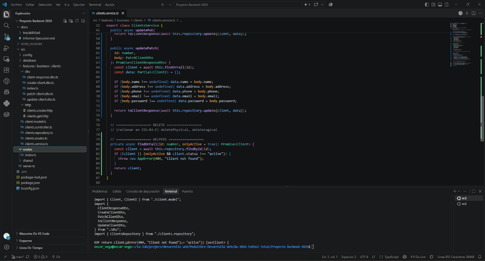

### Paso 37 — Conectar PUT y PATCH en el controller *(completado)*

**Referencia:** ISS-03-D, actualización de la capa de controller.  
**Acción:** agregar handlers que validan el identificador de ruta, envían el body al método correspondiente del service y responden con el cliente actualizado.

**Resultado observado:** `updatePut` y `updatePatch` quedaron implementados dentro de `BaseController.run`; ambos devuelven HTTP 200 con el cliente. La captura muestra ambos métodos y el manejo de sus DTO.

**Estado:** Implementado; pendiente de validación conjunta.  
**Evidencia:** [`E-ISS03D-P37-01-controller-update.png`](trazabilidad/E-ISS03D-P37-01-controller-update.png).

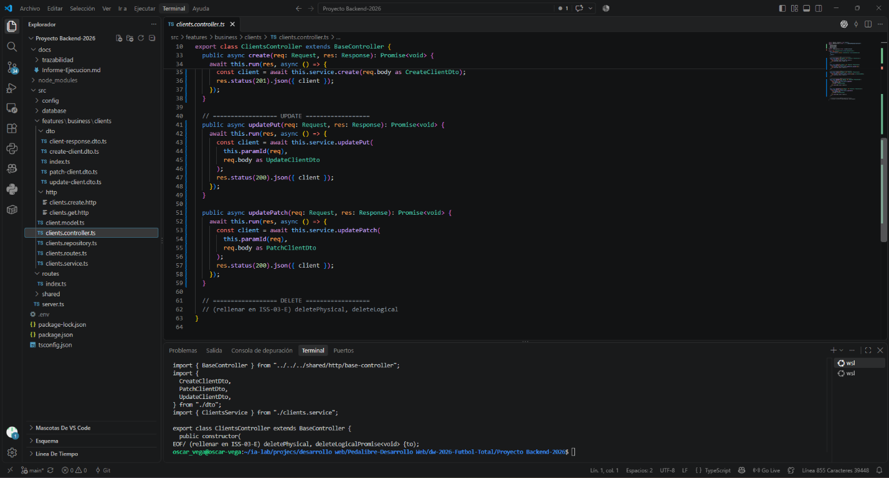

### Paso 38 — Registrar rutas PUT y PATCH *(completado)*

**Referencia:** ISS-03-D, registro de endpoints de actualización.  
**Acción:** asociar PUT y PATCH de `/api/clientes/:id` con sus handlers del controller.

**Resultado observado:** la ruta de detalle conserva GET y ahora registra PUT y PATCH. La captura muestra los tres métodos y sus handlers enlazados.

**Estado:** Implementado; pendiente de validación conjunta.  
**Evidencia:** [`E-ISS03D-P38-01-routes-put-patch.png`](trazabilidad/E-ISS03D-P38-01-routes-put-patch.png).

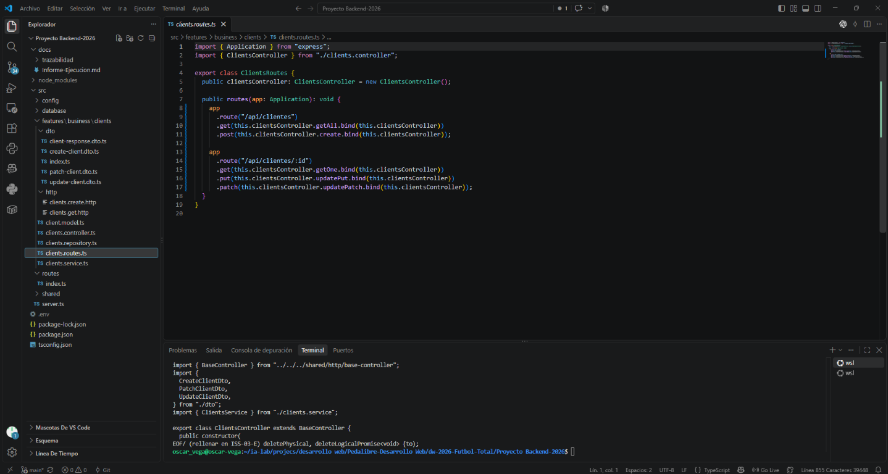

### Paso 39 — Preparar solicitudes HTTP para PUT y PATCH *(archivo preparado)*

**Acción:** crear una plantilla REST Client con solicitudes PUT y PATCH contra `/api/clientes/:id`.

**Resultado observado:** `clients.update.http` contiene ejemplos de actualización con datos sintéticos y usa el ID 113, identificado por consulta de solo lectura como el cliente creado en ISS-03-C. La plantilla no incluye contraseña. En PUT se conserva el correo existente del cliente para evitar una posible colisión con la restricción de unicidad; ambas operaciones modifican datos persistentes al enviarse.

**Estado:** Plantilla preparada para el cliente de prueba.  
**Evidencia:** [`E-ISS03D-P39-01-update-http-template.png`](trazabilidad/E-ISS03D-P39-01-update-http-template.png) documenta la plantilla inicial antes de asignar el ID; posteriormente se actualizó a 113, identificado por consulta de solo lectura.

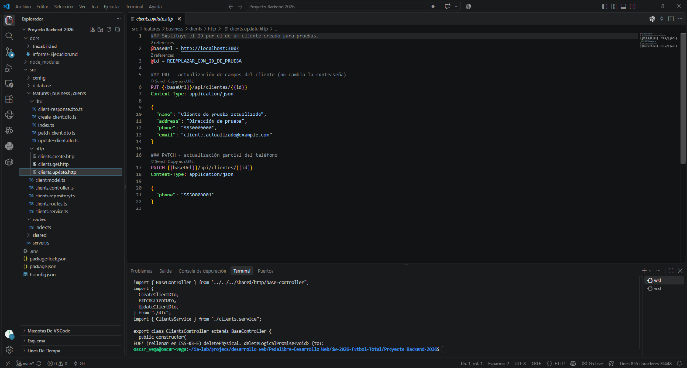

### Paso 40 — Probar la actualización PUT *(completado)*

**Acción:** enviar PUT a `/api/clientes/113` con los campos de perfil del cliente de prueba, conservando el correo existente para respetar la unicidad.

**Resultado observado:** la respuesta fue `HTTP/1.1 200 OK` y el JSON devolvió el cliente con nombre, dirección y teléfono actualizados. No se incluyó contraseña en la solicitud ni en la respuesta visible.

**Estado:** Cumple; el endpoint actualizó el registro de prueba.  
**Evidencia:** [`E-ISS03D-P40-01-put-200.png`](trazabilidad/E-ISS03D-P40-01-put-200.png).

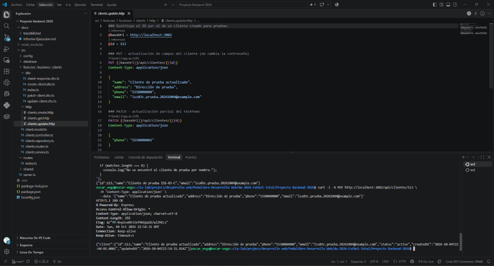

### Paso 41 — Probar la actualización PATCH *(completado)*

**Acción:** enviar PATCH a `/api/clientes/113` con únicamente el campo `phone`.

**Resultado observado:** la respuesta fue `HTTP/1.1 200 OK`. El JSON muestra el teléfono nuevo y conserva el nombre, dirección y correo establecidos en la prueba PUT, confirmando una actualización parcial.

**Estado:** Cumple; el endpoint PATCH modificó únicamente el campo solicitado.  
**Evidencia:** [`E-ISS03D-P41-01-patch-200.png`](trazabilidad/E-ISS03D-P41-01-patch-200.png).

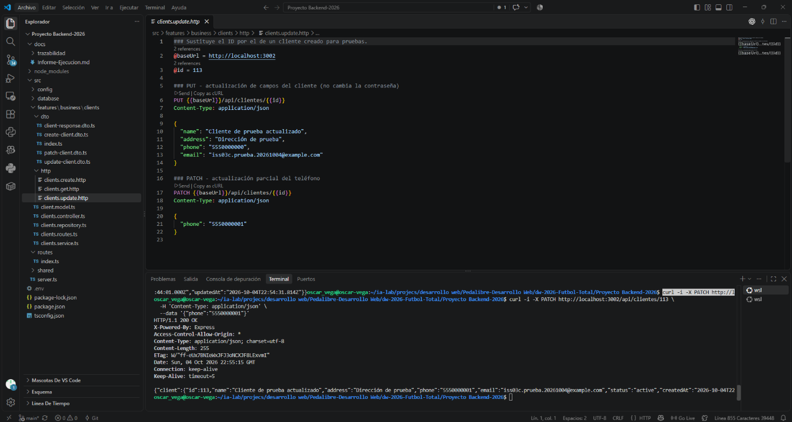

### Paso 42 — Verificar compilación de ISS-03-D *(completado)*

**Acción:** ejecutar `npx tsc --noEmit` desde `Proyecto Backend-2026`.

**Resultado observado:** TypeScript finalizó y devolvió el prompt sin errores. La captura muestra el comando ejecutado y la terminal disponible nuevamente.

**Estado:** Cumple; los cambios implementados hasta ISS-03-D compilan correctamente.  
**Evidencia:** [`E-ISS03D-P42-01-typescript.png`](trazabilidad/E-ISS03D-P42-01-typescript.png).

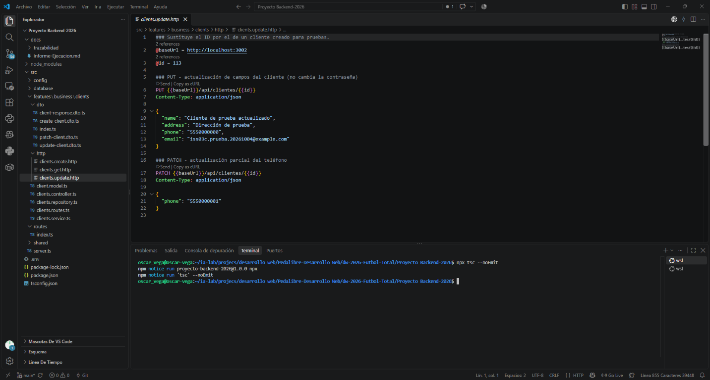

**Cierre ISS-03-D:** las operaciones PUT y PATCH quedaron conectadas, ambas respondieron HTTP 200 en el cliente de prueba y la compilación TypeScript terminó sin errores. No se modificó la política de autenticación; se mantuvo el criterio público aplicado en los endpoints anteriores.

### Paso 43 — Agregar eliminación física al repository *(completado)*

**Referencia:** ISS-03-E, operación de eliminación del repository.  
**Acción:** agregar `delete(client)` para eliminar físicamente la instancia recibida.

**Resultado observado:** `ClientsRepository.delete` espera la operación `client.destroy()`. La eliminación lógica se manejará por separado desde el service mediante el estado `inactive`.

**Estado:** Implementado; pendiente de validación conjunta.  
**Evidencia:** [`E-ISS03E-P43-01-repository-delete.png`](trazabilidad/E-ISS03E-P43-01-repository-delete.png).

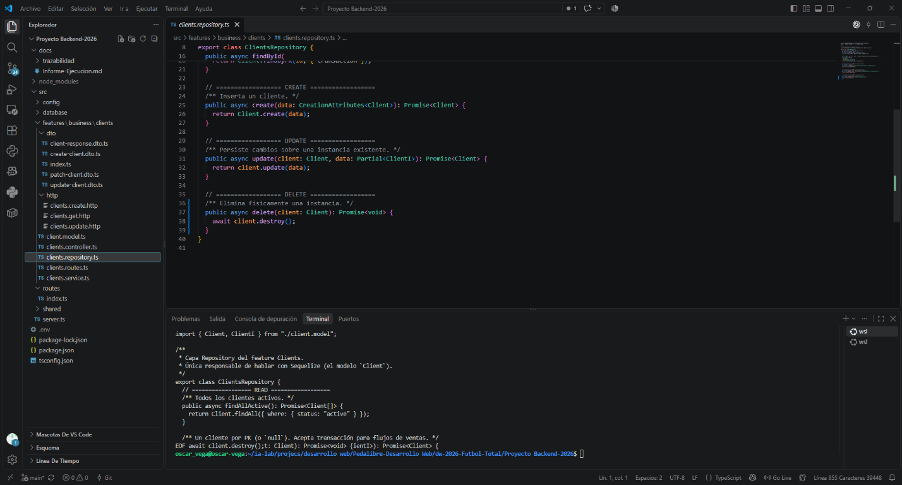

### Paso 44 — Implementar eliminación física y lógica en el service *(completado)*

**Referencia:** ISS-03-E, métodos del service.  
**Acción:** implementar `deletePhysical` y `deleteLogical`, reutilizando `findOrFail` y el repository.

**Resultado observado:** `deletePhysical` permite localizar también clientes inactivos antes de purgarlos; `deleteLogical` marca como `inactive` un cliente activo y devuelve el DTO de respuesta.

**Estado:** Implementado; pendiente de validación conjunta.  
**Evidencia:** [`E-ISS03E-P44-01-service-delete.png`](trazabilidad/E-ISS03E-P44-01-service-delete.png).

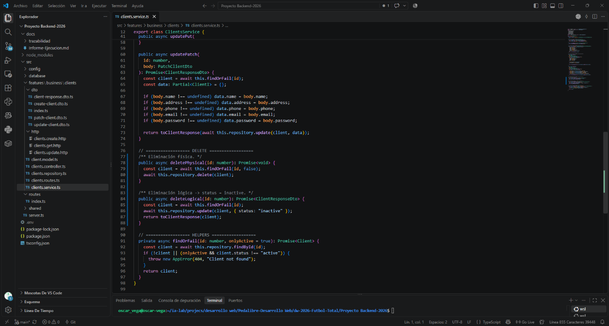

### Paso 45 — Conectar eliminaciones física y lógica en el controller *(completado)*

**Referencia:** ISS-03-E, handlers de eliminación.  
**Acción:** agregar `deletePhysical` y `deleteLogical`, validar el ID con `paramId` y ejecutar ambos dentro de `BaseController.run`.

**Resultado observado:** el handler físico responde con un mensaje y el ID eliminado; el lógico responde con un mensaje y el DTO del cliente desactivado. Ambos están preparados para responder HTTP 200.

**Estado:** Implementado; pendiente de validación conjunta.  
**Evidencia:** [`E-ISS03E-P45-01-controller-delete.png`](trazabilidad/E-ISS03E-P45-01-controller-delete.png).

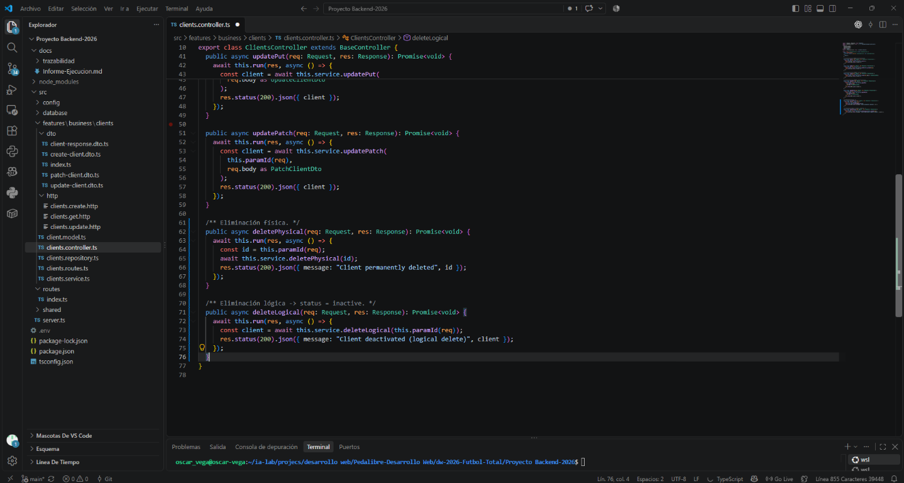

### Paso 46 — Registrar rutas de eliminación *(completado)*

**Referencia:** ISS-03-E, rutas públicas de eliminación.  
**Acción:** conectar `DELETE /api/clientes/:id` con `deletePhysical` y `PATCH /api/clientes/:id/deactivate` con `deleteLogical`, sin agregar middleware de autenticación.

**Resultado observado:** ambas rutas quedaron registradas; la ruta de detalle conserva GET, PUT, PATCH y DELETE. La verificación funcional se realizará en las pruebas HTTP.

**Estado:** Implementado; falta evidencia visual específica de la plantilla y las pruebas.  
**Evidencia:** [`E-ISS03E-P46-01-routes-delete.png`](trazabilidad/E-ISS03E-P46-01-routes-delete.png).

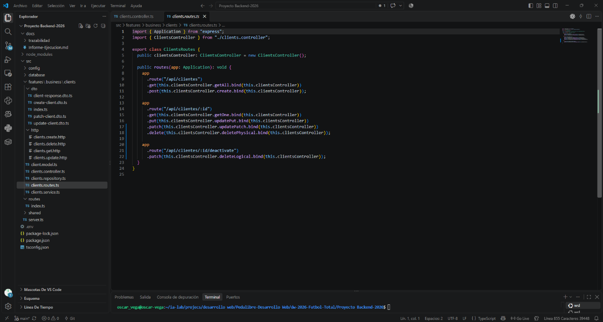

### Paso 47 — Preparar plantilla HTTP para eliminaciones *(archivo preparado)*

**Acción:** crear `clients.delete.http` con los endpoints públicos de eliminación lógica y física.

**Resultado observado:** la plantilla incluye `PATCH /api/clientes/:id/deactivate` con el ID 113, cliente de prueba usado en ISS-03-D, y separa el ID del borrado físico mediante un marcador que requiere un registro descartable distinto. Incluye una advertencia de que el borrado físico elimina permanentemente la fila; no se han ejecutado estas solicitudes.

**Estado:** Plantilla preparada; el ID 113 se reserva para probar la eliminación lógica. El borrado físico queda pendiente de un ID descartable y autorización antes de ejecutarlo.  
**Evidencia:** [`E-ISS03E-P47-01-delete-http.png`](trazabilidad/E-ISS03E-P47-01-delete-http.png).

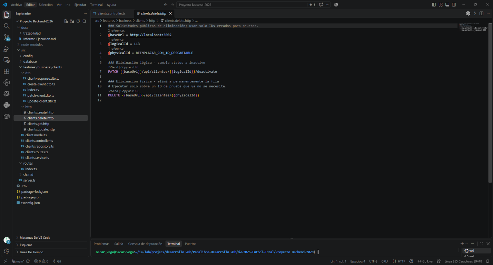

### Paso 48 — Probar la eliminación lógica *(completado)*

**Acción:** enviar `PATCH /api/clientes/113/deactivate` sobre el cliente de prueba.

**Resultado observado:** el servidor respondió `HTTP/1.1 200 OK`. El cuerpo confirma `Client deactivated (logical delete)` y muestra `status: inactive` para el cliente 113.

**Estado:** Cumple; el registro fue desactivado lógicamente, sin borrarlo físicamente.  
**Evidencia:** [`E-ISS03E-P48-01-deactivate-200.png`](trazabilidad/E-ISS03E-P48-01-deactivate-200.png).

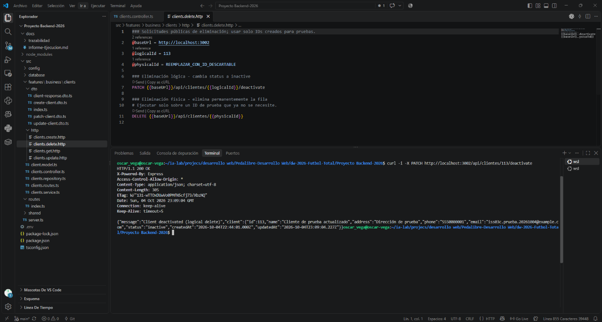

### Paso 49 — Verificar que el cliente inactivo no es visible por GET *(completado)*

**Acción:** consultar `GET /api/clientes/113` después de la eliminación lógica.

**Resultado observado:** el endpoint respondió `HTTP/1.1 404 Not Found` con `{"error":"Client not found"}`, confirmando que el cliente inactivo deja de estar disponible mediante la consulta individual.

**Estado:** Cumple la política de ocultar clientes inactivos en lecturas públicas.  
**Evidencia:** [`E-ISS03E-P49-01-inactive-not-found.png`](trazabilidad/E-ISS03E-P49-01-inactive-not-found.png).

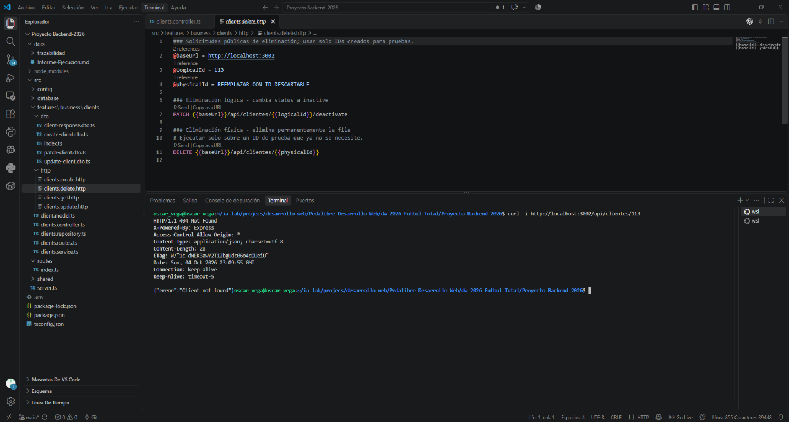

### Paso 50 — Crear cliente descartable para la prueba física *(completado)*

**Acción:** crear un cliente de prueba destinado exclusivamente a validar la eliminación física.

**Resultado observado:** el POST respondió `HTTP/1.1 201 Created` y devolvió el ID 114 para `Cliente descartable ISS-03-E`. Se actualizó `@physicalId` a 114 en la plantilla de eliminación. La captura se redactó para ocultar el comando, que contenía una contraseña temporal; esa contraseña no debe reutilizarse y no se conserva en el informe ni en la evidencia.

**Estado:** Cliente descartable creado; pendiente ejecutar DELETE sobre el ID 114, lo que eliminará permanentemente esa fila.  
**Evidencia:** [`E-ISS03E-P50-01-disposable-client-created-redacted.png`](trazabilidad/E-ISS03E-P50-01-disposable-client-created-redacted.png).

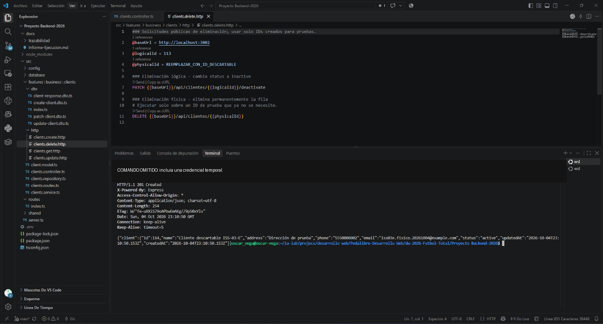

### Paso 51 — Probar la eliminación física *(completado)*

**Acción:** enviar `DELETE /api/clientes/114` sobre el registro descartable creado para esta prueba.

**Resultado observado:** el endpoint respondió `HTTP/1.1 200 OK` con `{"message":"Client permanently deleted","id":114}`.

**Estado:** Cumple; el endpoint eliminó físicamente el cliente descartable.  
**Evidencia:** [`E-ISS03E-P51-01-delete-200.png`](trazabilidad/E-ISS03E-P51-01-delete-200.png).

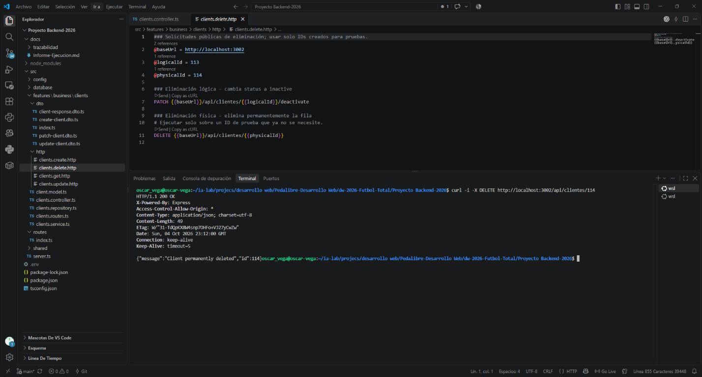

### Paso 52 — Verificar compilación de ISS-03-E *(completado)*

**Acción:** ejecutar `npx tsc --noEmit` desde `Proyecto Backend-2026`.

**Resultado observado:** TypeScript finalizó y devolvió el prompt sin errores.

**Estado:** Cumple; la implementación de ISS-03-E compila correctamente.  
**Evidencia:** [`E-ISS03E-P52-01-typescript.png`](trazabilidad/E-ISS03E-P52-01-typescript.png).

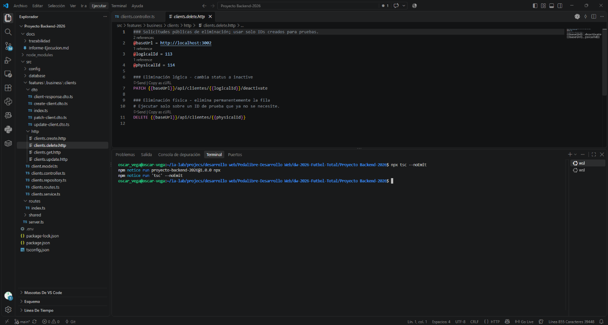

**Cierre ISS-03-E:** repository, service, controller, rutas públicas de eliminación física y lógica, plantilla HTTP y pruebas de ambas modalidades completadas. La desactivación lógica respondió HTTP 200 y quedó oculta del GET con HTTP 404; la eliminación física del registro descartable respondió HTTP 200. La compilación TypeScript terminó sin errores.

**Publicación local de ISS-03-B a ISS-03-E:** el usuario ejecutó `git push origin main`; la terminal confirmó la actualización de `main` desde `d080878` hasta `9c7b615`.  
**Evidencia:** [`E-ISS03E-P53-01-push-main.png`](trazabilidad/E-ISS03E-P53-01-push-main.png).

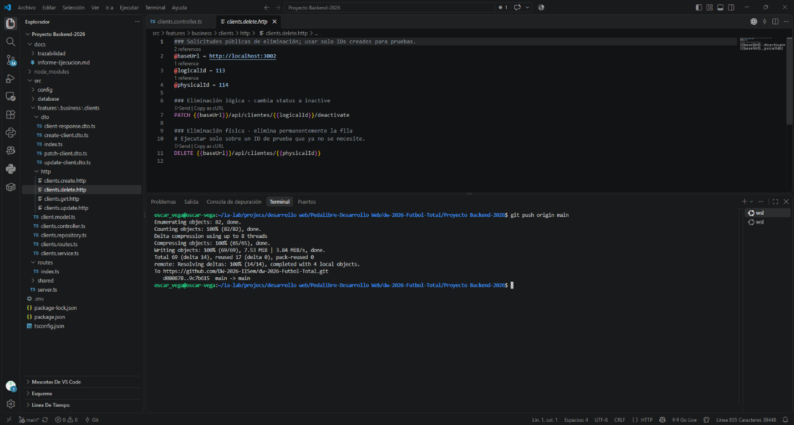

### Paso 54 — Instalar Faker *(completado)*

**Referencia:** ISS-04, seeder del feature Client.  
**Acción:** instalar `@faker-js/faker@^10.6.0` como dependencia de desarrollo.

**Resultado observado:** npm agregó el paquete y `package.json` declara `@faker-js/faker` con el rango `^10.6.0`. La salida reporta vulnerabilidades en el árbol de dependencias; no se ejecutó `npm audit fix`.

**Estado:** Cumple; Faker está disponible para el seeder.  
**Evidencia:** [`E-ISS04-P54-01-faker-install.png`](trazabilidad/E-ISS04-P54-01-faker-install.png).

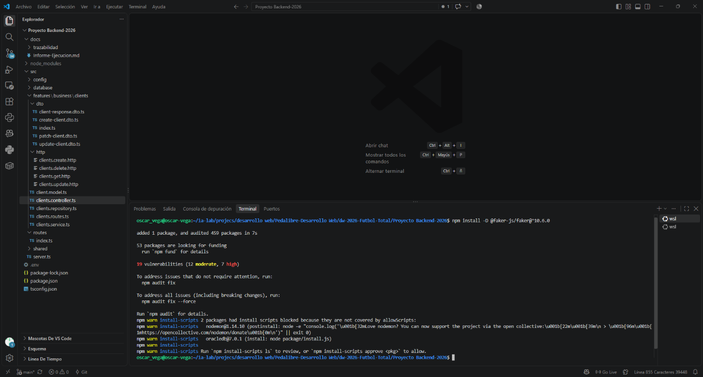

### Paso 55 — Crear el seeder del feature Client *(completado)*

**Referencia:** ISS-04, sección 9.1 — seeder dentro del feature Client.  
**Objetivo:** crear `src/features/business/clients/clients.seeder.ts` con `seedClients(count)`, generación Faker e idempotencia basada en el conteo existente.

**Adaptación prevista respecto al ejemplo del manual:** en lugar de usar una contraseña fija compartida (`Password123!`), generar una contraseña sintética independiente con Faker por cada fila. El modelo aplica su hook de hashing en `bulkCreate`; así no se incorpora una contraseña de prueba reutilizable al código fuente.

**Resultado observado:** `clients.seeder.ts` exporta `seedClients(count)`, omite conteo no positivo y no vuelve a insertar cuando ya existen clientes. Los datos se generan con Faker y la contraseña se genera por registro. El archivo compila pendiente de la verificación conjunta del ISS-04.

**Estado:** Implementado; falta evidencia visual específica del archivo y pruebas.
**Evidencia:** [`E-ISS04-P55-01-clients-seeder.png`](trazabilidad/E-ISS04-P55-01-clients-seeder.png).

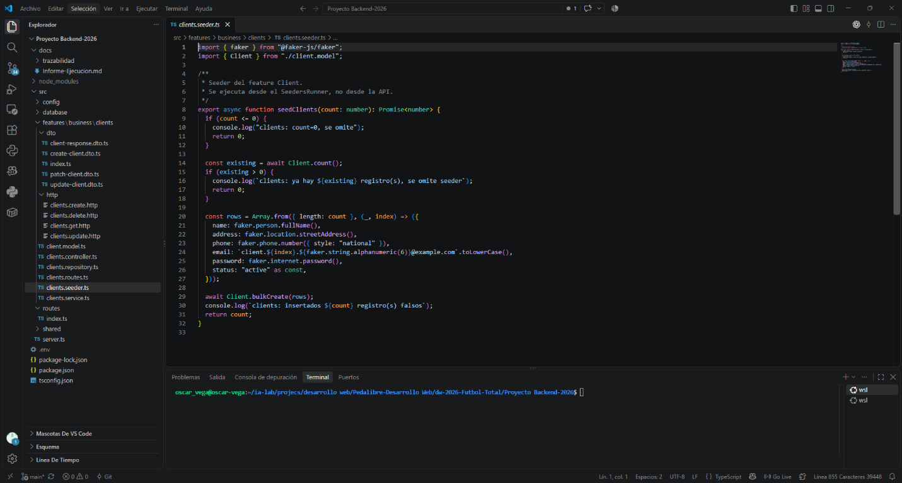

### Paso 56 — Configurar conteos por entidad *(completado)*

**Referencia:** ISS-04, sección 9.2.1 — conteos para el SeedersRunner.  
**Acción:** crear `src/database/seeders/counts.ts` para definir el conteo por defecto y resolver valores desde entorno y argumentos CLI.

**Resultado observado:** `SeedCounts` incluye `clients`, el valor por defecto es 10 y `resolveSeedCounts` aplica la prioridad CLI > `SEED_CLIENTS` > default.

**Estado:** Implementado; pendiente de validación junto con el runner.  
**Evidencia:** [`E-ISS04-P56-01-seed-counts.png`](trazabilidad/E-ISS04-P56-01-seed-counts.png).

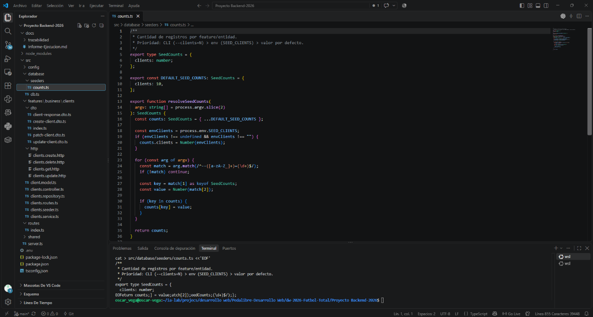

### Paso 57 — Crear el SeedersRunner *(completado)*

**Referencia:** ISS-04, sección 9.2.2 — orquestador de seeders.  
**Acción:** crear `src/database/seeders/index.ts` para resolver conteos, probar la conexión, sincronizar el esquema sin forzar y ejecutar el seeder de clientes; cerrar Sequelize al finalizar correctamente o ante error.

**Resultado observado:** el runner importa `sequelize`, `testConnection`, el modelo Client, `seedClients` y `resolveSeedCounts`. La captura muestra la ejecución y el cierre de recursos. Se mantiene el patrón del proyecto con `testConnection()` que devuelve booleano; si falla, el runner genera un error explícito.

**Estado:** Implementado; pendiente de validación conjunta.  
**Evidencia:** [`E-ISS04-P57-01-seeders-runner.png`](trazabilidad/E-ISS04-P57-01-seeders-runner.png).

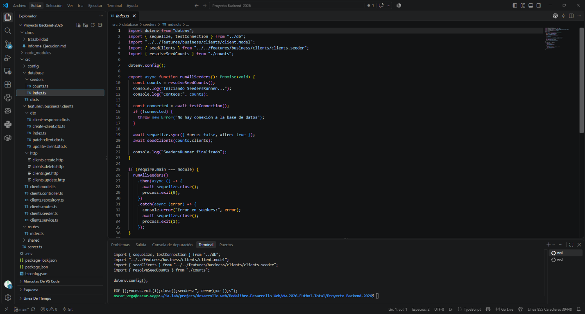

### Paso 58 — Agregar comando npm para el runner *(completado)*

**Acción:** agregar `db:seed` en `package.json` para ejecutar `src/database/seeders/index.ts` con ts-node.

**Resultado observado:** el script `db:seed` quedó configurado y fue listado por `npm run`.

**Estado:** Configurado y verificado en la lista de scripts.

### Paso 59 — Validar TypeScript y el script npm *(completado)*

**Acción:** ejecutar `npx tsc --noEmit` y `npm run` desde el proyecto.

**Resultado observado:** TypeScript terminó sin errores y npm listó `db:seed` junto con los demás scripts.

**Estado:** Cumple la comprobación estática y la configuración del comando.  
**Evidencia:** [`E-ISS04-P59-01-typescript-scripts.png`](trazabilidad/E-ISS04-P59-01-typescript-scripts.png).

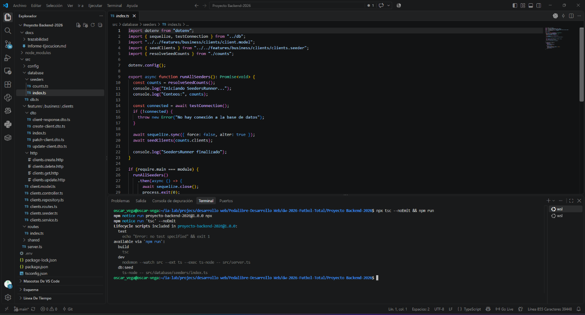

### Paso 60 — Ejecutar el seeder con el conteo predeterminado *(completado)*

**Acción:** ejecutar `npm run db:seed` con el conteo predeterminado de 10 clientes.

**Resultado observado:** el runner se conectó a MySQL y completó `sequelize.sync({ force: false, alter: true })`, mostrando sentencias `ALTER TABLE` para la tabla `clients`. El conteo existente fue de 110 registros, por lo que el seeder informó que omitía la inserción; no creó filas. El runner finalizó y cerró la conexión correctamente.

**Adaptación y precaución:** el manual también usa `alter: true`; esta ejecución lo aplicó a la base MySQL seleccionada por el `.env` local. Aunque el esquema se sincronizó correctamente, futuras ejecuciones del runner repetirán esta sincronización.

**Estado:** Cumple conexión, sincronización y omisión idempotente ante registros existentes.  
**Evidencia:** [`E-ISS04-P60-01-seed-default-skip.png`](trazabilidad/E-ISS04-P60-01-seed-default-skip.png).

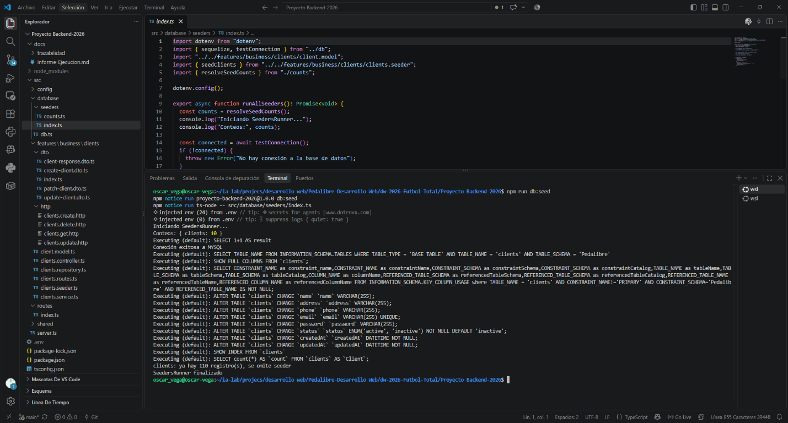

### Paso 61 — Verificar conteo configurado por CLI *(completado)*

**Acción:** ejecutar `npm run db:seed -- --clients=20`.

**Resultado observado:** el runner resolvió y mostró `clients: 20`, confirmando que el argumento CLI prevalece sobre el default. Se conectó a MySQL, volvió a sincronizar el esquema y detectó 110 registros, por lo que omitió nuevas inserciones.

**Estado:** Cumple precedencia CLI sobre el valor por defecto e idempotencia con registros existentes.  
**Evidencia:** [`E-ISS04-P61-01-seed-cli-count.png`](trazabilidad/E-ISS04-P61-01-seed-cli-count.png).

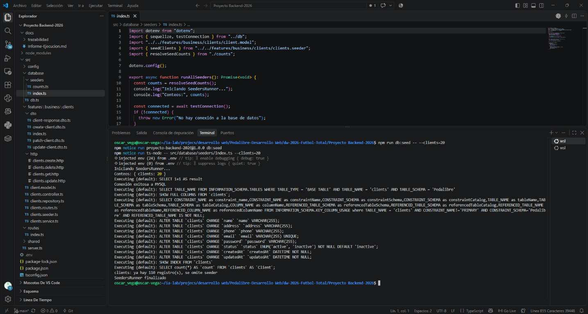

### Paso 62 — Verificar conteo por variable de entorno *(completado)*

**Acción:** ejecutar `SEED_CLIENTS=5 npm run db:seed`.

**Resultado observado:** el runner resolvió y mostró `clients: 5`, se conectó a MySQL, sincronizó la tabla y omitió la inserción porque ya existen 110 registros. Esto verifica que `SEED_CLIENTS` se utiliza cuando no se especifica un argumento CLI.

**Estado:** Cumple precedencia de entorno sobre default e idempotencia con registros existentes.  
**Evidencia:** [`E-ISS04-P62-01-seed-env-count.png`](trazabilidad/E-ISS04-P62-01-seed-env-count.png).

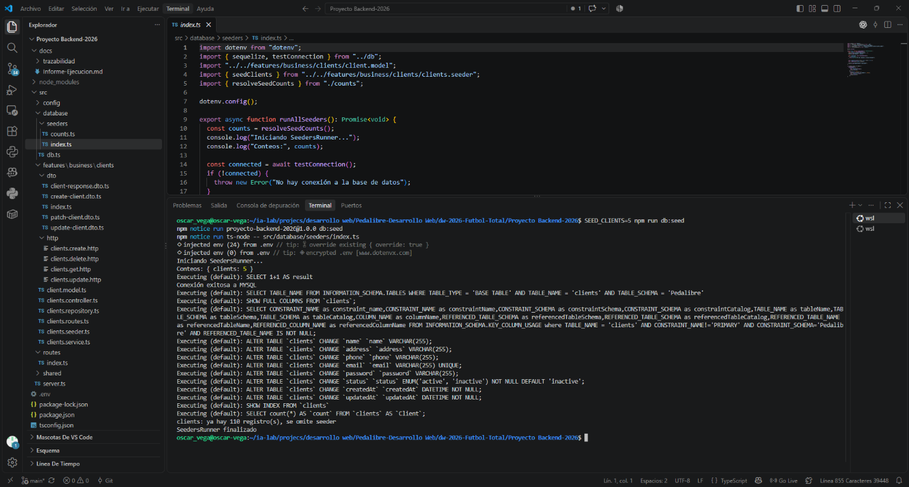

### Paso 63 — Verificar arranque del servidor al cerrar ISS-04 *(completado)*

**Referencia:** ISS-04, cierre del ISS.  
**Acción:** ejecutar `npm run dev`, confirmar el arranque y detener el servidor con Ctrl+C.

**Resultado observado:** el servidor sincronizó la base de datos y arrancó en el puerto 3002. Después se interrumpió con Ctrl+C y la terminal volvió al prompt.

**Estado:** Cumple el paso de cierre del manual.  
**Evidencia de arranque:** [`E-ISS04-P63-01-server-start.png`](trazabilidad/E-ISS04-P63-01-server-start.png).  
**Evidencia de detención:** [`E-ISS04-P64-01-server-stop.png`](trazabilidad/E-ISS04-P64-01-server-stop.png).

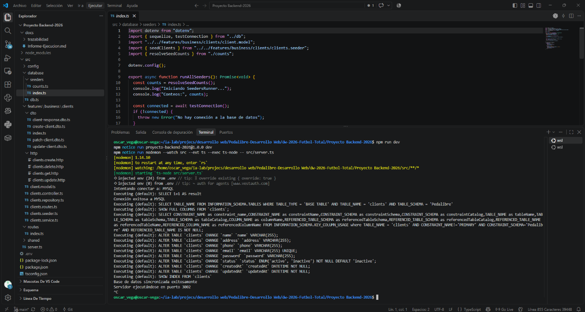

**Cierre ISS-04:** se implementaron el seeder de clientes con Faker, conteos configurables por default/entorno/CLI, SeedersRunner y script npm. Las tres ejecuciones del runner probaron resolución de cantidades e idempotencia ante 110 registros existentes; no se verificó la ruta de inserción sobre base vacía. TypeScript compiló sin errores y el servidor arrancó y se detuvo correctamente.

**Publicación de ISS-04:** el usuario ejecutó `git push origin main`; la terminal confirmó la actualización de `main` desde `9c7b615` hasta `2701d63`.  
**Evidencia:** [`E-ISS04-P65-01-push-main.png`](trazabilidad/E-ISS04-P65-01-push-main.png).


## ISS-05 — Swagger / OpenAPI

**Objetivo del manual:** documentar el feature Client con OpenAPI 3 y montar Swagger UI desde un registry externo.  
**Dependencia:** ISS-03-E, completado.  
**Referencia:** `Guia-unificada.md`, ISS-05, secciones 10.1 y 10.2.

### Paso 1 — Instalar paquetes de Swagger *(completado)*

**Referencia:** ISS-05, sección 10.1 — paquetes.
**Acción:** instalar `swagger-ui-express@^5.0.1` y `@types/swagger-ui-express@^4.1.8`.

**Registro de ejecución:**

- **Fecha:** 2026-10-08.
- **Resultado observado:** npm terminó las instalaciones. `package.json` declara `swagger-ui-express` en dependencias y `@types/swagger-ui-express` en dependencias de desarrollo.
- **Advertencias observadas:** npm reportó 21 vulnerabilidades (14 moderadas y 7 altas) en el árbol de dependencias. También indicó que bloqueó scripts de instalación de tres paquetes por la configuración `allowScripts`.
- **Adaptación/precaución:** no se ejecutó `npm audit fix` ni se aprobaron scripts de instalación; no forman parte de este paso de la guía.
- **Estado:** Cumple la instalación de los paquetes requeridos.
- **Evidencia:** [`E-ISS05-P01-01-swagger-install.png`](trazabilidad/E-ISS05-P01-01-swagger-install.png).

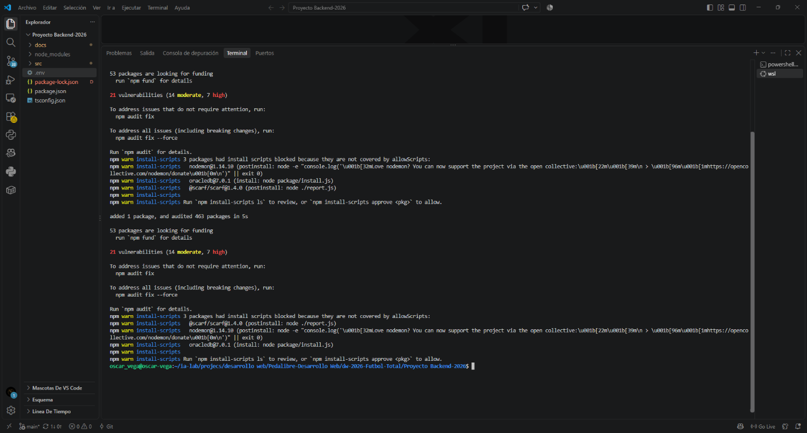

### Paso 2 — Documentar el feature Client en OpenAPI *(completado)*

**Referencia:** ISS-05, sección 10.1 — OpenAPI dentro del feature Client.  
**Acción:** crear `src/features/business/clients/clients.swagger.ts` con el tag Clientes, las operaciones HTTP del feature y los esquemas de entrada y respuesta.

**Registro de ejecución:**

- **Fecha:** 2026-10-08.
- **Resultado observado:** el módulo `clientsSwagger` documenta las rutas de clientes y los esquemas de Client. La documentación identifica los endpoints como **SIN AUTH**, de acuerdo con el comportamiento actual de Pedalibre.
- **Estado:** Implementado; falta la validación conjunta del ISS-05.
- **Evidencia:** [`E-ISS05-P02-01-clients-openapi.png`](trazabilidad/E-ISS05-P02-01-clients-openapi.png).

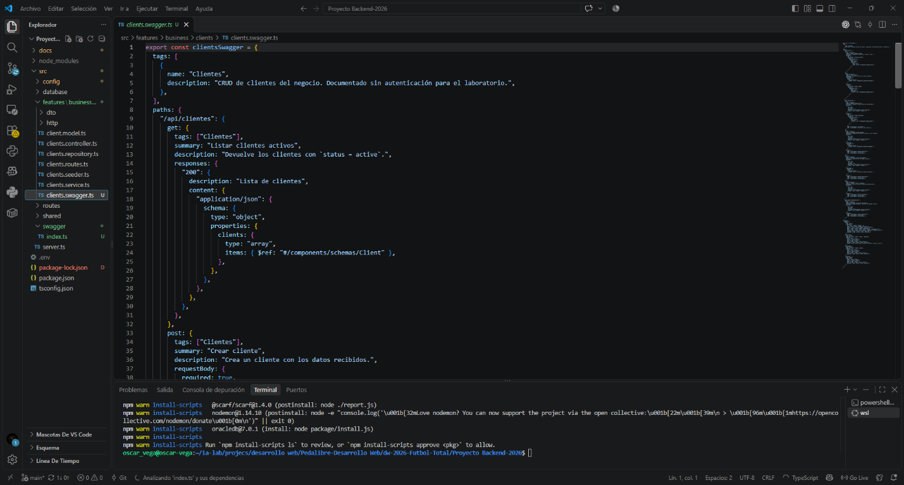

### Paso 3 — Crear el registry OpenAPI *(completado)*

**Referencia:** ISS-05, sección 10.2 — registry externo.
**Acción:** crear `src/swagger/index.ts` para agregar la documentación del feature Client y exponer Swagger UI y el JSON OpenAPI.

**Registro de ejecución:**

- **Fecha:** 2026-10-08.
- **Resultado observado:** `featureSwaggerModules` registra `clientsSwagger`; `buildOpenApiDocument()` reúne tags, paths y schemas, y `setupSwagger(app)` monta `/api/docs` y `/api/docs.json`.
- **Estado:** Implementado; falta la validación conjunta del ISS-05.
- **Evidencia:** [`E-ISS05-P03-01-openapi-registry.png`](trazabilidad/E-ISS05-P03-01-openapi-registry.png).

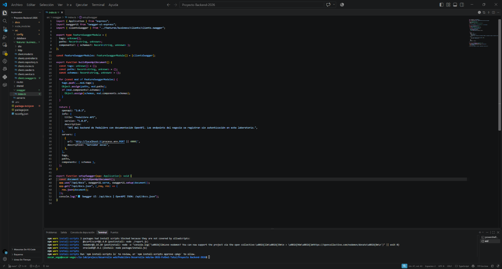

### Paso 4 — Montar Swagger desde `App` *(completado)*

**Referencia:** ISS-05, sección 10.2 — cableado en Config.
**Acción:** importar `setupSwagger`, llamarlo al construir `App` y definir el método `docs()` para montar la documentación sobre Express.

**Registro de ejecución:**

- **Fecha:** 2026-10-08.
- **Resultado observado:** `App` importa `setupSwagger`, invoca `this.docs()` después de registrar las rutas y `docs()` llama a `setupSwagger(this.app)`.
- **Estado:** Implementado; falta la validación de los endpoints documentados.
- **Evidencia:** [`E-ISS05-P04-01-app-swagger-wiring.png`](trazabilidad/E-ISS05-P04-01-app-swagger-wiring.png).

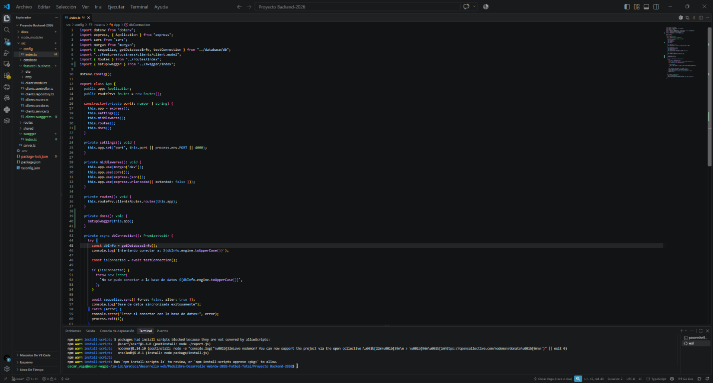

### Paso 5 — Verificar Swagger UI y el documento OpenAPI *(completado)*

**Referencia:** ISS-05, “Verificación ISS-05”.
**Acción:** abrir Swagger UI y solicitar el JSON OpenAPI con `curl`.

**Registro de ejecución:**

- **Fecha:** 2026-10-08.
- **Resultado observado:** `http://localhost:3002/api/docs/` muestra Swagger UI con las operaciones documentadas del feature Clientes y sus esquemas. `curl -s http://localhost:3002/api/docs.json | head` devolvió el documento OpenAPI, incluyendo `openapi: "3.0.3"`, el título Pedalibre API y los paths de clientes.
- **Adaptación:** se usó el puerto `3002` configurado para Pedalibre en `.env`, en lugar del puerto `4000` del ejemplo de la guía.
- **Estado:** Cumple ambos endpoints requeridos.
- **Evidencia UI:** [`E-ISS05-P05-01-swagger-ui.png`](trazabilidad/E-ISS05-P05-01-swagger-ui.png).
- **Evidencia JSON:** [`E-ISS05-P06-01-openapi-json.png`](trazabilidad/E-ISS05-P06-01-openapi-json.png).

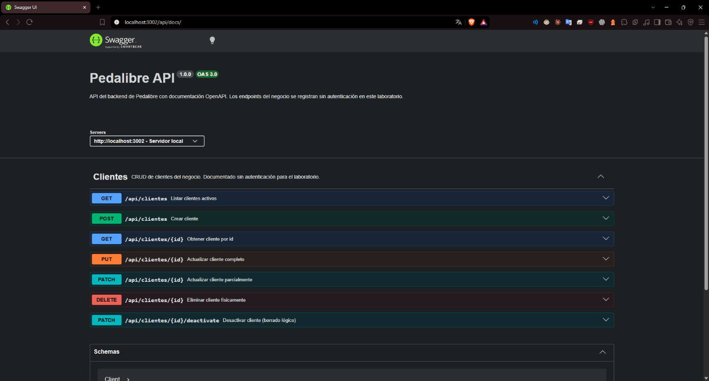

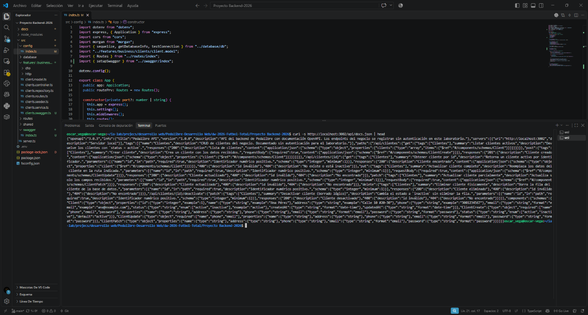

**Cierre ISS-05:** completé la documentación OpenAPI del feature Client, el registry externo y el montaje de Swagger desde `App`. Confirmé visualmente la UI en `/api/docs` y obtuve el documento OpenAPI en `/api/docs.json`. El GATE de ISS-05 queda cumplido y habilita ISS-06 — Feature ProductType.

## ISS-06 — Feature ProductType

**Objetivo del manual:** implementar el CRUD, seeder y documentación Swagger del feature ProductType.  
**Dependencia:** ISS-05, GATE cumplido.  
**Referencia:** `Guia-unificada.md`, ISS-06, secciones 11.1 a 11.6.

### Paso 1 — Crear el modelo ProductType *(completado)*

**Referencia:** ISS-06, sección 11.1 — Modelo ProductType.  
**Acción:** crear `src/features/business/product-types/product-type.model.ts` con el modelo Sequelize asociado a `product_types`.

**Registro de ejecución:**

- **Fecha:** 2026-10-08.
- **Resultado observado:** `ProductTypeI` y `ProductType` declaran `name`, `description`, `status` (`active`/`inactive`) y timestamps; `status` tiene `defaultValue: "inactive"` y el modelo activa `timestamps: true`.
- **Estado:** Implementado; la compilación se verificará en el paso de validación correspondiente.
- **Evidencia:** [`E-ISS06-P01-01-product-type-model.png`](trazabilidad/E-ISS06-P01-01-product-type-model.png).

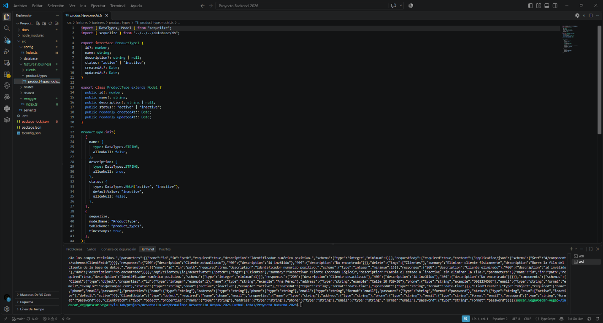

### Paso 2 — Crear DTOs de ProductType *(completado)*

**Referencia:** ISS-06, sección 11.2 — DTOs del feature ProductType.  
**Acción:** definir los contratos de entrada create/update/patch, el DTO de respuesta con mapper y el agregador `dto/index.ts`.

**Registro de ejecución:**

- **Fecha:** 2026-10-08.
- **Resultado observado:** se crearon `CreateProductTypeDto`, `UpdateProductTypeDto`, `PatchProductTypeDto` y `ProductTypeResponseDto`, además del mapper `toProductTypeResponse` y las exportaciones en `index.ts`. El estado no forma parte del DTO de actualización y se reserva para el borrado lógico.
- **Estado:** Implementado; la compilación se verificará en el paso de validación correspondiente.
- **Evidencias:** [`E-ISS06-P02-01-create-product-type-dto.png`](trazabilidad/E-ISS06-P02-01-create-product-type-dto.png), [`E-ISS06-P02-02-product-type-dto-index.png`](trazabilidad/E-ISS06-P02-02-product-type-dto-index.png), [`E-ISS06-P02-03-patch-product-type-dto.png`](trazabilidad/E-ISS06-P02-03-patch-product-type-dto.png), [`E-ISS06-P02-04-product-type-response-dto.png`](trazabilidad/E-ISS06-P02-04-product-type-response-dto.png) y [`E-ISS06-P02-05-update-product-type-dto.png`](trazabilidad/E-ISS06-P02-05-update-product-type-dto.png).

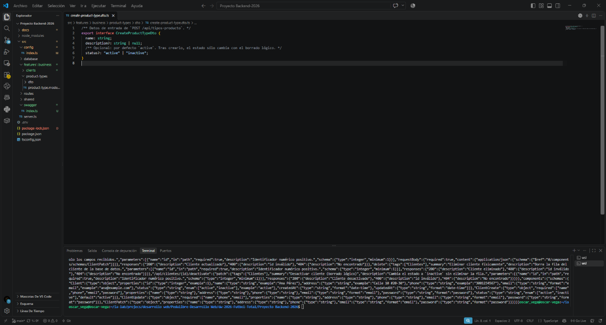

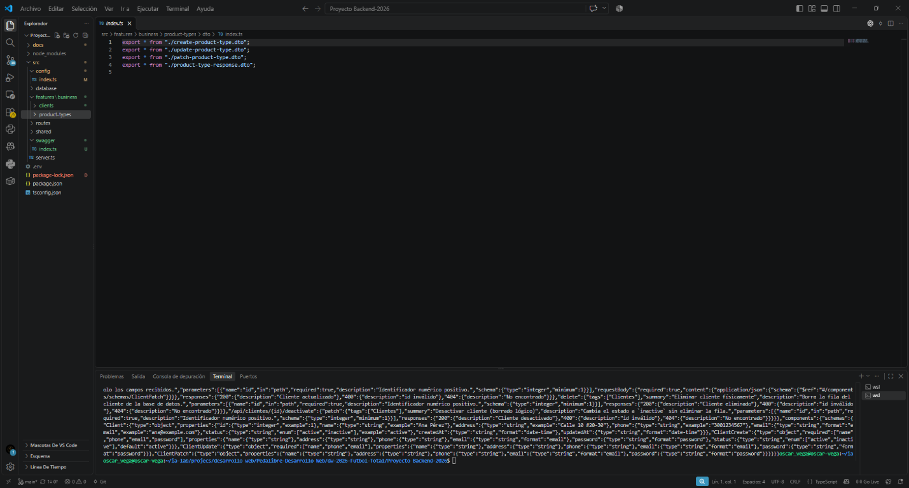

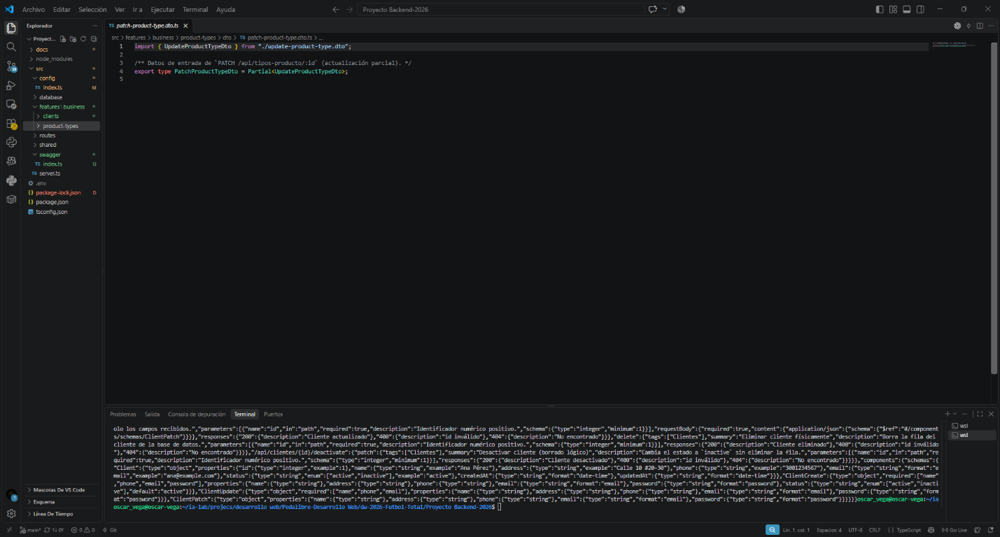

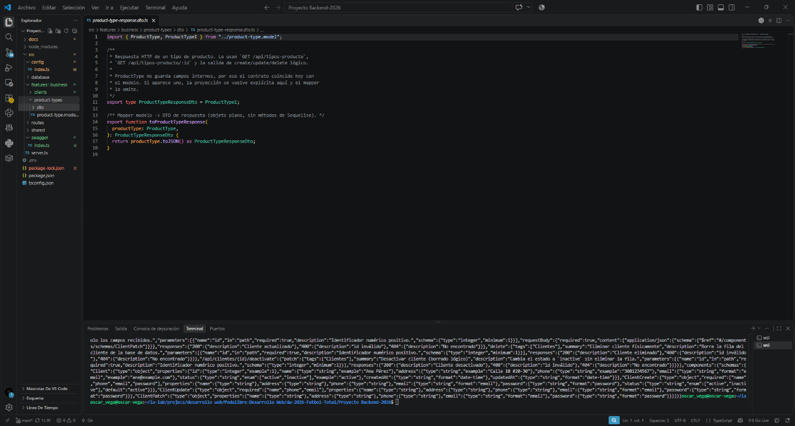

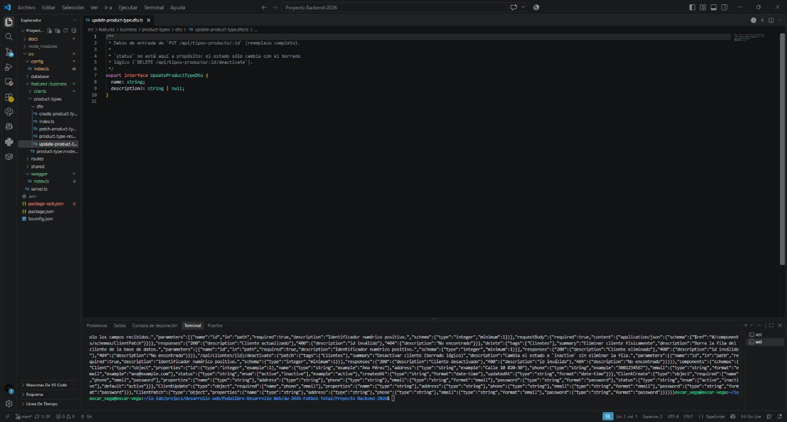

### Paso 3 — Crear el repository de ProductType *(completado)*

**Referencia:** ISS-06, sección 11.2 — Repository.  
**Acción:** implementar la capa responsable de consultar y persistir mediante el modelo `ProductType`.

**Registro de ejecución:**

- **Fecha:** 2026-10-08.
- **Resultado observado:** `ProductTypesRepository` implementa `findAllActive`, `findById`, `create`, `update` y `delete`, delegando las operaciones en el modelo Sequelize.
- **Estado:** Implementado; la compilación se verificará en el paso de validación correspondiente.
- **Evidencia:** [`E-ISS06-P03-01-product-types-repository.png`](trazabilidad/E-ISS06-P03-01-product-types-repository.png).

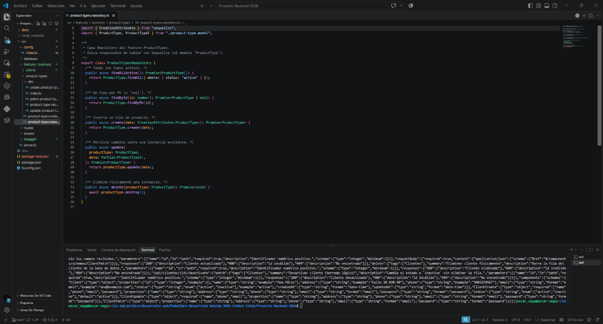

### Paso 4 — Implementar el service de ProductType *(completado)*

**Referencia:** ISS-06, sección 11.2 — Service.  
**Acción:** implementar las operaciones de negocio sobre `ProductType`, delegando persistencia en el repository y devolviendo DTOs.

**Registro de ejecución:**

- **Fecha:** 2026-10-08.
- **Resultado observado:** `ProductTypesService` implementa consultas, creación con `status` activo por defecto, actualización completa y parcial, eliminación física y lógica, y el helper `findOrFail` para los registros inexistentes o inactivos.
- **Evidencia:** [`E-ISS06-P04-01-product-types-service.png`](trazabilidad/E-ISS06-P04-01-product-types-service.png). La captura muestra la clase, las operaciones de lectura y creación y el comienzo de `updatePut`.
- **Estado:** Implementado; la compilación se verificará en el paso de validación correspondiente.

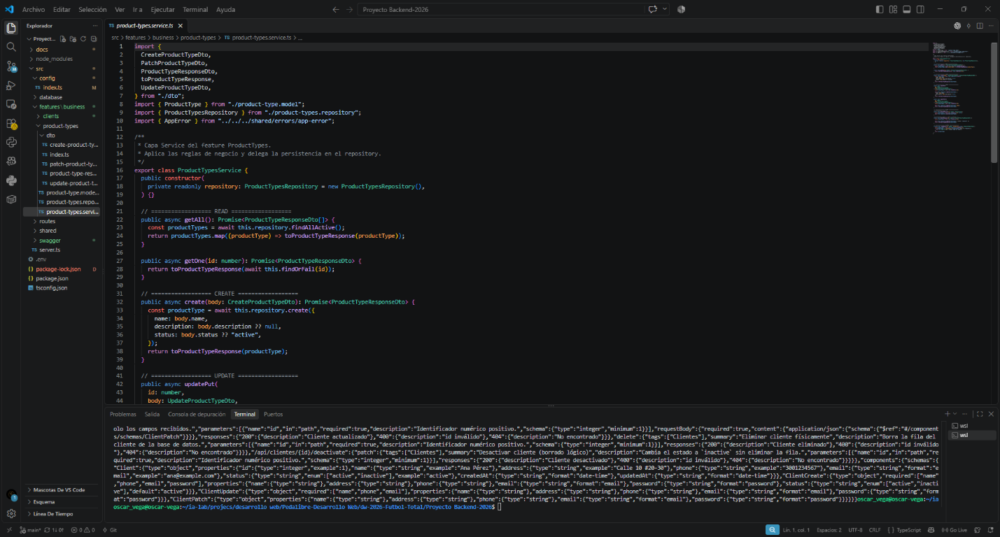

### Paso 5 — Crear el controller de ProductType *(completado)*

**Referencia:** ISS-06, sección 11.2 — Controller.  
**Acción:** implementar los handlers HTTP del feature ProductTypes delegando la lógica al service y el manejo de errores a `BaseController.run()`.

**Registro de ejecución:**

- **Fecha:** 2026-10-08.
- **Resultado observado:** `ProductTypesController` contiene handlers para getAll, getOne, create, updatePut, updatePatch, deletePhysical y deleteLogical; usa los códigos HTTP y estructuras JSON definidos en el manual.
- **Estado:** Implementado; la compilación se verificará en el paso de validación correspondiente.
- **Evidencia:** [`E-ISS06-P05-01-product-types-controller.png`](trazabilidad/E-ISS06-P05-01-product-types-controller.png).

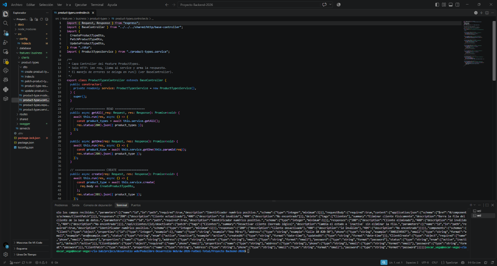

### Paso 6 — Registrar las rutas de ProductType *(completado)*

**Referencia:** ISS-06, sección 11.2 — routes.  
**Acción:** asociar los endpoints de `/api/tipos-producto` con los handlers de `ProductTypesController`.

**Registro de ejecución:**

- **Fecha:** 2026-10-08.
- **Resultado observado:** `ProductTypesRoutes` registra GET all/one, POST, PUT, PATCH, DELETE físico y PATCH de desactivación lógica. Las rutas son públicas, sin autenticación ni middleware JWT, conforme al proyecto.
- **Estado:** Implementado; la integración del agregador y la aplicación se registrará en la sección 11.4.
- **Evidencia:** [`E-ISS06-P06-01-product-types-routes.png`](trazabilidad/E-ISS06-P06-01-product-types-routes.png).

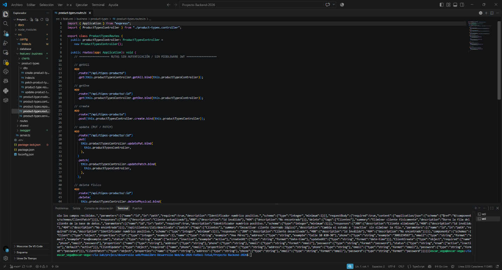

### Paso 7 — Preparar solicitudes HTTP de ProductType *(completado)*

**Referencia:** ISS-06, sección 11.3 — HTTP (REST Client).  
**Acción:** preparar solicitudes para GET all/one, create, update PUT/PATCH y delete físico/lógico.

**Registro de ejecución:**

- **Fecha:** 2026-10-08.
- **Resultado observado:** se crearon cuatro archivos `.http` para las operaciones de ProductType. Las solicitudes usan `http://localhost:3002` y reflejan que la API es pública, sin flujo de login ni token. Las plantillas de actualización y eliminación incluyen marcadores de ID para evitar operar accidentalmente sobre registros reales.
- **Estado:** Plantillas preparadas; sus ejecuciones se registrarán cuando se realicen.
- **Evidencias:** [`E-ISS06-P07-01-product-types-create-http.png`](trazabilidad/E-ISS06-P07-01-product-types-create-http.png), [`E-ISS06-P07-02-product-types-delete-http.png`](trazabilidad/E-ISS06-P07-02-product-types-delete-http.png), [`E-ISS06-P07-03-product-types-get-http.png`](trazabilidad/E-ISS06-P07-03-product-types-get-http.png) y [`E-ISS06-P07-04-product-types-update-http.png`](trazabilidad/E-ISS06-P07-04-product-types-update-http.png).

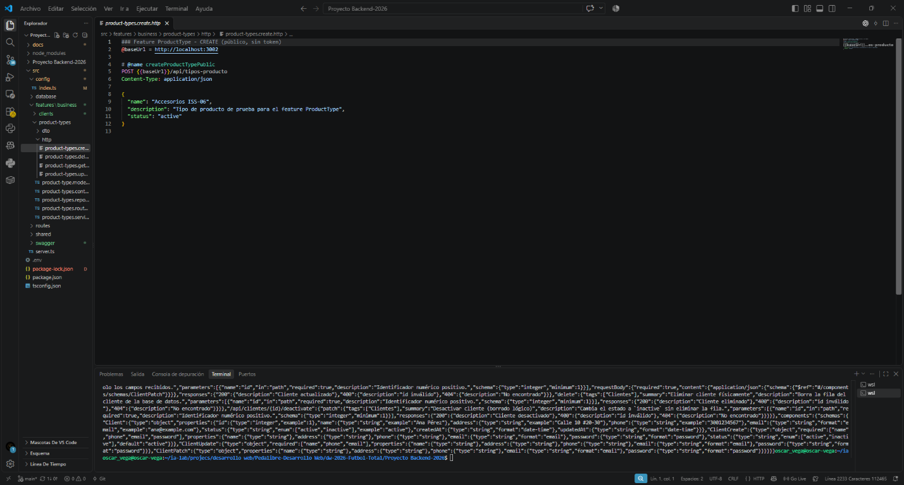

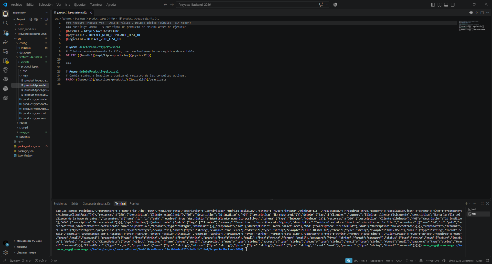

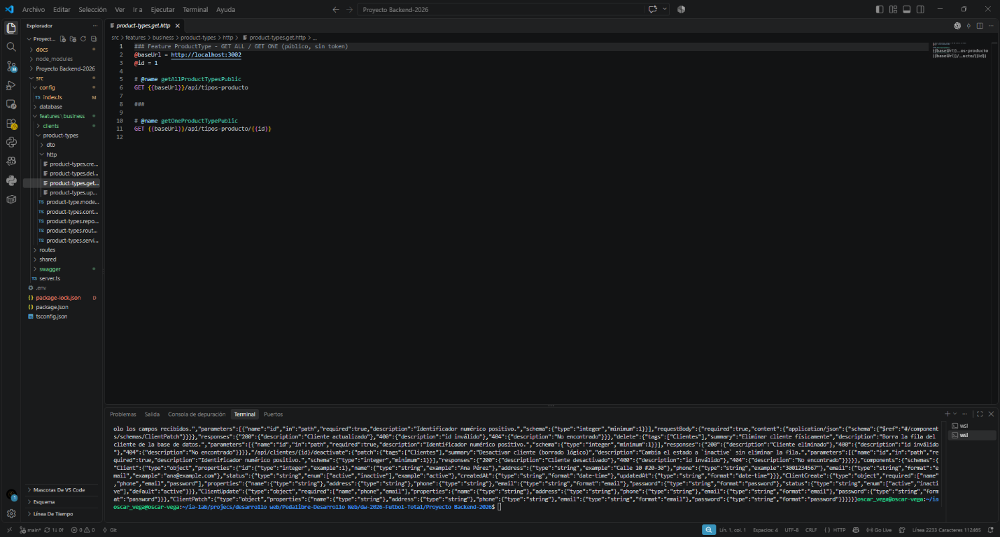

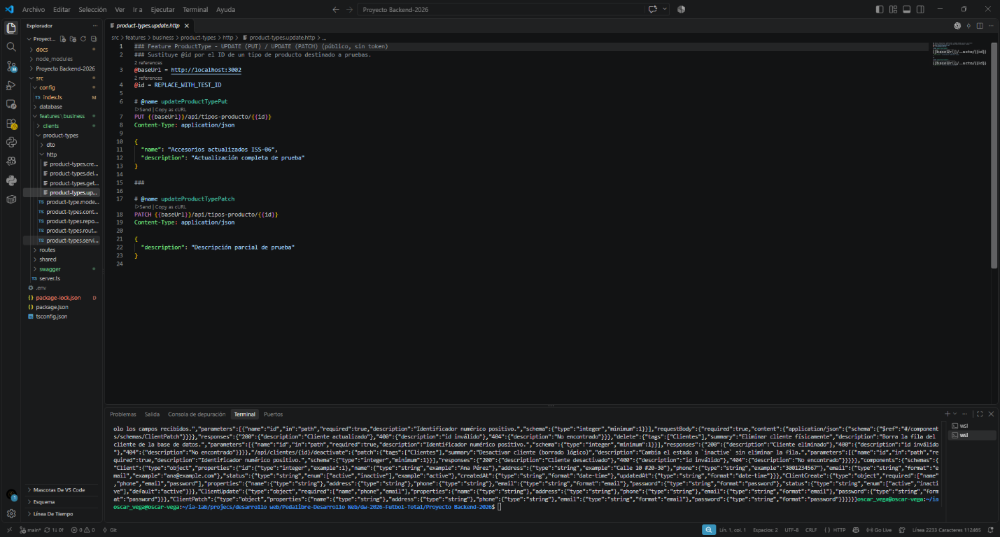

### Paso 8 — Conectar ProductType a Routes y Config *(completado)*

**Referencia:** ISS-06, sección 11.4 — Cableado Routes + Config.
**Acción:** registrar `ProductTypesRoutes` en el agregador `Routes`, importar el modelo ProductType para Sequelize y montar las rutas desde `App`.

**Registro de ejecución:**

- **Fecha:** 2026-10-08.
- **Resultado observado:** agregué `productTypesRoutes` a `Routes`; en `App` importé `product-type.model` y registré las rutas de ProductTypes junto con las de Clients.
- **Estado:** Implementado; la verificación HTTP indicada en la guía queda pendiente.
- **Evidencia:** [`E-ISS06-P08-01-product-types-app-wiring.png`](trazabilidad/E-ISS06-P08-01-product-types-app-wiring.png).

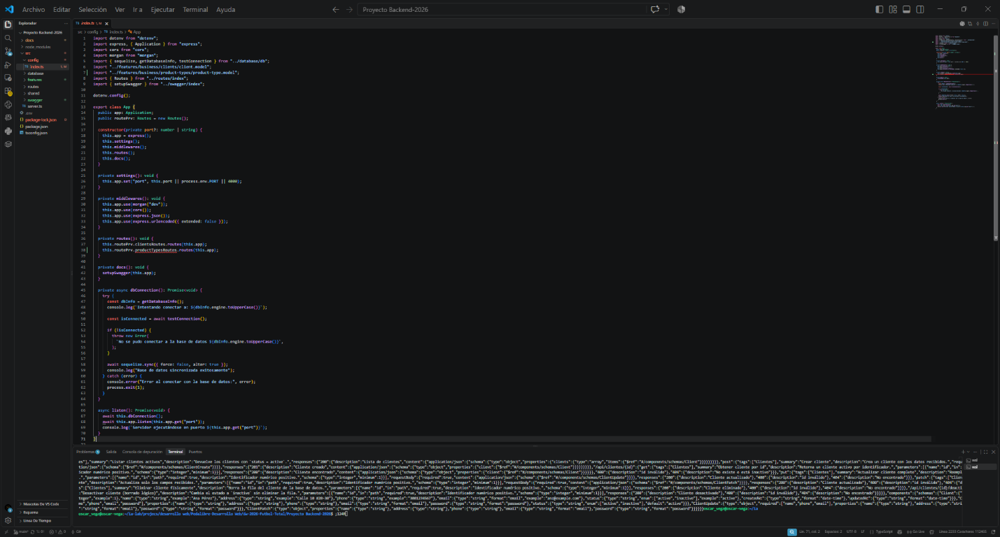

### Paso 9 — Verificar creación y listado de ProductTypes *(completado)*

**Referencia:** ISS-06, sección 11.4 — Verificación.  
**Acción:** inicié el servidor y envié las solicitudes POST y GET a `/api/tipos-producto`.

**Registro de ejecución:**

- **Fecha:** 2026-10-08.
- **Resultado observado:** el servidor arrancó en el puerto `3002`. El POST respondió `201 Created` y creó el tipo `Bebidas ISS-06` con estado `active`; el GET respondió `200` y mostró ese registro en la colección `product_types`.
- **Estado:** Cumple la verificación de creación y listado indicada en la guía.
- **Evidencia POST:** [`E-ISS06-P09-01-post-product-type.png`](trazabilidad/E-ISS06-P09-01-post-product-type.png).
- **Evidencia del servidor y GET:** [`E-ISS06-P09-02-server-and-get-product-types.png`](trazabilidad/E-ISS06-P09-02-server-and-get-product-types.png).

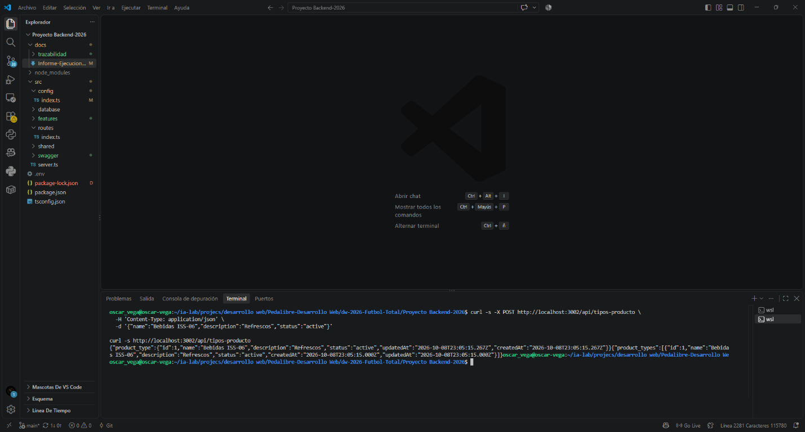

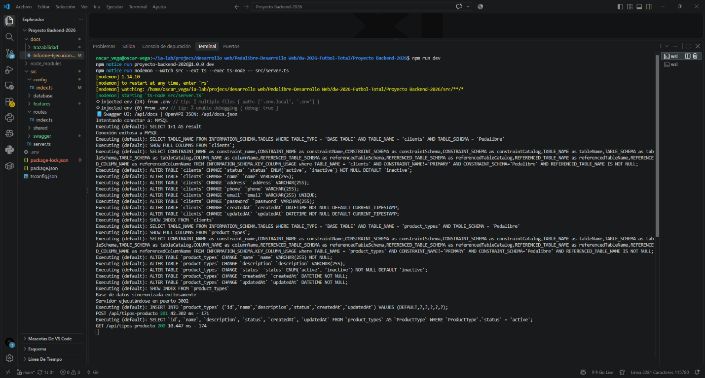

### Paso 10 — Agregar el seeder de ProductType al runner *(completado)*

**Referencia:** ISS-06, sección 11.5 — Seeder ProductType.  
**Acción:** implementé `seedProductTypes(count)` con Faker e idempotencia; añadí `product_types` a `SeedCounts`, fijé el conteo predeterminado en 25 y agregué la lectura de `SEED_PRODUCT_TYPES`. También registré el modelo y ejecuté el seeder desde `SeedersRunner`.

**Registro de ejecución:**

- **Fecha:** 2026-10-08.
- **Resultado observado:** el seeder omite la inserción si el conteo es no positivo o si ya existen registros. El runner invoca `seedProductTypes(counts.product_types)` después de `seedClients(counts.clients)`.
- **Estado:** Implementado; la ejecución del runner y su resultado se registrarán en el siguiente paso.
- **Evidencias:** [`E-ISS06-P10-01-product-types-seeder.png`](trazabilidad/E-ISS06-P10-01-product-types-seeder.png), [`E-ISS06-P10-02-seed-counts.png`](trazabilidad/E-ISS06-P10-02-seed-counts.png) y [`E-ISS06-P10-03-seeders-runner.png`](trazabilidad/E-ISS06-P10-03-seeders-runner.png).

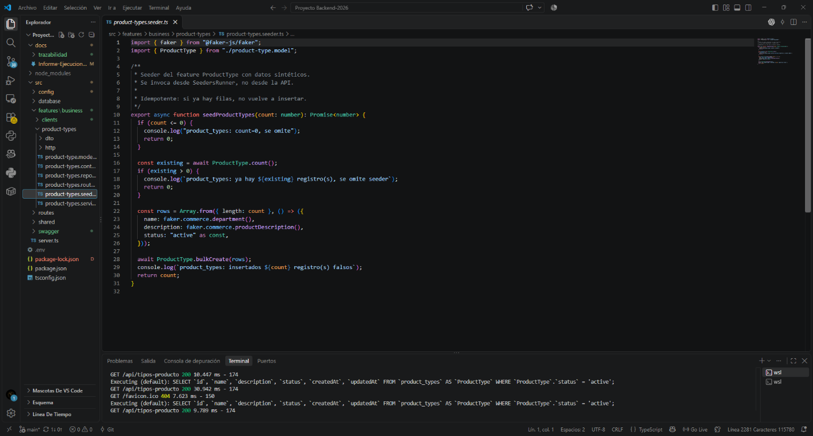

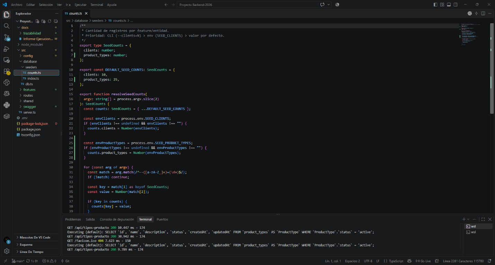

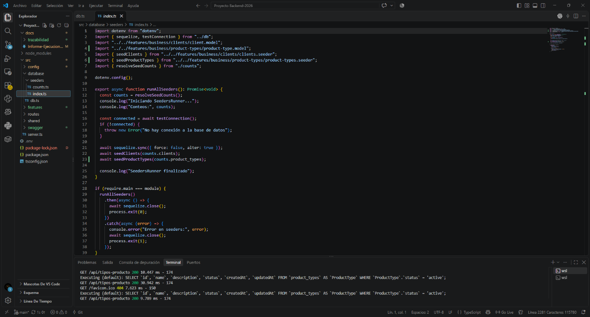

### Paso 11 — Ejecutar SeedersRunner con ProductType *(completado)*

**Referencia:** ISS-06, sección 11.5 — ejecución del seeder desde SeedersRunner.  
**Acción:** ejecuté `npm run db:seed` con el conteo predeterminado.

**Registro de ejecución:**

- **Fecha:** 2026-10-08.
- **Resultado observado:** el runner resolvió `clients: 10` y `product_types: 25`, se conectó a MySQL y sincronizó el esquema. Detectó 1 cliente y 1 tipo de producto existente; omitió la inserción de ambos seeders y terminó correctamente.
- **Adaptación/alcance:** no se probó la inserción de datos Faker en una tabla vacía, ya que `product_types` ya contenía el registro de prueba creado en el paso 9.
- **Estado:** Cumple conexión, sincronización, resolución del conteo predeterminado e idempotencia con registros existentes.
- **Evidencia:** [`E-ISS06-P11-01-seeder-existing-skip.png`](trazabilidad/E-ISS06-P11-01-seeder-existing-skip.png).

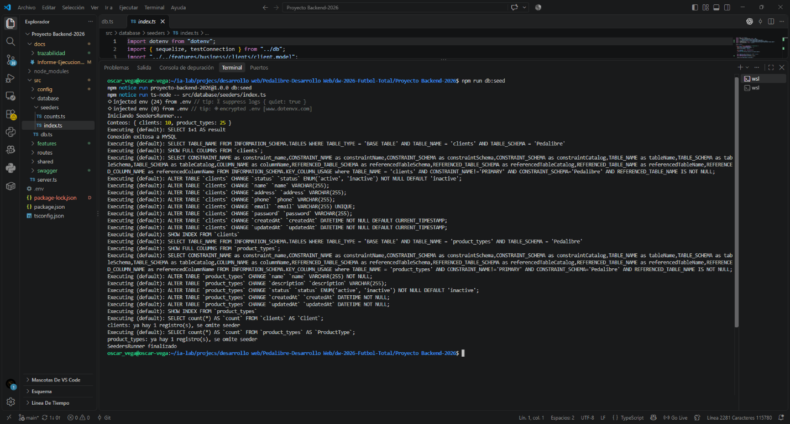

### Paso 12 — Documentar ProductType en OpenAPI *(completado)*

**Referencia:** ISS-06, sección 11.6 — Swagger ProductType.  
**Acción:** documenté las operaciones y esquemas de ProductType en `product-types.swagger.ts` y registré el módulo en `src/swagger/index.ts`.

**Registro de ejecución:**

- **Fecha:** 2026-10-08.
- **Resultado observado:** documenté GET all/one, POST, PUT, PATCH, DELETE físico y desactivación lógica, junto con los esquemas ProductType. Adapté la documentación al API público actual de Pedalibre, sin requisitos de autenticación JWT/RBAC.
- **Estado:** Implementado; falta la validación conjunta y el cierre del ISS-06.
- **Evidencias:** [`E-ISS06-P12-01-product-types-openapi.png`](trazabilidad/E-ISS06-P12-01-product-types-openapi.png) y [`E-ISS06-P12-02-product-types-openapi-registry.png`](trazabilidad/E-ISS06-P12-02-product-types-openapi-registry.png).

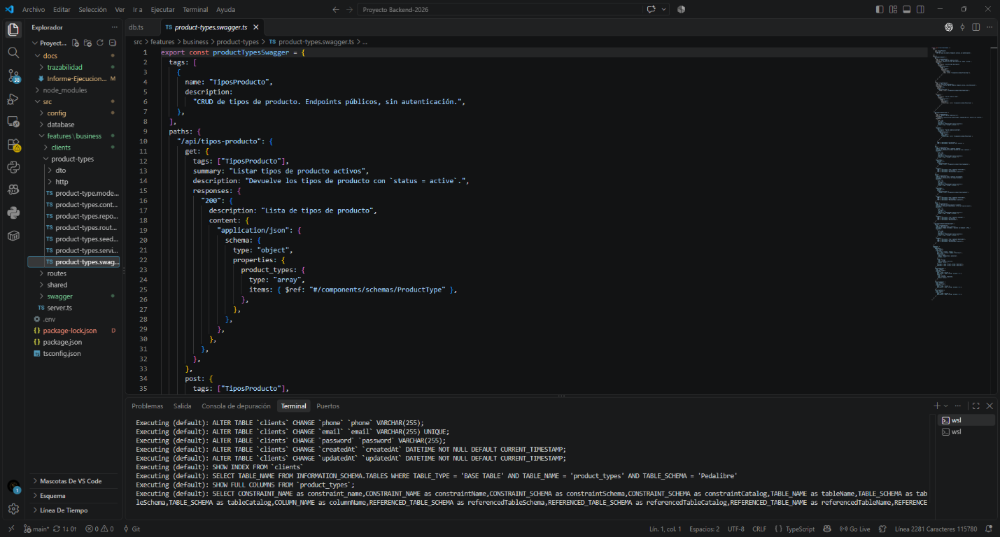

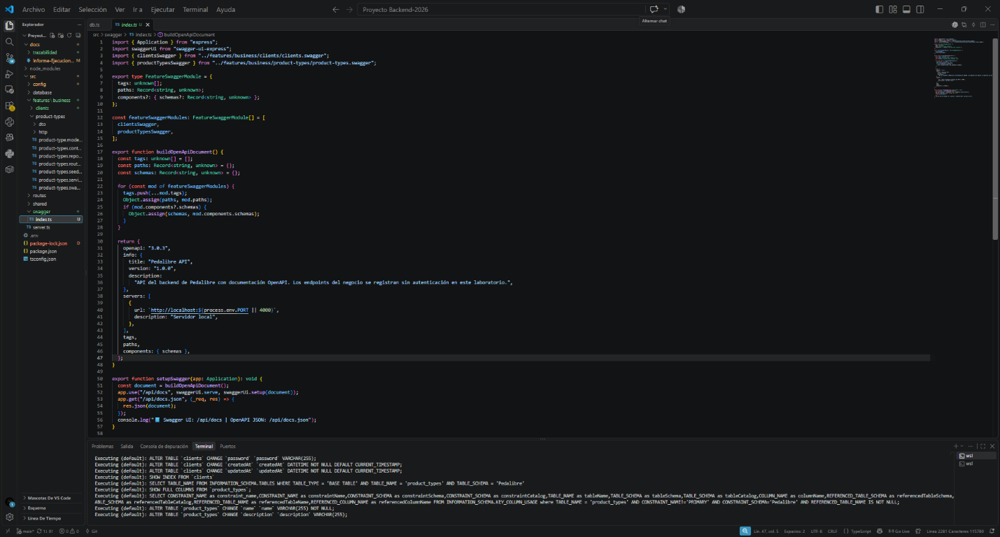

### Paso 13 — Cerrar ISS-06 y revisar Swagger UI *(completado)*

**Referencia:** ISS-06, cierre del ISS.
**Acción:** inicié el servidor con `npm run dev` y abrí Swagger UI en `http://localhost:3002/api/docs/`.

**Registro de ejecución:**

- **Fecha:** 2026-10-08.
- **Resultado observado:** el servidor arrancó y sincronizó la base de datos. En Swagger UI confirmé que aparecen Clientes y TiposProducto con sus operaciones y esquemas.
- **Estado:** Cumple el paso de cierre del manual. Con este resultado, el GATE de ISS-06 queda cumplido y se habilita ISS-07 — Feature Product.
- **Evidencia de Swagger UI:** [`E-ISS06-P13-01-swagger-product-types-ui.png`](trazabilidad/E-ISS06-P13-01-swagger-product-types-ui.png).
- **Evidencia de arranque:** [`E-ISS06-P13-02-server-start.png`](trazabilidad/E-ISS06-P13-02-server-start.png).

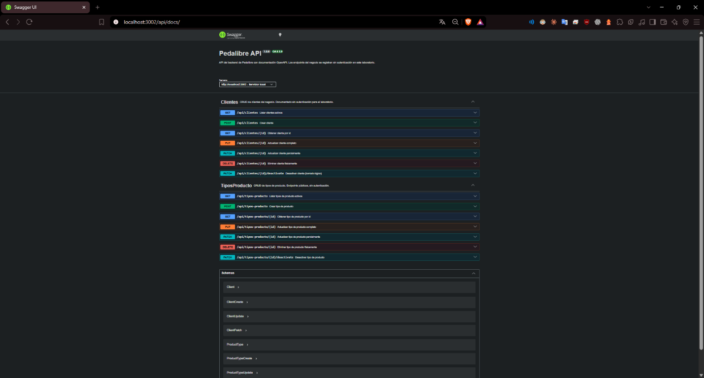

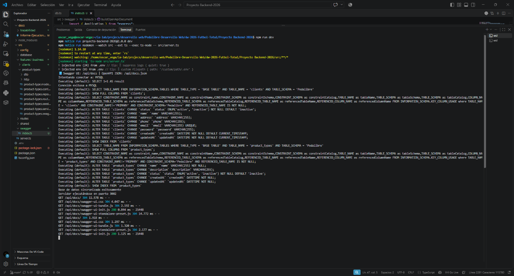

**Cierre ISS-06:** implementé el modelo, DTOs, repository, service, controller, rutas, plantillas HTTP, cableado, seeder y documentación OpenAPI de ProductType. Verifiqué la creación y listado mediante POST/GET, ejecuté el SeedersRunner y confirmé que Swagger UI muestra el feature. No probé la inserción del seeder sobre una tabla vacía, porque ya existía el registro de prueba.

## ISS-07 — Feature Product

**Objetivo del manual:** implementar el CRUD de Product con FK `product_type_id`.  
**Dependencia:** ISS-06, GATE cumplido.  
**Referencia:** `Guia-unificada.md`, ISS-07, secciones 12.1 a 12.6.

### Paso 1 — Crear el modelo Product *(completado)*

**Referencia:** ISS-07, sección 12.1 — Modelo Product.  
**Acción:** definí el modelo Sequelize `Product` para la tabla `products`.

**Registro de ejecución:**

- **Fecha:** 2026-10-08.
- **Resultado observado:** declaré los campos `name`, `brand`, `price`, `min_stock`, `quantity`, `product_type_id` y `status`; configuré `status` con valor predeterminado `inactive` y activé `timestamps: true`.
- **Estado:** Implementado; la compilación se verificará en el paso de validación correspondiente.
- **Evidencia:** [`E-ISS07-P01-01-product-model.png`](trazabilidad/E-ISS07-P01-01-product-model.png).

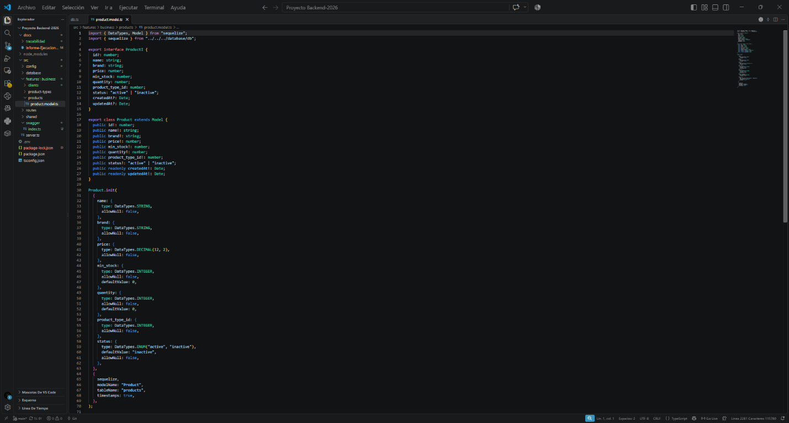

### Paso 2 — Definir los DTOs de Product *(completado)*

**Referencia:** ISS-07, sección 12.2 — DTOs.  
**Acción:** definí los contratos de entrada para crear, reemplazar y actualizar parcialmente un producto, además de su DTO de respuesta y el índice de exportación.

**Registro de ejecución:**

- **Fecha:** 2026-10-08.
- **Resultado observado:** `CreateProductDto` declara los datos de creación y el estado opcional; `UpdateProductDto` define el reemplazo completo sin permitir cambiar `status`; `PatchProductDto` reutiliza el contrato de actualización completa para la entrada parcial; `ProductResponseDto` y `toProductResponse` representan la respuesta plana del modelo.
- **Estado:** Implementado.
- **Evidencias:** [`E-ISS07-P02-01-create-product-dto.png`](trazabilidad/E-ISS07-P02-01-create-product-dto.png), [`E-ISS07-P02-02-dto-index.png`](trazabilidad/E-ISS07-P02-02-dto-index.png), [`E-ISS07-P02-03-patch-product-dto.png`](trazabilidad/E-ISS07-P02-03-patch-product-dto.png), [`E-ISS07-P02-04-product-response-dto.png`](trazabilidad/E-ISS07-P02-04-product-response-dto.png) y [`E-ISS07-P02-05-update-product-dto.png`](trazabilidad/E-ISS07-P02-05-update-product-dto.png).

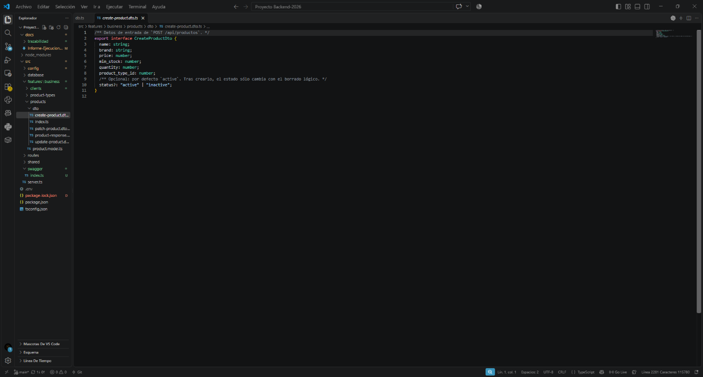

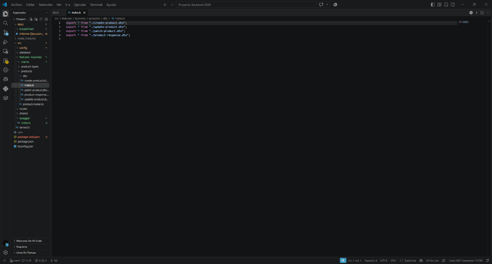

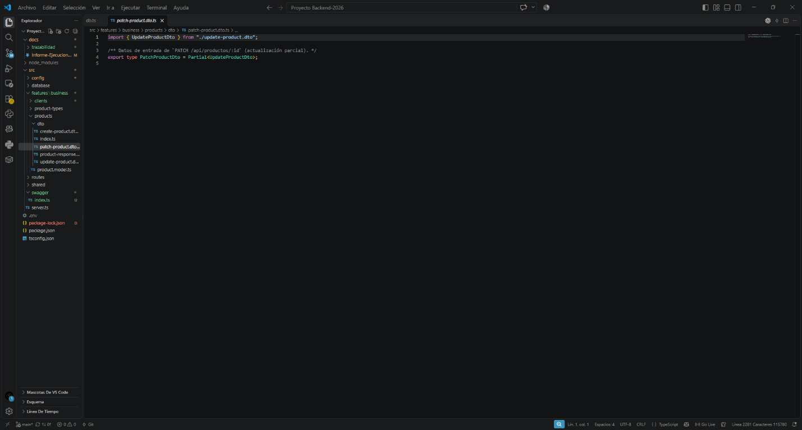

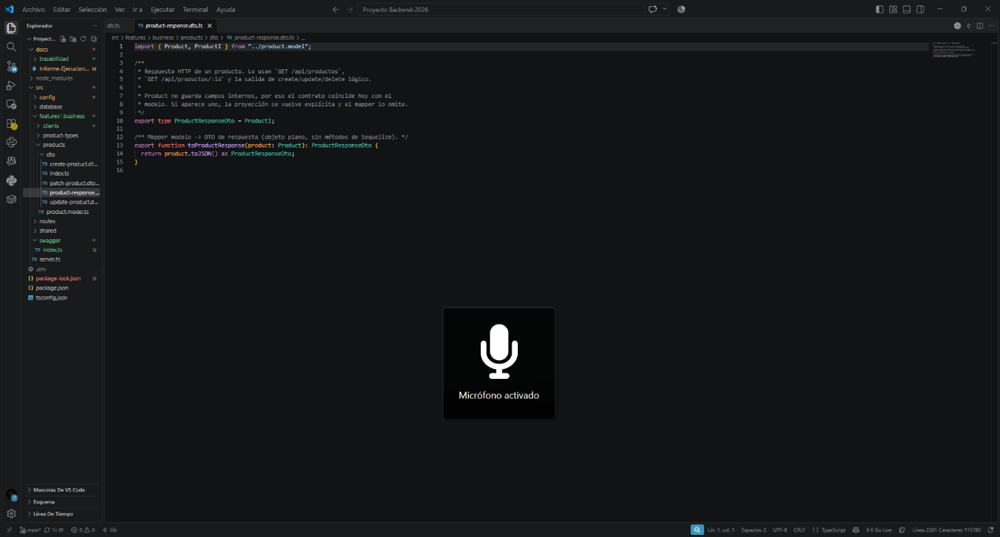

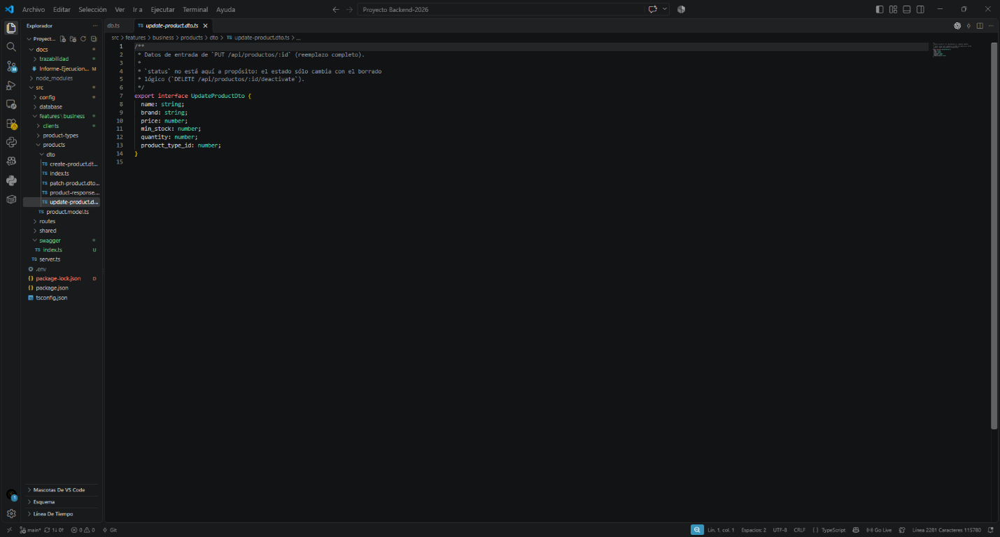

### Paso 3 — Implementar Repository, Service, Controller y Routes *(completado)*

**Referencia:** ISS-07, sección 12.2 — capas del feature Product.  
**Acción:** implementé el acceso a datos, las reglas de negocio, el controlador HTTP y las rutas del CRUD de Product.

**Registro de ejecución:**

- **Fecha:** 2026-10-08.
- **Resultado observado:** el repository contiene operaciones de consulta, creación, actualización y eliminación; el service expone productos activos y aplica borrado lógico, además de comprobar que el tipo asociado exista y esté activo tanto en la creación como en PUT y cuando PATCH cambia `product_type_id`; el controller entrega las respuestas HTTP y Routes publica los endpoints `/api/productos`.
- **Estado:** Implementado.
- **Evidencias:** [`E-ISS07-P03-01-products-repository.png`](trazabilidad/E-ISS07-P03-01-products-repository.png), [`E-ISS07-P03-02-product-model.png`](trazabilidad/E-ISS07-P03-02-product-model.png), [`E-ISS07-P03-03-products-controller.png`](trazabilidad/E-ISS07-P03-03-products-controller.png), [`E-ISS07-P03-04-products-routes.png`](trazabilidad/E-ISS07-P03-04-products-routes.png) y [`E-ISS07-P03-05-products-service.png`](trazabilidad/E-ISS07-P03-05-products-service.png).

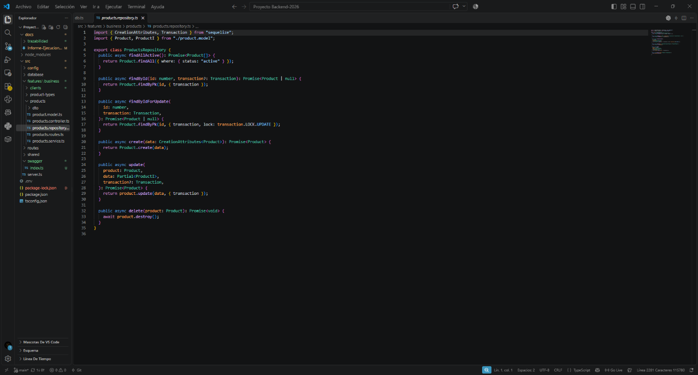

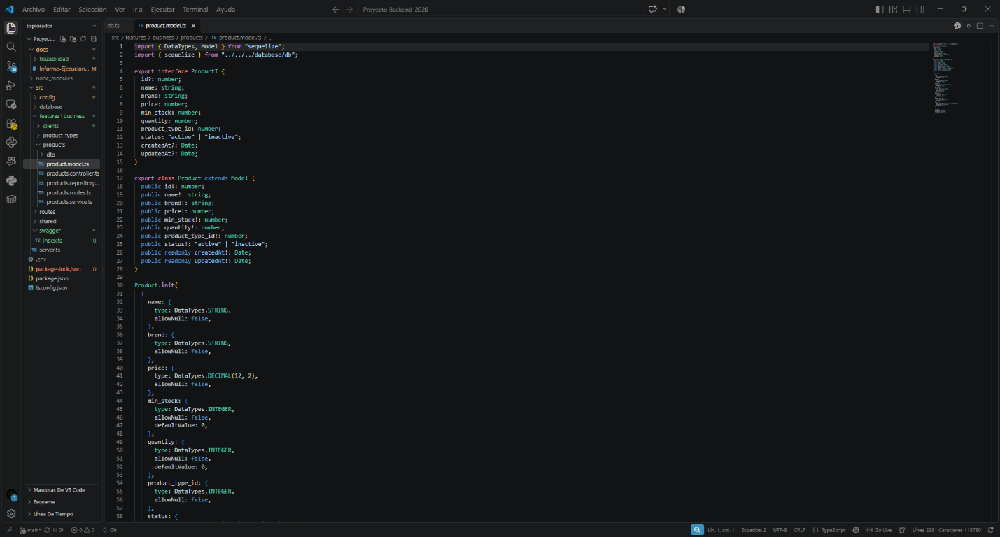

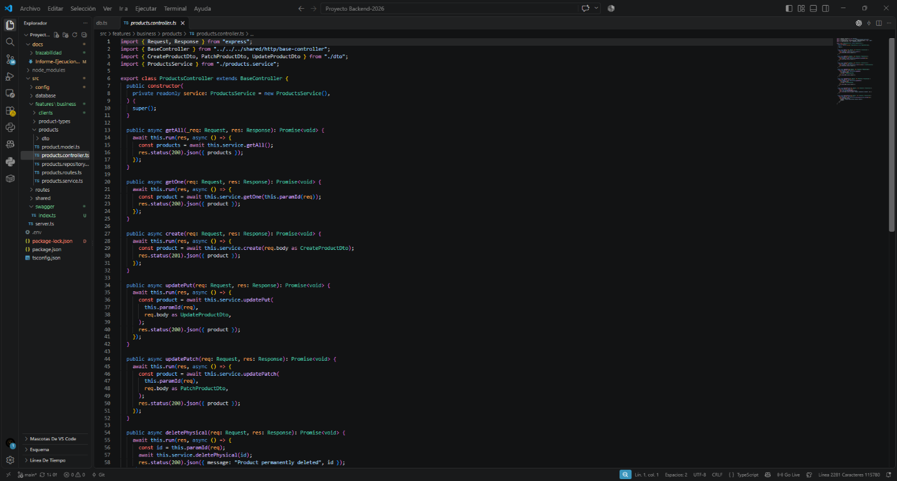

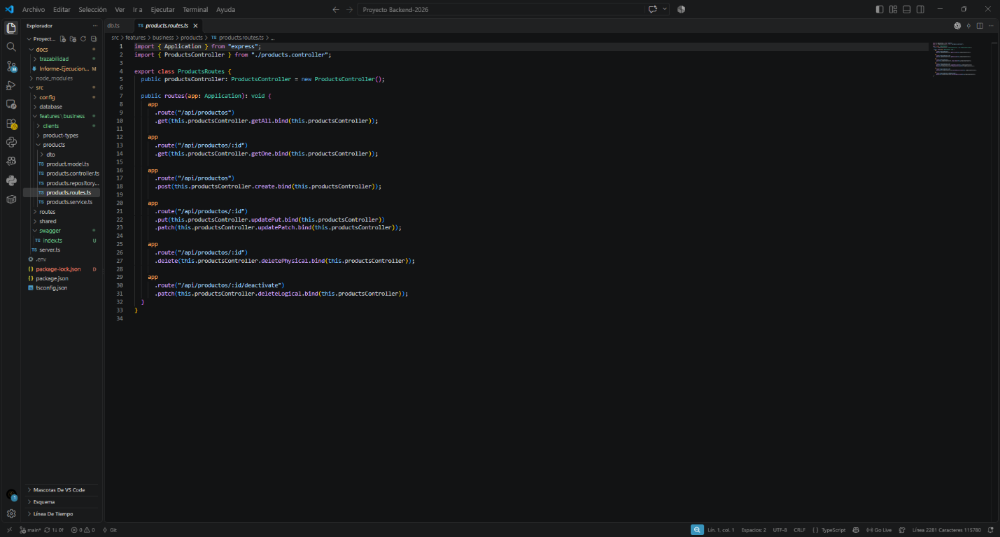

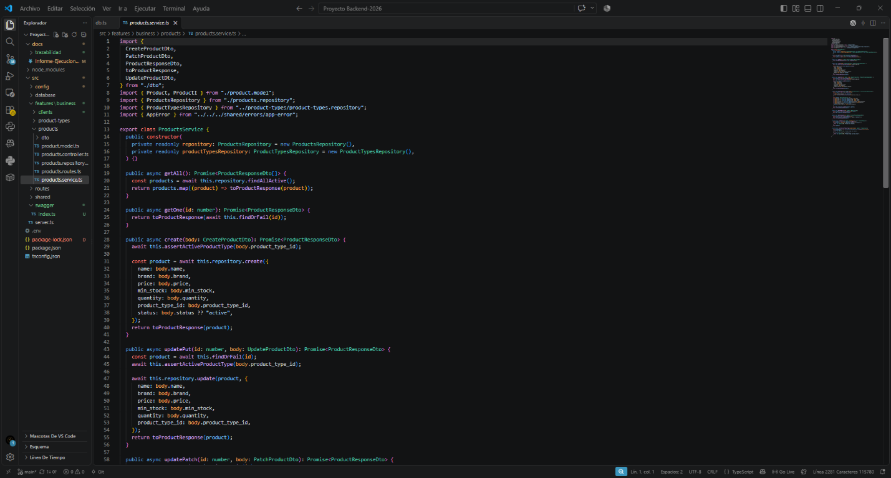

### Paso 4 — Crear las plantillas HTTP de Product *(completado)*

**Referencia:** ISS-07, sección 12.3 — HTTP.  
**Acción:** preparé las solicitudes REST Client para consultar, crear, actualizar y eliminar productos.

**Registro de ejecución:**

- **Fecha:** 2026-10-08.
- **Resultado observado:** configuré las plantillas con la URL base `http://localhost:3002`; incluí GET ALL/GET ONE, POST, PUT/PATCH y DELETE físico/lógico. Dejé identificadores marcadores en las solicitudes destructivas para sustituirlos por IDs de prueba antes de ejecutarlas.
- **Estado:** Implementado; pendiente ejecutar las solicitudes en las verificaciones indicadas por la guía.
- **Evidencias:** [`E-ISS07-P04-01-products-create-http.png`](trazabilidad/E-ISS07-P04-01-products-create-http.png), [`E-ISS07-P04-02-products-delete-http.png`](trazabilidad/E-ISS07-P04-02-products-delete-http.png), [`E-ISS07-P04-03-products-get-http.png`](trazabilidad/E-ISS07-P04-03-products-get-http.png) y [`E-ISS07-P04-04-products-update-http.png`](trazabilidad/E-ISS07-P04-04-products-update-http.png).

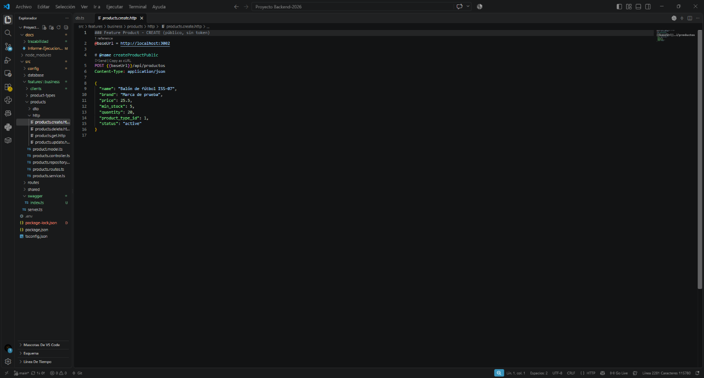

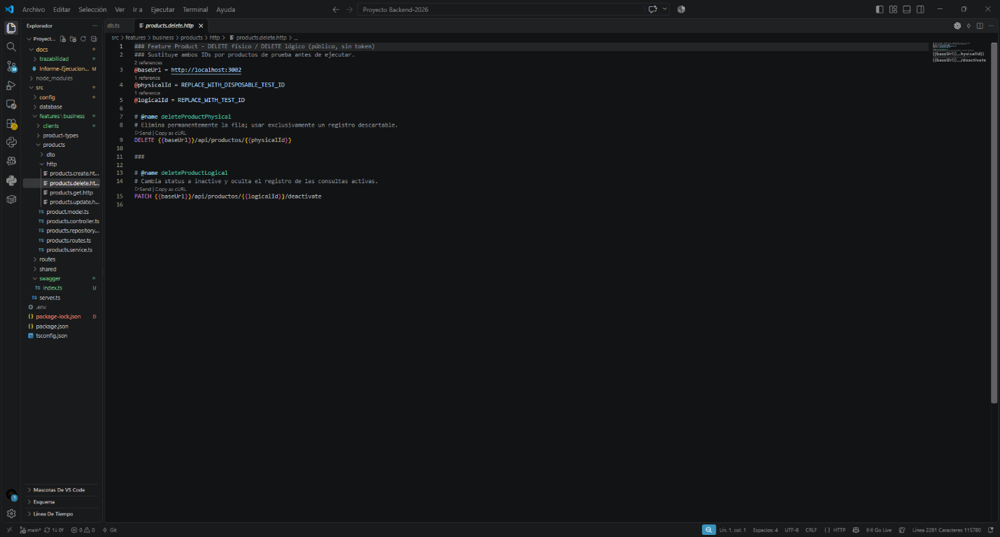

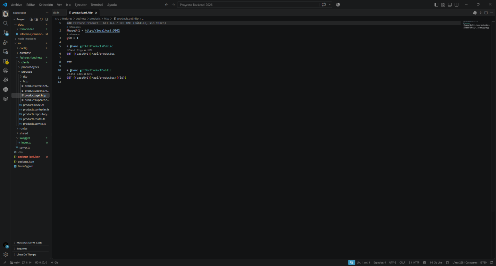

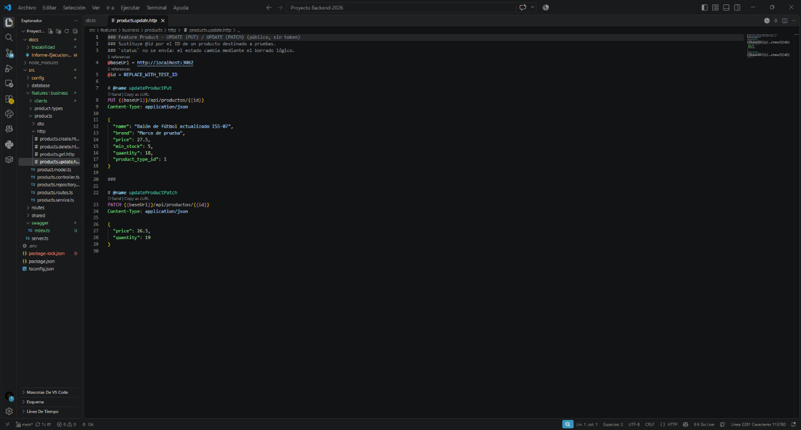

### Paso 5 — Cablear Product y registrar la relación con ProductType *(completado)*

**Referencia:** ISS-07, secciones 12.4 — Cableado y 12.5 — Relación ProductType ↔ Product.  
**Acción:** conecté las rutas de Product en la aplicación y declaré la asociación Sequelize entre Product y ProductType.

**Registro de ejecución:**

- **Fecha:** 2026-10-08.
- **Resultado observado:** agregué `ProductsRoutes` al registro `Routes`, monté sus endpoints en `App` y cargué el modelo Product junto con el archivo de asociaciones. Definí `Product.belongsTo(ProductType)` y `ProductType.hasMany(Product)` con la clave `product_type_id`.
- **Estado:** Implementado; la verificación de las solicitudes se realizará en los pasos de ejecución indicados por la guía.
- **Evidencias:** [`E-ISS07-P05-01-products-routes-registry.png`](trazabilidad/E-ISS07-P05-01-products-routes-registry.png), [`E-ISS07-P05-02-products-app-wiring.png`](trazabilidad/E-ISS07-P05-02-products-app-wiring.png) y [`E-ISS07-P05-03-product-type-associations.png`](trazabilidad/E-ISS07-P05-03-product-type-associations.png).

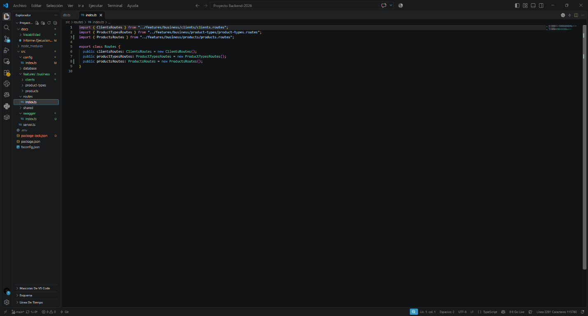

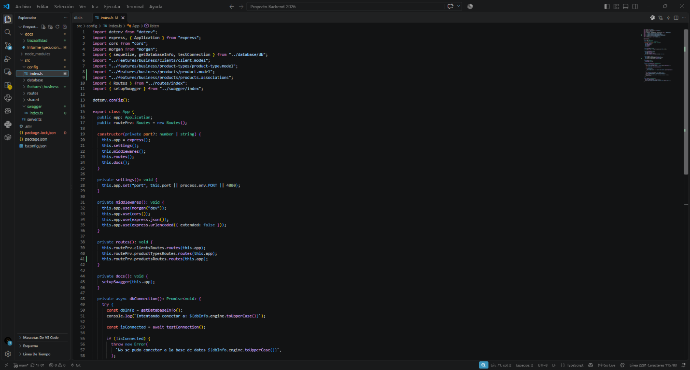

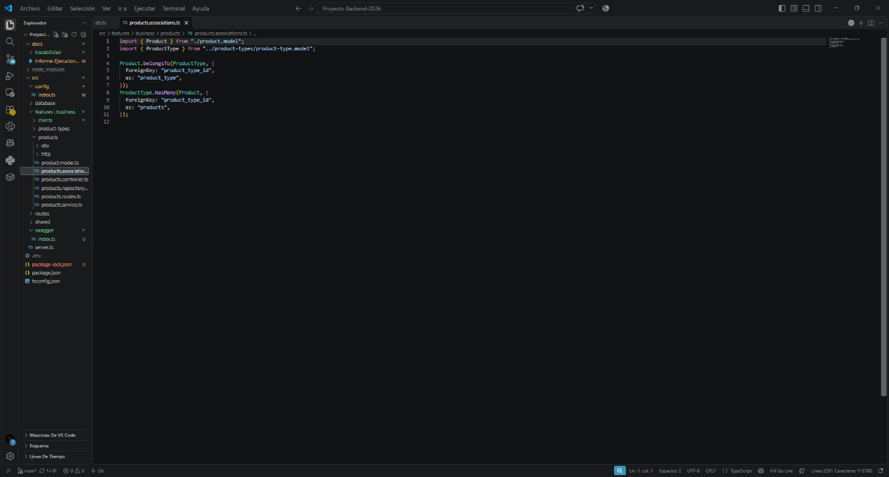

### Paso 6 — Agregar el seeder y documentar Product en OpenAPI *(completado)*

**Referencia:** ISS-07, sección 12.6 — Seeder + Swagger Product.  
**Acción:** incorporé el seeder de productos al SeedersRunner y añadí los endpoints y esquemas de Product al registro OpenAPI.

**Registro de ejecución:**

- **Fecha:** 2026-10-08.
- **Resultado observado:** preparé un seeder idempotente que requiere tipos activos; añadí `products` al conteo con valor predeterminado `15`, configurable mediante `SEED_PRODUCTS` o `--products=N`, y conecté su ejecución después de ProductType. Registré `productsSwagger` en el agregador OpenAPI con los esquemas de Product y las operaciones CRUD.
- **Estado:** Implementado; la ejecución del seeder y la visualización en Swagger quedan para las verificaciones de cierre.
- **Evidencias:** [`E-ISS07-P06-01-products-seeder.png`](trazabilidad/E-ISS07-P06-01-products-seeder.png), [`E-ISS07-P06-02-product-seed-counts.png`](trazabilidad/E-ISS07-P06-02-product-seed-counts.png), [`E-ISS07-P06-03-seeders-runner.png`](trazabilidad/E-ISS07-P06-03-seeders-runner.png), [`E-ISS07-P06-04-products-openapi-schemas.png`](trazabilidad/E-ISS07-P06-04-products-openapi-schemas.png) y [`E-ISS07-P06-05-openapi-registry.png`](trazabilidad/E-ISS07-P06-05-openapi-registry.png).

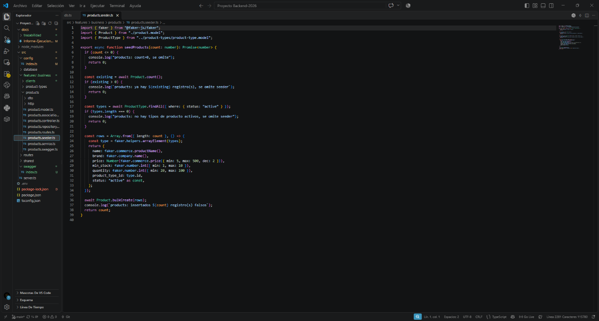

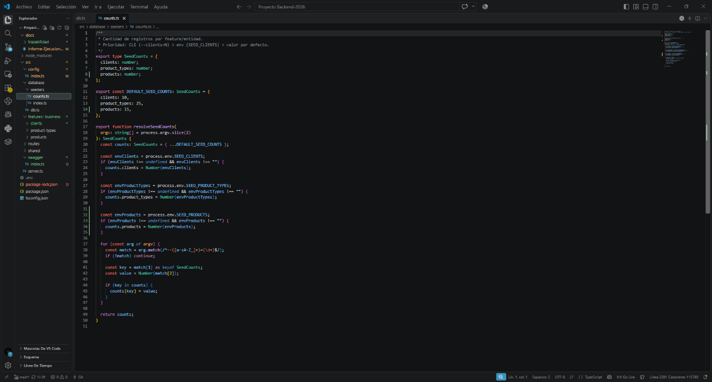

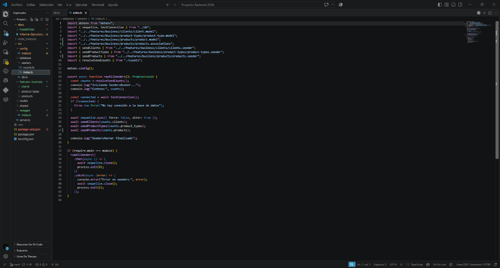

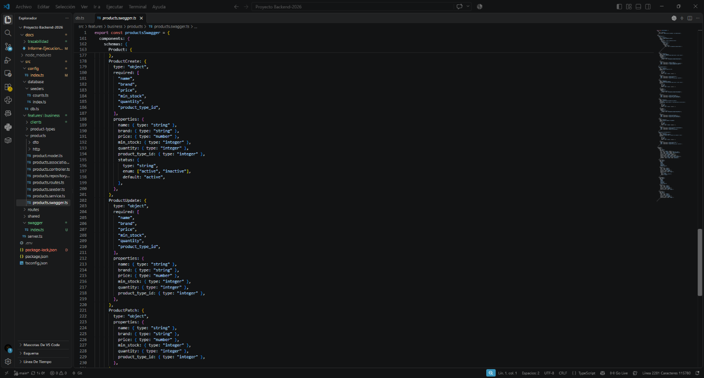

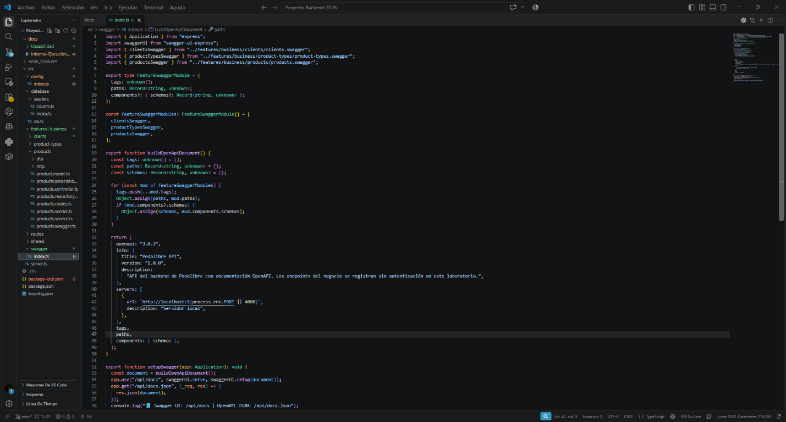


### Paso 7 — Iniciar la aplicación *(completado)*

**Referencia:** ISS-07, cierre de la unidad — ejecutar `npm run dev` y confirmar que el servidor inicia sin error.  
**Acción:** inicié el servidor de desarrollo para comprobar el arranque de la aplicación con Product cableado.

**Registro de ejecución:**

- **Fecha:** 2026-10-08.
- **Resultado observado:** el proceso conectó con MySQL, sincronizó las tablas `clients`, `product_types` y `products`, y anunció que el servidor se ejecuta en el puerto `3002`.
- **Estado:** Arranque verificado.
- **Evidencia:** [`E-ISS07-P07-01-products-server-start.png`](trazabilidad/E-ISS07-P07-01-products-server-start.png).

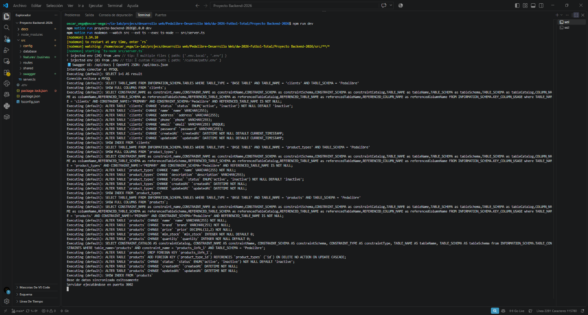

## ISS-08 — Feature Sale + ProductSale

**Objetivo del manual:** implementar ventas con ítems asociados a productos, usando las tablas `sales` y `product_sales`.  
**Dependencias:** ISS-07 — Feature Product e ISS-03 — Feature Client.  
**Referencia:** `Guia-unificada.md`, ISS-08, secciones 13.1 en adelante. El manual indica construir primero el detalle ProductSale y después las operaciones de Sale.

### Paso 1 — Crear los modelos Sale y ProductSale *(modelos implementados; arranque pendiente)*

**Referencia:** ISS-08, sección 13.1 — Modelos Sale y feature ProductSale.  
**Acción:** definí los modelos Sequelize para la cabecera de venta y sus líneas de detalle.

**Registro de ejecución:**

- **Fecha:** 2026-10-08.
- **Resultado observado:** `Sale` declara fecha, subtotal, impuestos, descuentos, total, cliente y estado. `ProductSale` declara las referencias `sale_id` y `product_id`, cantidad, precio unitario capturado al vender y total de línea.
- **Estado:** Modelos implementados. La captura del terminal muestra que un intento de iniciar otra instancia encontró `EADDRINUSE` en el puerto `3002`; nodemon quedó esperando cambios. Por ello, ese intento no cuenta como una nueva verificación de arranque.
- **Evidencias:** [`E-ISS08-P01-01-sale-model.png`](trazabilidad/E-ISS08-P01-01-sale-model.png) y [`E-ISS08-P01-02-product-sale-model.png`](trazabilidad/E-ISS08-P01-02-product-sale-model.png).

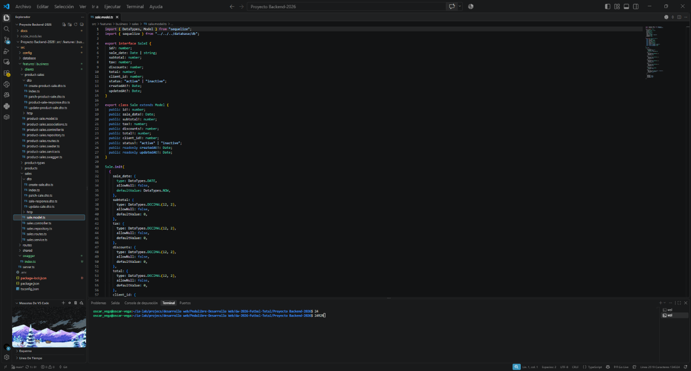

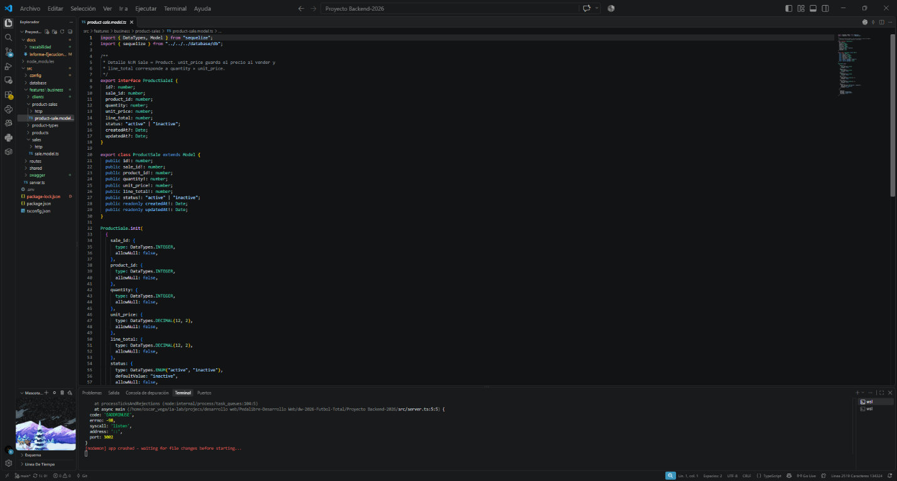

### Paso 2 — Asociar ProductSale con Sale y Product *(completado)*

**Referencia:** ISS-08, sección 13.1b — Associations ProductSale.  
**Acción:** registré las asociaciones Sequelize entre la línea de venta, su cabecera Sale y el producto vendido.

**Registro de ejecución:**

- **Fecha:** 2026-10-08.
- **Resultado observado:** declaré `ProductSale.belongsTo(Sale)` y `ProductSale.belongsTo(Product)`; también declaré las relaciones inversas `Sale.hasMany(ProductSale)` y `Product.hasMany(ProductSale)` con las claves `sale_id` y `product_id`.
- **Estado:** Implementado. La carga de estas asociaciones en el agregador/configuración se completará al cablear ISS-08.
- **Evidencia:** [`E-ISS08-P02-01-product-sales-associations.png`](trazabilidad/E-ISS08-P02-01-product-sales-associations.png).

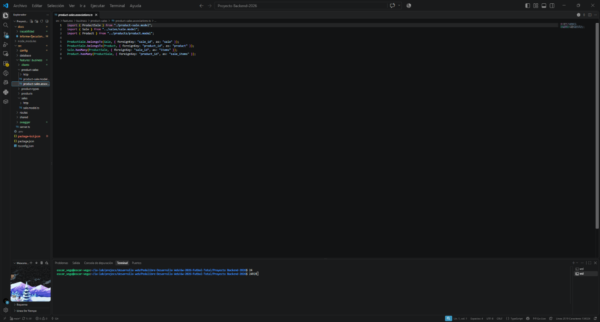

### Paso 3 — Definir los DTOs y el Repository de ProductSale *(completado)*

**Referencia:** ISS-08, sección 13.2b — DTO + Repository ProductSale.  
**Acción:** definí los contratos de entrada y respuesta para las líneas de venta e implementé su capa Repository.

**Registro de ejecución:**

- **Fecha:** 2026-10-08.
- **Resultado observado:** `CreateProductSaleDto` recibe venta, producto y cantidad; `UpdateProductSaleDto` sólo permite cambiar la cantidad para mantener sincronizados stock y totales; `PatchProductSaleDto` deriva de ese contrato; `ProductSaleResponseDto` representa el resultado plano. El repository permite consultar líneas activas, encontrar y bloquear por ID, crear, actualizar y eliminar líneas individuales o de una venta con transacciones opcionales.
- **Estado:** Implementado.
- **Evidencias:** [`E-ISS08-P03-01-create-product-sale-dto.png`](trazabilidad/E-ISS08-P03-01-create-product-sale-dto.png), [`E-ISS08-P03-02-product-sale-dto-index.png`](trazabilidad/E-ISS08-P03-02-product-sale-dto-index.png), [`E-ISS08-P03-03-patch-product-sale-dto.png`](trazabilidad/E-ISS08-P03-03-patch-product-sale-dto.png), [`E-ISS08-P03-04-product-sale-response-dto.png`](trazabilidad/E-ISS08-P03-04-product-sale-response-dto.png), [`E-ISS08-P03-05-update-product-sale-dto.png`](trazabilidad/E-ISS08-P03-05-update-product-sale-dto.png) y [`E-ISS08-P03-06-product-sales-repository.png`](trazabilidad/E-ISS08-P03-06-product-sales-repository.png).

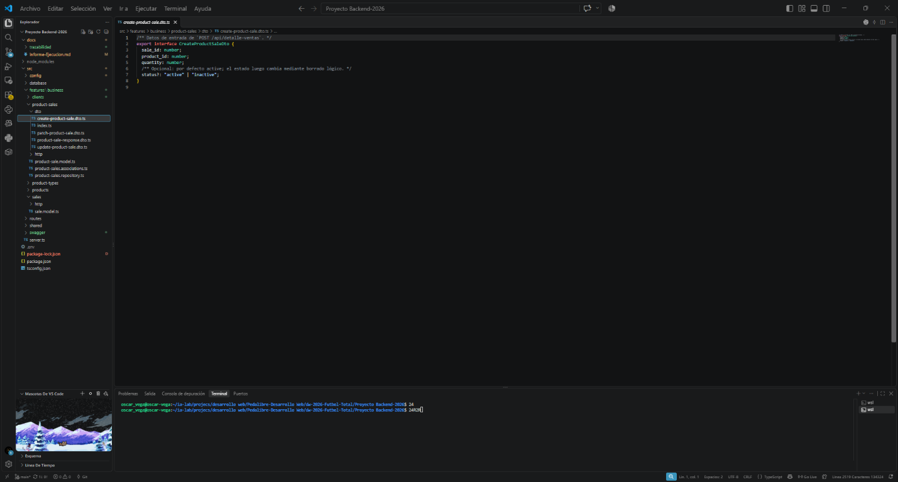

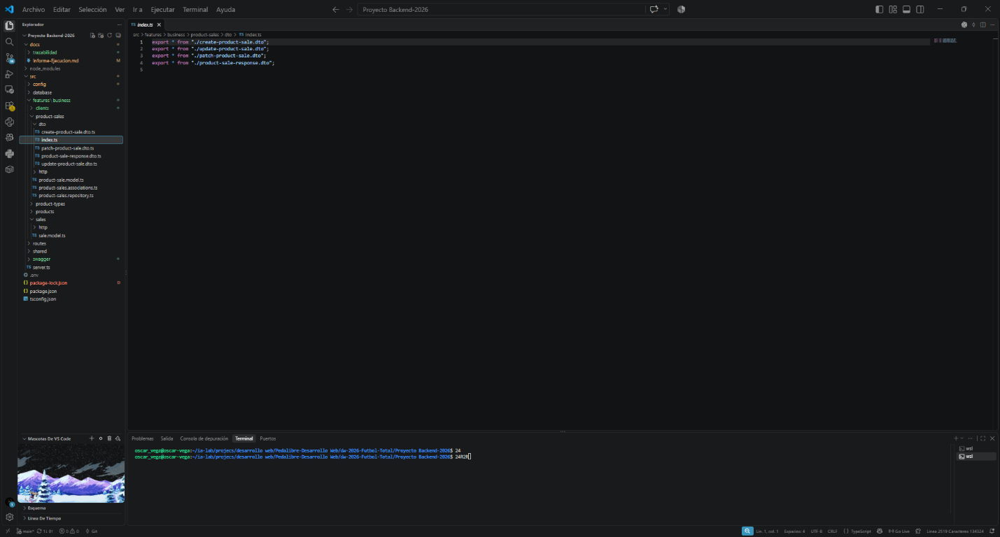

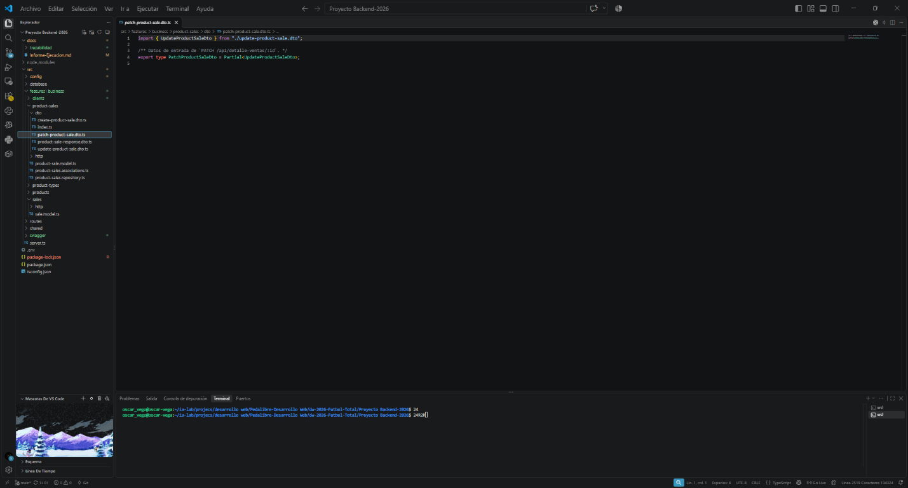

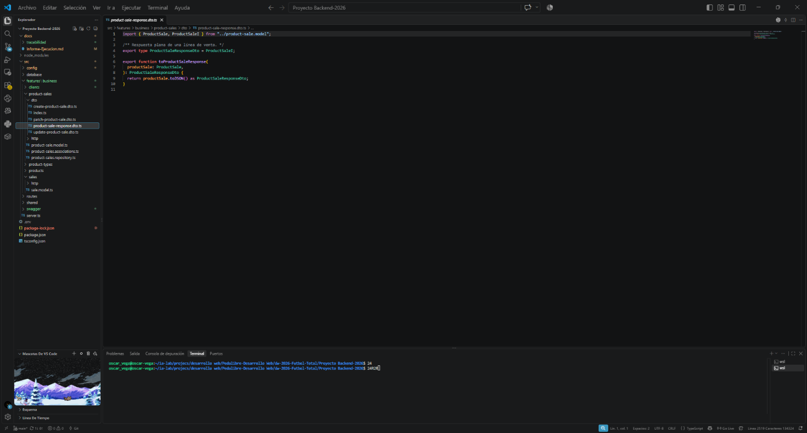

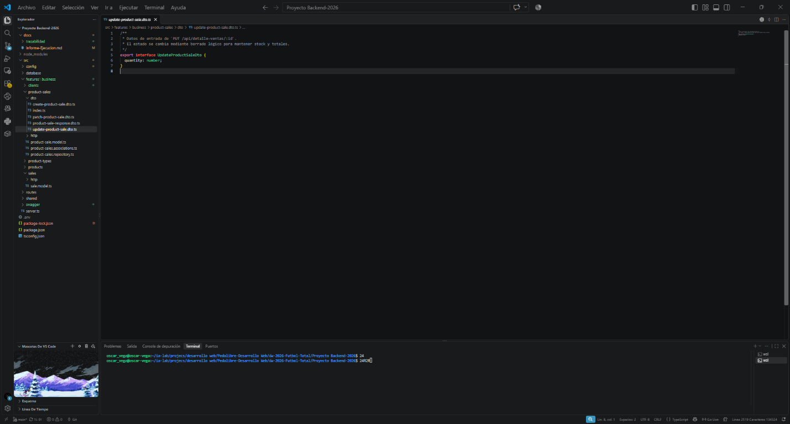

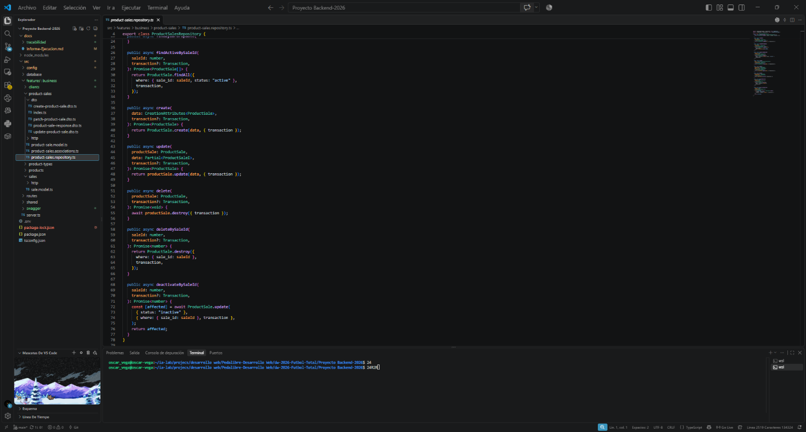

### Paso 4 — Implementar Service, Controller y Routes de ProductSale *(completado)*

**Referencia:** ISS-08, secciones 13.2b y 13.3b — capas y rutas de ProductSale.  
**Acción:** implementé las reglas transaccionales para las líneas de venta, el controlador HTTP y las rutas públicas de `/api/detalle-ventas`.

**Registro de ejecución:**

- **Fecha:** 2026-10-08.
- **Resultado observado:** el service valida la venta y el producto activos, controla la disponibilidad de stock, actualiza inventario y recalcula los totales de la venta dentro de transacciones. En las operaciones de escritura aplica el orden de bloqueos `sales` → `products` → `product_sales`; los borrados físico y lógico restauran el stock. El controller delega las operaciones al service y Routes expone GET, POST, PUT, PATCH y DELETE para ProductSale.
- **Estado:** Implementado; su funcionamiento integrado se verificará en los pasos posteriores del ISS.
- **Evidencias:** [`E-ISS08-P04-01-product-sales-service.png`](trazabilidad/E-ISS08-P04-01-product-sales-service.png), [`E-ISS08-P04-02-product-sales-controller.png`](trazabilidad/E-ISS08-P04-02-product-sales-controller.png), [`E-ISS08-P04-03-product-sales-routes.png`](trazabilidad/E-ISS08-P04-03-product-sales-routes.png) y [`E-ISS08-P04-04-product-sales-repository.png`](trazabilidad/E-ISS08-P04-04-product-sales-repository.png).

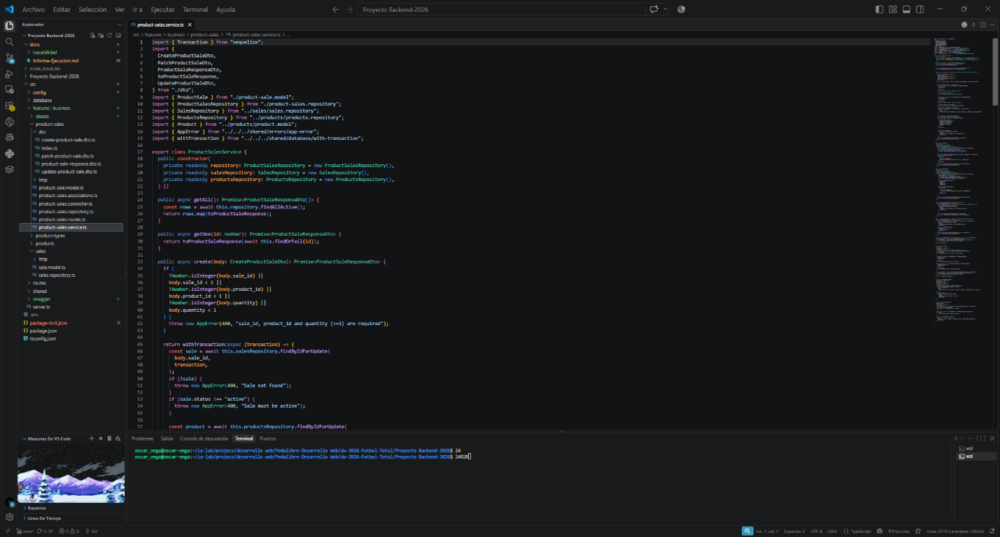

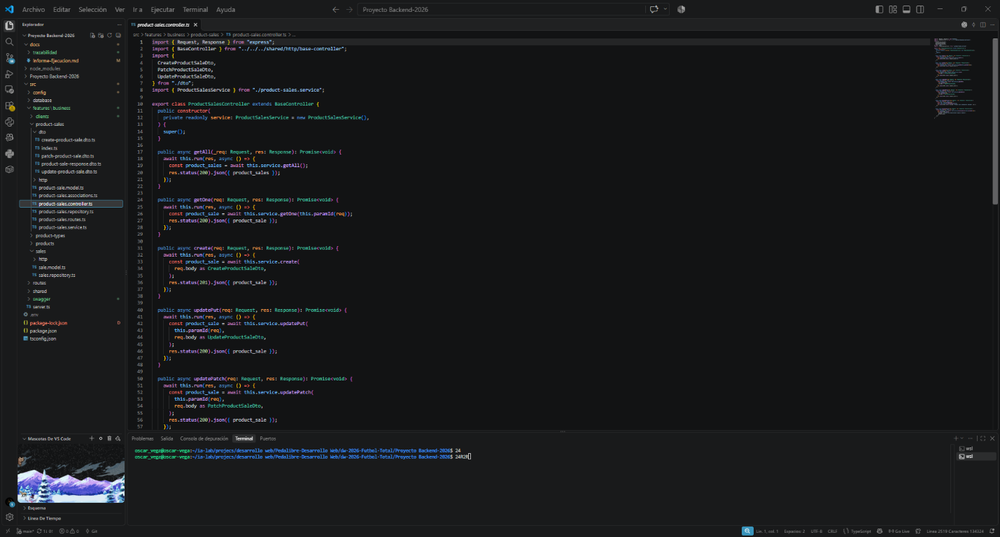

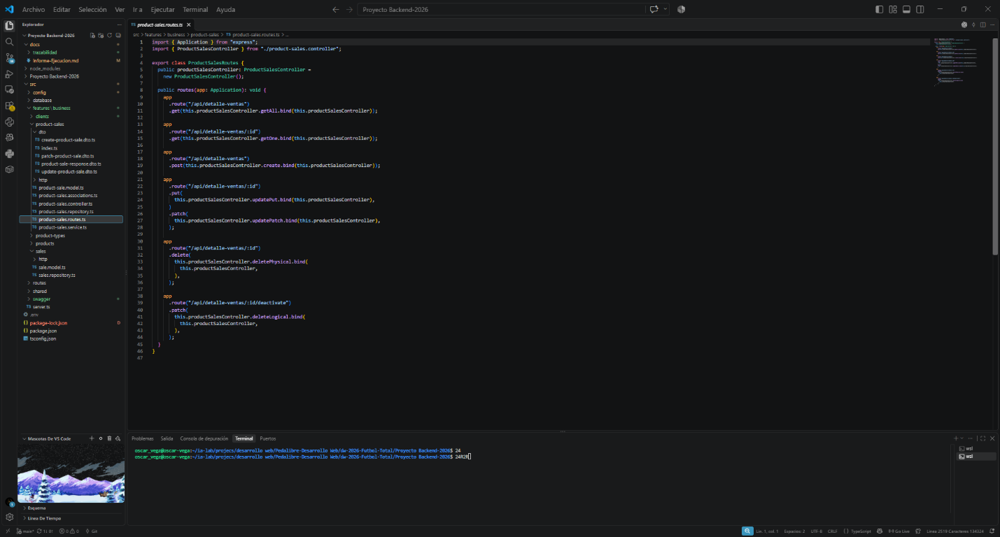

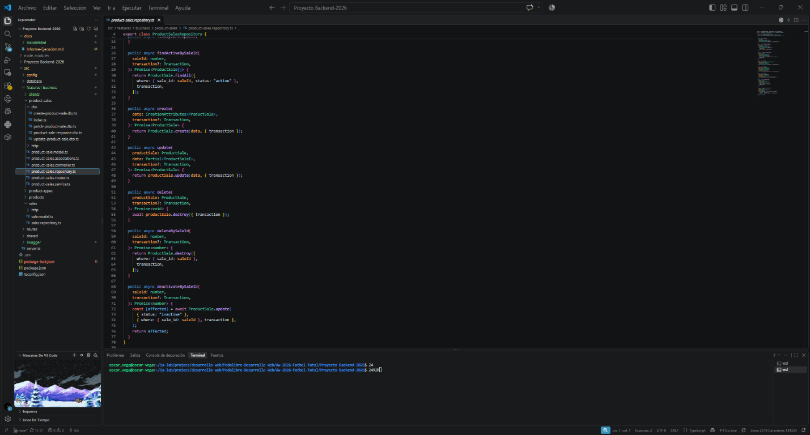

### Paso 5 — Crear el seeder de ProductSale *(completado)*

**Referencia:** ISS-08, sección 13.4b — Seeder ProductSale.  
**Acción:** preparé la generación idempotente de líneas de venta de prueba, actualizando el inventario y los importes de sus ventas.

**Registro de ejecución:**

- **Fecha:** 2026-10-08.
- **Resultado observado:** el seeder omite la ejecución si el conteo es cero, ya existen líneas o faltan ventas/productos activos. Por cada línea generada bloquea la venta y el producto dentro de una transacción, verifica el inventario disponible, registra el precio unitario, descuenta stock y recalcula subtotal y total.
- **Estado:** Implementado; su ejecución integrada se registrará durante las verificaciones de la guía.
- **Evidencia:** [`E-ISS08-P05-01-product-sales-seeder.png`](trazabilidad/E-ISS08-P05-01-product-sales-seeder.png).

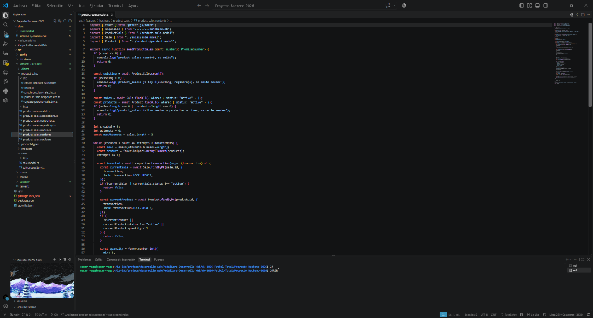

### Paso 6 — Preparar HTTP y OpenAPI de ProductSale *(completado)*

**Referencia:** ISS-08, secciones 13.6b — Swagger ProductSale y HTTP ProductSale.  
**Acción:** preparé las solicitudes REST Client del detalle de venta y su documentación OpenAPI.

**Registro de ejecución:**

- **Fecha:** 2026-10-08.
- **Resultado observado:** dejé plantillas GET, POST, PUT/PATCH y DELETE físico/lógico para `/api/detalle-ventas`, usando el puerto `3002` y marcadores en operaciones destructivas. Definí el módulo OpenAPI `productSalesSwagger` y lo incorporé al registro.
- **Estado:** Plantillas y módulo OpenAPI implementados y documentados.
- **Evidencias HTTP:** [`E-ISS08-P06-01-product-sales-create-http.png`](trazabilidad/E-ISS08-P06-01-product-sales-create-http.png), [`E-ISS08-P06-02-product-sales-delete-http.png`](trazabilidad/E-ISS08-P06-02-product-sales-delete-http.png), [`E-ISS08-P06-03-product-sales-get-http.png`](trazabilidad/E-ISS08-P06-03-product-sales-get-http.png) y [`E-ISS08-P06-04-product-sales-update-http.png`](trazabilidad/E-ISS08-P06-04-product-sales-update-http.png).
- **Evidencia OpenAPI:** [`E-ISS08-P06-05-product-sales-openapi.png`](trazabilidad/E-ISS08-P06-05-product-sales-openapi.png).

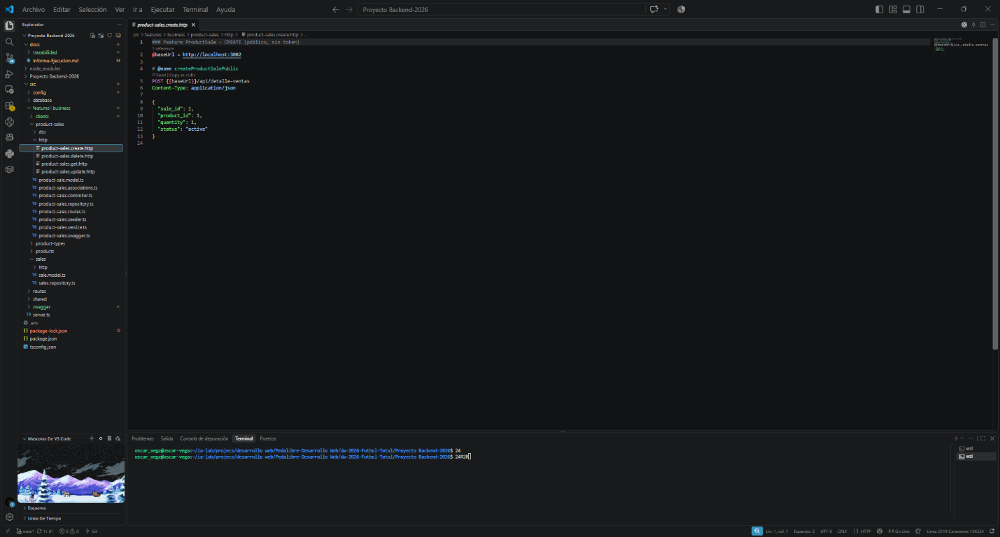

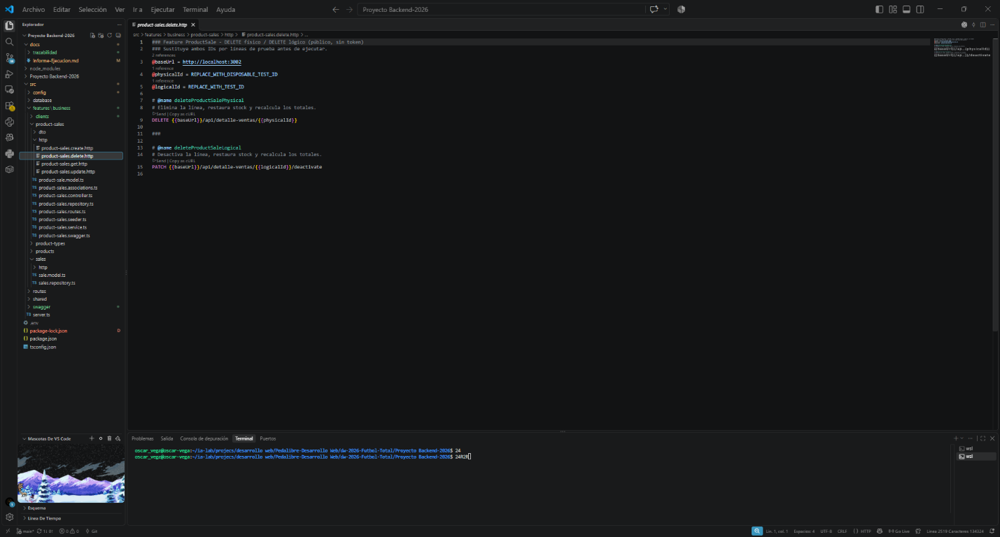

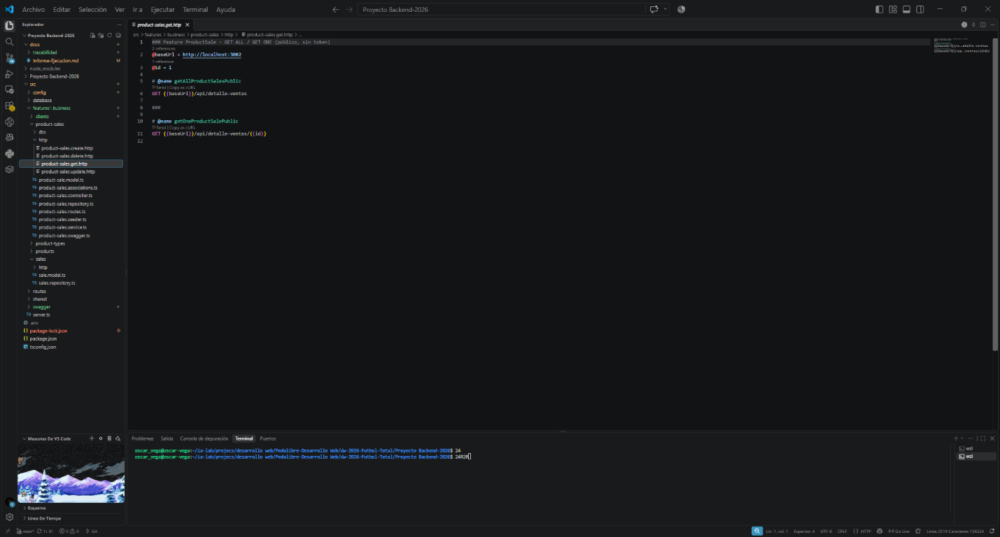

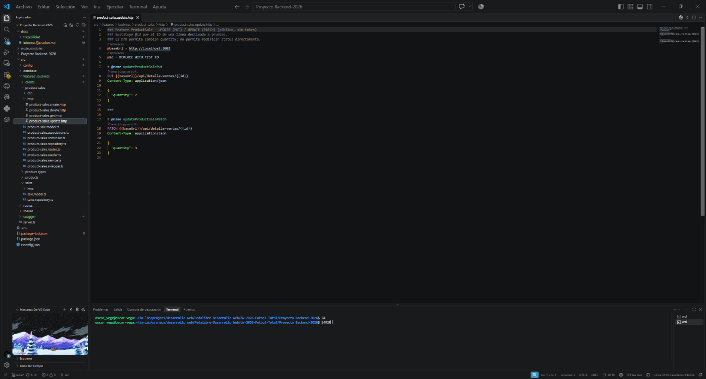

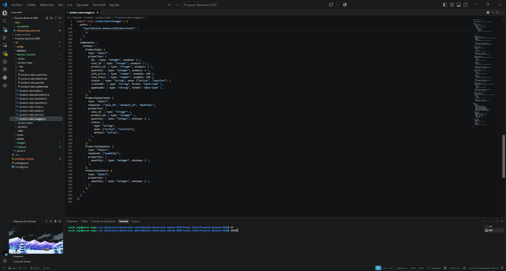

### Paso 7 — Implementar DTOs y capas de Sale *(implementado)*

**Referencia:** ISS-08, sección 13.2 — DTO, Repository, Service, Controller y Routes de Sale.  
**Acción:** definí los contratos de entrada y respuesta de la venta e implementé las capas para consultar, crear, actualizar y eliminar ventas y sus detalles.

**Registro de ejecución:**

- **Fecha:** 2026-10-08.
- **Resultado observado:** `SalesService` crea la cabecera y sus líneas en una sola transacción, valida el cliente y los productos activos, controla el stock, calcula subtotal, impuestos, descuentos y total, y restaura existencias al eliminar una venta. También incorporé consultas de ventas con sus detalles y las rutas públicas de `/api/ventas`.
- **Evidencias:** [`E-ISS08-P07-01-sales-controller.png`](trazabilidad/E-ISS08-P07-01-sales-controller.png), [`E-ISS08-P07-02-sales-repository.png`](trazabilidad/E-ISS08-P07-02-sales-repository.png), [`E-ISS08-P07-03-sales-routes.png`](trazabilidad/E-ISS08-P07-03-sales-routes.png) y [`E-ISS08-P07-04-sales-service.png`](trazabilidad/E-ISS08-P07-04-sales-service.png). La captura del modelo Sale quedó registrada en el Paso 1.
- **Comandos indicados en la guía para crear los archivos:**

```bash
mkdir -p src/features/business/sales/dto
: > src/features/business/sales/dto/create-sale.dto.ts
: > src/features/business/sales/dto/update-sale.dto.ts
: > src/features/business/sales/dto/patch-sale.dto.ts
: > src/features/business/sales/dto/sale-response.dto.ts
: > src/features/business/sales/dto/index.ts
: > src/features/business/sales/sales.repository.ts
: > src/features/business/sales/sales.service.ts
: > src/features/business/sales/sales.controller.ts
: > src/features/business/sales/sales.routes.ts
```

- **Estado:** Implementado y documentado.

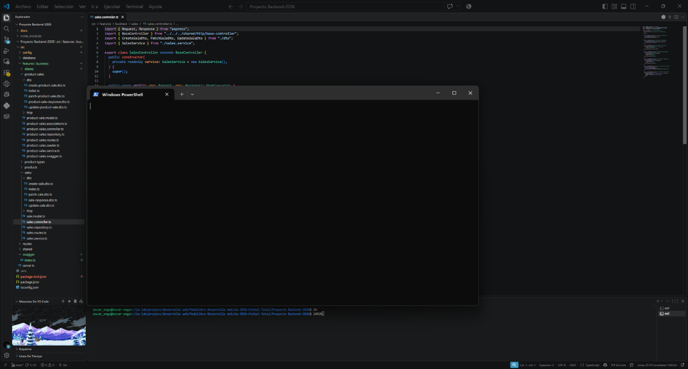

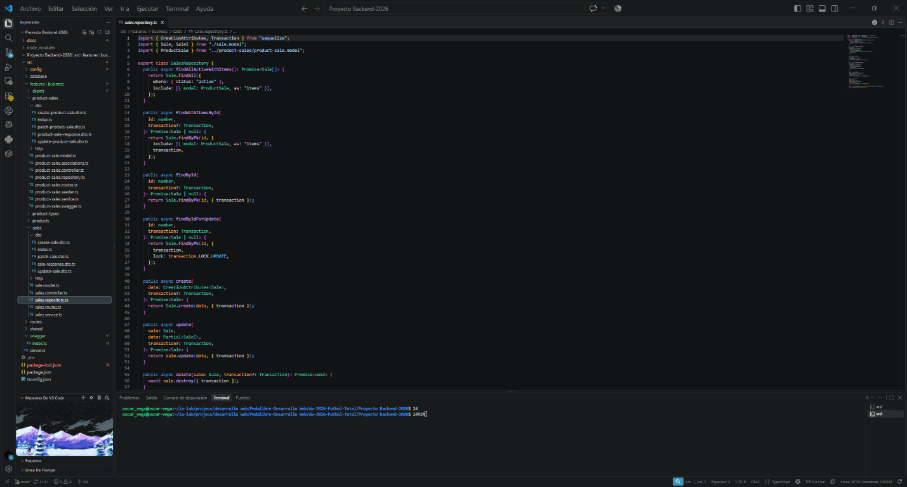

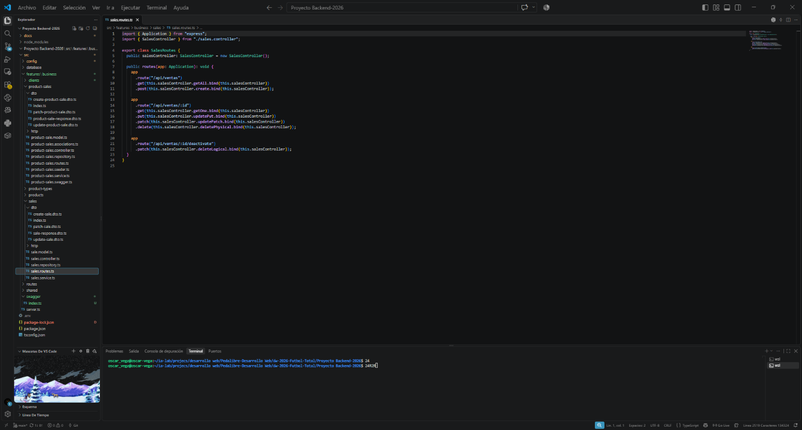

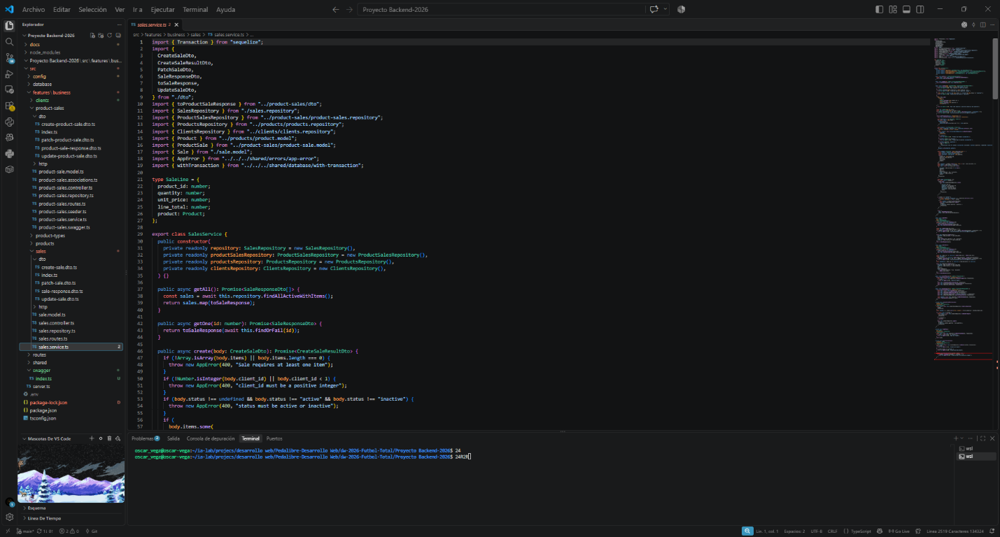
